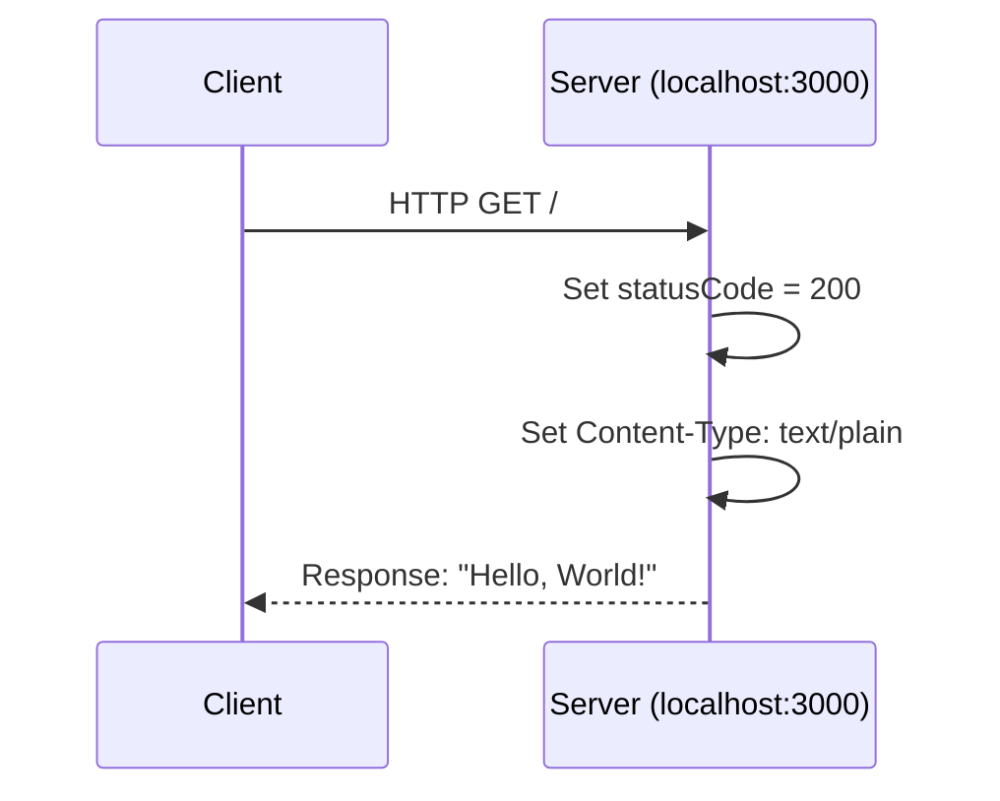
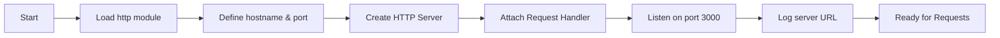

# Hello World Node.js Server

[](https://opensource.org/licenses/MIT)
[](https://nodejs.org/)

A simple HTTP server that responds with "Hello, World!" - a minimal Node.js application demonstrating the basics of creating an HTTP server using Node.js built-in modules.

## Table of Contents

- [Prerequisites](#prerequisites)
- [Installation](#installation)
- [Usage](#usage)
- [API Documentation](#api-documentation)
- [Configuration](#configuration)
- [Deployment Guide](#deployment-guide)
- [Project Structure](#project-structure)
- [Contributing](#contributing)
- [License](#license)

## Prerequisites

Before running this application, ensure you have the following installed:

| Requirement | Minimum Version | Recommended Version | Download |
|-------------|-----------------|---------------------|----------|
| Node.js | 14.0.0 | 20.x LTS | [nodejs.org](https://nodejs.org/) |
| npm | 6.0.0 | 10.x | Bundled with Node.js |

To verify your installations:

```bash
# Check Node.js version
node --version

# Check npm version
npm --version
```

## Installation

Follow these steps to set up the project locally:

1. **Clone the repository:**

```bash
git clone <repository-url>
```

2. **Navigate to the project directory:**

```bash
cd hello_world
```

3. **Install dependencies:**

```bash
npm install
```

> **Note:** This project has no external dependencies, so `npm install` will complete quickly.

4. **Verify the installation:**

```bash
# Check that server.js exists
ls server.js

# Verify syntax is correct
node --check server.js
```

If no errors appear, the installation is complete.

## Usage

### Starting the Server

Run the following command to start the HTTP server:

```bash
node server.js
```

**Expected console output:**

```
Server running at http://127.0.0.1:3000/
```

### Testing the Server

Once the server is running, you can test it using curl or a web browser:

**Using curl:**

```bash
curl http://127.0.0.1:3000/
```

**Expected response:**

```
Hello, World!
```

**Using a web browser:**

Open [http://127.0.0.1:3000/](http://127.0.0.1:3000/) in your browser to see "Hello, World!" displayed.

### Stopping the Server

Press `Ctrl + C` in the terminal where the server is running to stop it.

## API Documentation

### Endpoint Reference

| Method | Endpoint | Description | Status Code | Content-Type |
|--------|----------|-------------|-------------|--------------|
| GET | `/` | Returns a greeting message | 200 | text/plain |

### Request/Response Details

#### GET /

**Request:**
- No request body required
- No query parameters
- No authentication required

**Response:**
- **Status Code:** `200 OK`
- **Content-Type:** `text/plain`
- **Body:** `Hello, World!`

**Example Request:**

```bash
curl -X GET http://127.0.0.1:3000/
```

**Example Response:**

```
HTTP/1.1 200 OK
Content-Type: text/plain
Date: [current date]
Connection: keep-alive
Keep-Alive: timeout=5

Hello, World!
```

### Request Flow Diagram



*Source: server.js:6-10*

## Configuration

The server configuration is defined through constants in `server.js`:

| Constant | Value | Type | Description | Source |
|----------|-------|------|-------------|--------|
| `hostname` | `'127.0.0.1'` | string | The IP address the server binds to | server.js:3 |
| `port` | `3000` | number | The port number the server listens on | server.js:4 |

### Modifying Configuration

To change the server's host or port, edit the constants in `server.js`:

```javascript
// server.js - Configuration section
const hostname = '127.0.0.1';  // Change to '0.0.0.0' to accept external connections
const port = 3000;             // Change to desired port number
```

**Common configurations:**

| Use Case | hostname | port |
|----------|----------|------|
| Local development only | `'127.0.0.1'` | `3000` |
| Accept external connections | `'0.0.0.0'` | `3000` |
| Production with reverse proxy | `'127.0.0.1'` | `8080` |

## Deployment Guide

### Production Considerations

When deploying to production, consider the following:

#### 1. Environment Variables

Instead of hardcoding values, use environment variables for configuration:

```javascript
// Recommended production configuration
const hostname = process.env.HOST || '0.0.0.0';
const port = process.env.PORT || 3000;
```

Set environment variables before starting:

```bash
export HOST=0.0.0.0
export PORT=8080
node server.js
```

#### 2. Process Management with PM2

Use PM2 to keep your server running in production:

**Install PM2 globally:**

```bash
npm install -g pm2
```

**Start the server with PM2:**

```bash
pm2 start server.js --name "hello-world-server"
```

**Common PM2 commands:**

```bash
# View running processes
pm2 list

# View logs
pm2 logs hello-world-server

# Restart the server
pm2 restart hello-world-server

# Stop the server
pm2 stop hello-world-server

# Enable auto-start on system reboot
pm2 startup
pm2 save
```

#### 3. Ecosystem Configuration

Create a PM2 ecosystem file for advanced configuration:

```javascript
// ecosystem.config.js
module.exports = {
  apps: [{
    name: 'hello-world-server',
    script: 'server.js',
    instances: 1,
    env: {
      NODE_ENV: 'development',
      PORT: 3000
    },
    env_production: {
      NODE_ENV: 'production',
      PORT: 8080
    }
  }]
};
```

Start with ecosystem file:

```bash
pm2 start ecosystem.config.js --env production
```

### Monitoring Recommendations

| Aspect | Tool/Approach | Purpose |
|--------|---------------|---------|
| Process monitoring | PM2 | Restart on crash, memory management |
| Logs | PM2 logs, Winston, or Bunyan | Track requests and errors |
| Health checks | External monitoring service | Ensure uptime |
| Metrics | PM2 Plus or custom metrics | Performance tracking |

### Logging Considerations

For production, consider adding structured logging:

```javascript
// Basic console logging (current implementation)
console.log(`Server running at http://${hostname}:${port}/`);

// For production, consider adding request logging
const server = http.createServer((req, res) => {
  console.log(`[${new Date().toISOString()}] ${req.method} ${req.url}`);
  // ... rest of handler
});
```

### Server Architecture



## Project Structure

```
hello_world/
├── server.js           # Main HTTP server entry point (15 lines)
├── package.json        # NPM configuration and project metadata
├── package-lock.json   # Dependency lock file for reproducible installs
└── README.md           # Project documentation (this file)
```

### File Descriptions

| File | Purpose | Key Contents |
|------|---------|--------------|
| `server.js` | Main application entry point | HTTP server creation, request handling, server startup |
| `package.json` | Project configuration | Name, version, description, license, scripts |
| `package-lock.json` | Dependency lock | Ensures consistent installs across environments |
| `README.md` | Documentation | Setup, usage, API reference, deployment guide |

## Contributing

Contributions are welcome! To contribute to this project:

1. **Fork the repository** to your own GitHub account

2. **Clone your fork** locally:
   ```bash
   git clone <your-fork-url>
   ```

3. **Create a feature branch:**
   ```bash
   git checkout -b feature/your-feature-name
   ```

4. **Make your changes** and test thoroughly

5. **Commit your changes:**
   ```bash
   git commit -m "Add: description of your changes"
   ```

6. **Push to your fork:**
   ```bash
   git push origin feature/your-feature-name
   ```

7. **Open a Pull Request** with a clear description of your changes

### Code Style Guidelines

- Use consistent indentation (2 spaces)
- Include JSDoc comments for functions
- Follow existing naming conventions
- Test changes before submitting

## License

This project is licensed under the **MIT License**.

```
MIT License

Copyright (c) 2024 hxu

Permission is hereby granted, free of charge, to any person obtaining a copy
of this software and associated documentation files (the "Software"), to deal
in the Software without restriction, including without limitation the rights
to use, copy, modify, merge, publish, distribute, sublicense, and/or sell
copies of the Software, and to permit persons to whom the Software is
furnished to do so, subject to the following conditions:

The above copyright notice and this permission notice shall be included in all
copies or substantial portions of the Software.

THE SOFTWARE IS PROVIDED "AS IS", WITHOUT WARRANTY OF ANY KIND, EXPRESS OR
IMPLIED, INCLUDING BUT NOT LIMITED TO THE WARRANTIES OF MERCHANTABILITY,
FITNESS FOR A PARTICULAR PURPOSE AND NONINFRINGEMENT. IN NO EVENT SHALL THE
AUTHORS OR COPYRIGHT HOLDERS BE LIABLE FOR ANY CLAIM, DAMAGES OR OTHER
LIABILITY, WHETHER IN AN ACTION OF CONTRACT, TORT OR OTHERWISE, ARISING FROM,
OUT OF OR IN CONNECTION WITH THE SOFTWARE OR THE USE OR OTHER DEALINGS IN THE
SOFTWARE.
```

*License type sourced from package.json*

---

**Version:** 1.0.0 | **Author:** hxu | **Project:** hello_world
