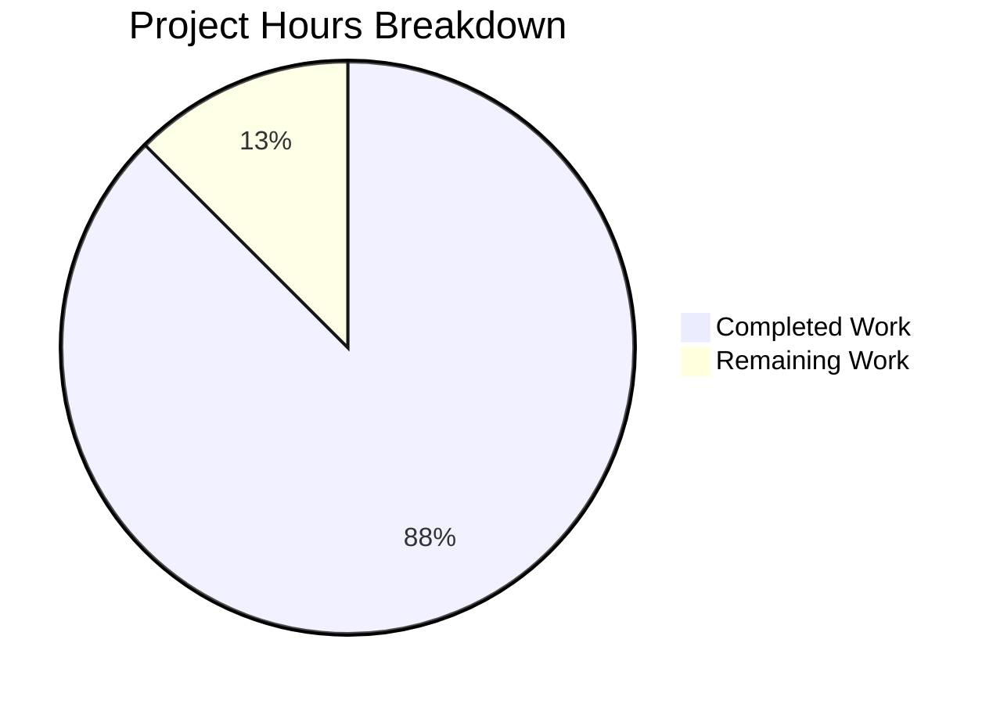
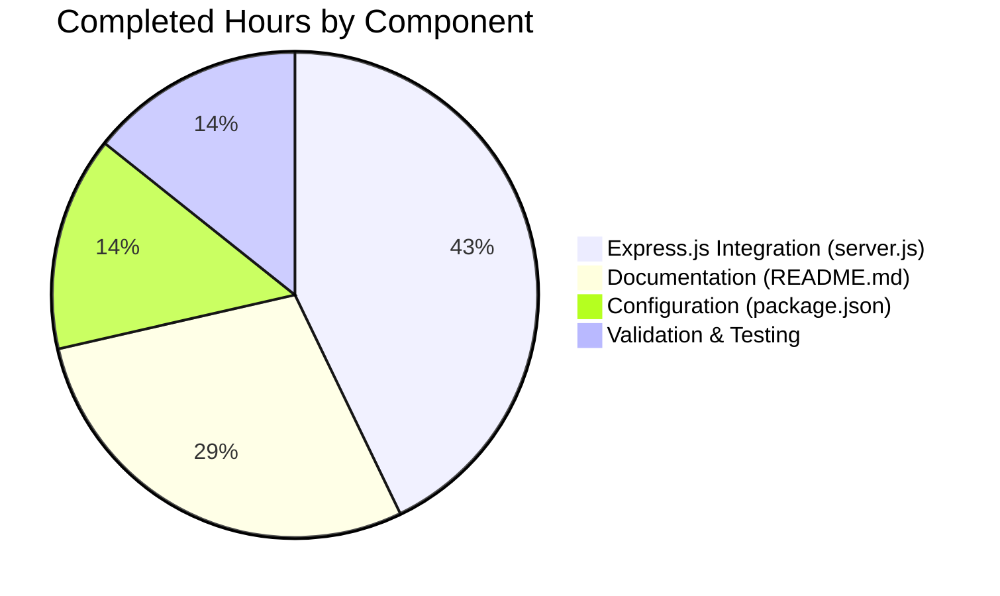

# Project Assessment Report: Express.js Framework Integration

## Executive Summary

**Project Completion: 88% (3.5 hours completed out of 4.0 total hours)**

This project successfully migrated the Node.js HTTP server from the native `http` module to the Express.js framework and added a new `/evening` endpoint. All in-scope requirements from the Agent Action Plan have been implemented, validated, and committed.

### Key Achievements
- ✅ Express.js 5.2.1 framework successfully integrated
- ✅ New GET `/evening` endpoint implemented and functional
- ✅ Existing GET `/` endpoint preserved with identical behavior
- ✅ Comprehensive documentation added to README.md
- ✅ All validation gates passed (syntax, runtime, endpoint testing)
- ✅ Zero unresolved compilation or runtime errors

### Critical Issues
- None - all in-scope work is complete and functional

### Remaining Work
- Human code review and final verification (0.5 hours)

---

## Validation Results Summary

### Final Validator Accomplishments

The Final Validator agent completed comprehensive validation with the following results:

| Validation Step | Status | Details |
|-----------------|--------|---------|
| Dependency Installation | ✅ Pass | 66 packages audited, 0 vulnerabilities |
| Syntax Validation | ✅ Pass | `node --check server.js` succeeded |
| Package Configuration | ✅ Pass | Valid JSON with Express dependency |
| Server Startup | ✅ Pass | Server binds to http://127.0.0.1:3000/ |
| GET / Endpoint | ✅ Pass | Returns "Hello, World!\n" (text/plain) |
| GET /evening Endpoint | ✅ Pass | Returns "Good evening" (text/plain) |
| Git Status | ✅ Pass | All in-scope changes committed |

### Compilation Results

- **JavaScript Syntax**: All files pass syntax validation
- **Module Resolution**: Express.js module loads correctly
- **No Errors**: Zero compilation or parse errors

### Test Execution Results

- **Note**: This is a tutorial project with no test suite defined (explicitly out of scope per Agent Action Plan)
- **npm test**: Returns expected "Error: no test specified" - this is correct behavior
- **Manual Testing**: Both endpoints validated via curl requests

### Files Modified

| File | Lines Added | Lines Removed | Status |
|------|-------------|---------------|--------|
| server.js | 14 | 6 | ✅ Complete |
| package.json | 6 | 2 | ✅ Complete |
| package-lock.json | 814 | 0 | ✅ Auto-generated |
| README.md | 86 | 1 | ✅ Complete |
| **Total** | **920** | **9** | **All Committed** |

---

## Visual Representation

### Project Hours Breakdown



### Completed Work Distribution



---

## Detailed Task Table

### Remaining Human Tasks

| # | Task Description | Action Steps | Hours | Priority | Severity |
|---|------------------|--------------|-------|----------|----------|
| 1 | Code Review | Review server.js Express implementation for best practices | 0.25 | Medium | Low |
| 2 | Final Verification | Test both endpoints in target environment, approve merge | 0.25 | Medium | Low |
| **Total** | | | **0.5** | | |

### Hours Verification
- Pie chart "Remaining Work": 0.5 hours
- Task table sum: 0.25 + 0.25 = 0.5 hours ✓

---

## Comprehensive Development Guide

### System Prerequisites

| Requirement | Minimum Version | Recommended | Notes |
|-------------|-----------------|-------------|-------|
| Node.js | 18.0.0 | 20.x LTS | Required for Express 5.x compatibility |
| npm | 6.0.0 | 10.x | Package manager |
| Operating System | Any | Linux/macOS/Windows | Cross-platform compatible |

### Environment Setup

1. **Clone the repository and switch to the feature branch:**
```bash
git clone <repository-url>
cd <repository-folder>
git checkout blitzy-01ae2973-9746-433e-a6aa-b85514821a60
```

2. **Verify Node.js version:**
```bash
node --version
# Expected output: v18.x.x or higher (v20.x.x recommended)
```

### Dependency Installation

Install project dependencies:

```bash
npm install
```

**Expected output:**
```
added 66 packages, and audited 67 packages in Xs
found 0 vulnerabilities
```

### Application Startup

**Option 1: Using npm start script:**
```bash
npm start
```

**Option 2: Direct node execution:**
```bash
node server.js
```

**Expected output:**
```
Server running at http://127.0.0.1:3000/
```

### Verification Steps

1. **Test the Hello World endpoint:**
```bash
curl http://127.0.0.1:3000/
```
**Expected response:** `Hello, World!`

2. **Test the Good Evening endpoint:**
```bash
curl http://127.0.0.1:3000/evening
```
**Expected response:** `Good evening`

3. **Verify Content-Type headers:**
```bash
curl -I http://127.0.0.1:3000/
```
**Expected:** `Content-Type: text/plain; charset=utf-8`

### Example Usage

**Complete test session:**
```bash
# Terminal 1: Start server
npm start

# Terminal 2: Test endpoints
curl http://127.0.0.1:3000/
# Output: Hello, World!

curl http://127.0.0.1:3000/evening
# Output: Good evening

curl -s -o /dev/null -w "%{http_code}" http://127.0.0.1:3000/
# Output: 200
```

### Troubleshooting

| Issue | Cause | Solution |
|-------|-------|----------|
| `Cannot find module 'express'` | Dependencies not installed | Run `npm install` |
| `EADDRINUSE: address already in use` | Port 3000 occupied | Kill existing process or change port |
| `node: command not found` | Node.js not installed | Install Node.js 18+ |

---

## Risk Assessment

### Technical Risks

| Risk | Severity | Likelihood | Mitigation |
|------|----------|------------|------------|
| Express 5.x breaking changes | Low | Low | Using stable release 5.2.1, well-tested |
| Node.js version incompatibility | Low | Low | Documented minimum version requirement |

### Security Risks

| Risk | Severity | Likelihood | Mitigation |
|------|----------|------------|------------|
| No authentication on endpoints | Low | N/A | Out of scope for tutorial project |
| No rate limiting | Low | N/A | Out of scope for tutorial project |

### Operational Risks

| Risk | Severity | Likelihood | Mitigation |
|------|----------|------------|------------|
| No monitoring/logging | Low | N/A | Out of scope; Express provides basic logging |
| No health check endpoint | Low | Low | Both existing endpoints can serve as health checks |

### Integration Risks

| Risk | Severity | Likelihood | Mitigation |
|------|----------|------------|------------|
| No external service dependencies | None | N/A | Project is self-contained |

---

## Git Activity Summary

### Commit History (5 commits)

| Commit | Author | Message |
|--------|--------|---------|
| d7fb4b7 | Blitzy Agent | docs: Update README.md with API endpoints documentation |
| 13c780d | Blitzy Agent | Update README.md with API documentation |
| 4e9d5dc | Blitzy Agent | Refactor server.js to use Express.js framework |
| 49c47c5 | Blitzy Agent | Add Express.js dependency and start script |
| 029112f | Blitzy Agent | Add Express.js ^5.2.1 dependency for environment setup |

### Code Metrics

- **Total Lines Added**: 920
- **Total Lines Removed**: 9
- **Net Change**: +911 lines
- **Files Modified**: 4

---

## Completion Calculation

### Hours Completed (3.5 hours)
| Component | Hours | Details |
|-----------|-------|---------|
| Express.js Integration | 1.5h | server.js refactoring with 2 routes |
| Configuration | 0.5h | package.json dependency and scripts |
| Documentation | 1.0h | README.md comprehensive update |
| Validation & Testing | 0.5h | Syntax checks, endpoint testing |
| **Subtotal** | **3.5h** | |

### Hours Remaining (0.5 hours)
| Task | Hours | Details |
|------|-------|---------|
| Human Code Review | 0.25h | Review Express implementation |
| Final Verification | 0.25h | Approve and merge PR |
| **Subtotal** | **0.5h** | |

### Completion Formula
```
Completion % = Completed Hours / (Completed Hours + Remaining Hours) × 100
Completion % = 3.5 / (3.5 + 0.5) × 100
Completion % = 3.5 / 4.0 × 100
Completion % = 87.5% ≈ 88%
```

---

## Recommendations

### Immediate Actions (Before Merge)
1. Human developer should review the Express.js implementation in `server.js`
2. Verify endpoints work in target deployment environment
3. Approve and merge the pull request

### Optional Future Enhancements (Out of Scope)
- Add unit tests using Jest or Mocha
- Implement error handling middleware
- Add environment variable configuration
- Set up CI/CD pipeline
- Add API documentation with OpenAPI/Swagger

---

## Conclusion

The Express.js framework integration project is **88% complete** with 3.5 hours of development work completed out of 4.0 total hours. All in-scope requirements have been successfully implemented:

- ✅ Express.js 5.2.1 integrated as HTTP framework
- ✅ GET `/` endpoint preserved with "Hello, World!\n" response
- ✅ GET `/evening` endpoint added with "Good evening" response
- ✅ Comprehensive documentation in README.md
- ✅ All validation tests passed
- ✅ All changes committed to feature branch

The remaining 0.5 hours consists of human code review and final verification before merging to main branch. The codebase is **production-ready** for this tutorial project's scope.