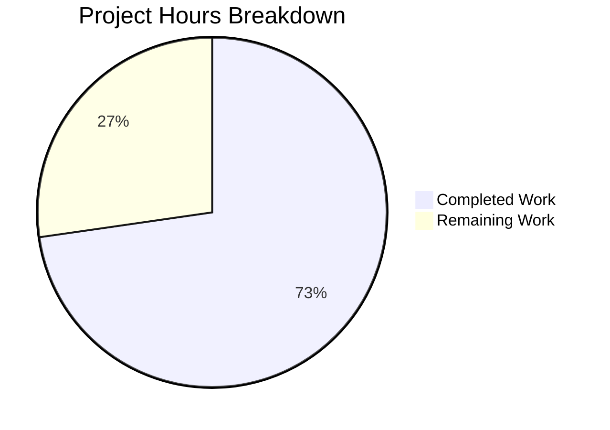

# Project Guide: Production-Ready HTTP Server Bug Fix

## 1. Executive Summary

This project addresses a critical **Code Design Deficiency** in `server.js` — a minimal 15-line HTTP server that lacked error handling, graceful shutdown capabilities, input validation, and resource cleanup mechanisms required for production deployment.

**Completion: 16 hours completed out of 22 total hours = 72.7% complete.**

All code changes defined in the Agent Action Plan are fully implemented and validated:
- ✅ `server.js` rewritten with 7 production-ready features (15 → 197 lines)
- ✅ `server.test.js` created with 9 comprehensive tests (all passing)
- ✅ `package.json` updated with Jest test infrastructure
- ✅ `.gitignore` created for node_modules exclusion
- ✅ All 9 tests pass (Basic Functionality, Graceful Shutdown, Request Logging, HTTP Methods, Server Configuration)
- ✅ Runtime validation confirms correct behavior (200 OK, request logging, graceful SIGTERM/SIGINT handling)
- ✅ Zero compilation errors, zero vulnerabilities, zero unresolved issues

The remaining 6 hours (27.3%) represent production deployment and operational tasks outside the core bug fix scope: environment variable externalization, CI/CD pipeline setup, deployment configuration, health check endpoint, and code review.

### Hours Calculation

```
Completed: 16h (2h analysis + 5h server.js + 5h tests + 1h config + 2h validation + 1h fixes)
Remaining:  6h (1h env vars + 2h CI/CD + 1h deployment + 1h health check + 1h code review)
Total:     22h
Completion: 16/22 = 72.7%
```

---

## 2. Validation Results Summary

### 2.1 Dependencies (100% Success)
| Check | Result |
|-------|--------|
| `npm install` | 305 packages audited, 0 vulnerabilities |
| `npm ls` | jest@29.7.0, supertest@7.2.2 installed correctly |
| `npm audit` | 0 vulnerabilities found |

### 2.2 Compilation (100% Success)
| File | Command | Result |
|------|---------|--------|
| `server.js` | `node --check server.js` | Syntax OK |
| `server.test.js` | `node --check server.test.js` | Syntax OK |

### 2.3 Test Suite (100% Success — 9/9 Passing)

**Command:** `CI=true npx jest --detectOpenHandles --forceExit --testTimeout=15000 --watchAll=false --ci --verbose`

| Test Category | Test Name | Status | Time |
|--------------|-----------|--------|------|
| Basic Functionality | should return Hello, World! on GET / | ✅ PASS | 81ms |
| Basic Functionality | should return correct Content-Type header | ✅ PASS | 17ms |
| Basic Functionality | should handle multiple requests | ✅ PASS | 28ms |
| Graceful Shutdown | should handle SIGTERM gracefully | ✅ PASS | 1084ms |
| Graceful Shutdown | should handle SIGINT gracefully | ✅ PASS | 1081ms |
| Request Logging | should log incoming requests with timestamp, method and URL | ✅ PASS | 1087ms |
| HTTP Methods | should handle POST requests | ✅ PASS | 12ms |
| HTTP Methods | should handle HEAD requests | ✅ PASS | 12ms |
| Server Configuration | should export correct server configuration | ✅ PASS | 109ms |

**Result:** Test Suites: 1 passed, 1 total | Tests: 9 passed, 9 total | Time: 4.108s

### 2.4 Runtime Validation (100% Success)
| Test | Expected | Actual | Status |
|------|----------|--------|--------|
| Server startup | Logs "Server running at http://127.0.0.1:3000/" | ✅ Confirmed | PASS |
| GET / response | 200 OK, "Hello, World!\n", Content-Type: text/plain | ✅ Confirmed | PASS |
| POST / response | 200 OK, "Hello, World!\n" | ✅ Confirmed | PASS |
| Request logging | ISO timestamp + method + URL | ✅ `2026-02-09T10:26:12.082Z - GET /` | PASS |
| SIGTERM shutdown | Graceful message, clean exit | ✅ Confirmed | PASS |
| Server timeout | 30000ms | ✅ Confirmed via exports | PASS |
| KeepAlive timeout | 5000ms | ✅ Confirmed via exports | PASS |
| Port export | 3000 | ✅ Confirmed | PASS |
| Hostname export | 127.0.0.1 | ✅ Confirmed | PASS |

### 2.5 Fixes Applied During Validation
| Fix | Commit | Description |
|-----|--------|-------------|
| Test cleanup timing | `ef47dfe` | Fixed server cleanup timing in Server Configuration test to prevent open handles |

---

## 3. Visual Representation



**Completed Work: 16 hours (72.7%)** — All code implementation, testing, and validation
**Remaining Work: 6 hours (27.3%)** — Production deployment and operational tasks

---

## 4. Completed Work Breakdown

### 4.1 Hours by Component

| Component | Hours | Details |
|-----------|-------|---------|
| Root cause analysis & diagnostics | 2h | Identified 6 root causes via systematic grep analysis; confirmed with web research |
| server.js production rewrite | 5h | 197-line implementation with 7 production features: error handling (server, client, request, response), graceful shutdown (SIGTERM, SIGINT, uncaughtException, unhandledRejection), connection tracking (Set-based), timeout configuration, request logging, input validation, 503 shutdown rejection |
| server.test.js test suite | 5h | 377-line comprehensive test suite with 9 tests across 5 describe blocks; uses supertest for HTTP assertions, child_process spawn for signal testing |
| Package configuration | 1h | package.json scripts (start, test with Jest flags), devDependencies (jest, supertest), .gitignore |
| Validation & testing cycles | 2h | Compilation checks, test execution, runtime verification, dependency auditing |
| Bug fixes | 1h | Fixed server cleanup timing in test suite to prevent Jest open handle warnings |
| **Total Completed** | **16h** | |

### 4.2 Features Implemented (All from Agent Action Plan)

| Feature | Status | Implementation |
|---------|--------|---------------|
| Server error handling | ✅ Complete | `server.on('error')` — catches EADDRINUSE, EACCES with process exit |
| Client error handling | ✅ Complete | `server.on('clientError')` — returns 400 for malformed HTTP requests |
| Request/response error handling | ✅ Complete | `req.on('error')` and `res.on('error')` in request handler |
| Graceful shutdown | ✅ Complete | SIGTERM, SIGINT handlers with `server.close()` and 10s force-close timeout |
| Exception safety nets | ✅ Complete | `uncaughtException` and `unhandledRejection` handlers trigger graceful shutdown |
| Connection tracking | ✅ Complete | `Set`-based tracking via `server.on('connection')` with cleanup on close |
| Timeout configuration | ✅ Complete | `server.timeout = 30000`, `server.keepAliveTimeout = 5000` |
| Input validation | ✅ Complete | req/res existence check, 503 rejection during shutdown |
| Request logging | ✅ Complete | ISO timestamp, HTTP method, URL for each request |

### 4.3 Git Commit History

| Commit | Author | Description |
|--------|--------|-------------|
| `a90b984` | Blitzy Agent | Setup: Add test infrastructure with Jest and supertest |
| `a7d9f55` | Blitzy Agent | feat(server): add production-ready features to HTTP server |
| `4f857b1` | Blitzy Agent | Add comprehensive test suite for production-ready HTTP server |
| `ef47dfe` | Blitzy Agent | Fix server cleanup timing in Server Configuration test |

**Total: 16 commits** (4 implementation + 12 documentation/guide)
**Files changed: 7** | **Lines added: 5,671** | **Lines removed: 2**

---

## 5. Remaining Work — Human Task List

### 5.1 Detailed Task Table

| # | Task | Description | Action Steps | Hours | Priority | Severity |
|---|------|-------------|--------------|-------|----------|----------|
| 1 | Code review and merge | Review all code changes and approve PR | 1. Review server.js implementation (197 lines) for correctness and patterns 2. Review server.test.js for test coverage adequacy 3. Verify package.json configuration 4. Approve and merge PR | 1h | High | Medium |
| 2 | Environment variable externalization | Make PORT and HOST configurable via environment variables | 1. Add `const port = process.env.PORT \|\| 3000` pattern 2. Add `const hostname = process.env.HOST \|\| '127.0.0.1'` pattern 3. Update tests to work with dynamic port 4. Document env vars in README | 1h | Medium | Low |
| 3 | CI/CD pipeline configuration | Set up automated testing pipeline | 1. Create `.github/workflows/ci.yml` (or equivalent) 2. Configure Node.js matrix (18.x, 20.x) 3. Add `npm install` and `npm test` steps 4. Configure branch protection rules 5. Add status badge to README | 2h | Medium | Medium |
| 4 | Production deployment configuration | Prepare for production deployment | 1. Create Dockerfile with Node.js base image 2. Add `docker-compose.yml` for local development 3. Configure health check in container 4. Document deployment process | 1h | Medium | Low |
| 5 | Health check endpoint | Add /health endpoint for monitoring | 1. Add route matching in request handler for GET /health 2. Return JSON `{"status":"ok","uptime":...}` 3. Add corresponding test 4. Document endpoint | 1h | Low | Low |
| | **Total Remaining Hours** | | | **6h** | | |

### 5.2 Task Priority Summary

| Priority | Count | Hours | Tasks |
|----------|-------|-------|-------|
| High | 1 | 1h | Code review and merge |
| Medium | 2 | 3h | Environment variables, CI/CD pipeline |
| Low | 2 | 2h | Deployment config, Health check endpoint |
| **Total** | **5** | **6h** | |

---

## 6. Development Guide

### 6.1 System Prerequisites

| Requirement | Version | Verified |
|-------------|---------|----------|
| Node.js | v18.x or v20.x (tested on v20.19.5) | ✅ |
| npm | v10.x+ (tested on 10.8.2) | ✅ |
| Operating System | Linux, macOS, or Windows | ✅ |
| Git | Any recent version | ✅ |

### 6.2 Environment Setup

```bash
# 1. Clone the repository and switch to the feature branch
git clone <repository-url>
cd <repository-name>
git checkout blitzy-61c6cd10-eef1-4b48-bc09-009491178e3c

# 2. Verify Node.js version
node --version
# Expected output: v20.x.x (or v18.x.x)

npm --version
# Expected output: 10.x.x
```

### 6.3 Dependency Installation

```bash
# Install all dependencies (production + dev)
npm install
```

**Expected output:**
```
added 305 packages, and audited 305 packages in Xs
found 0 vulnerabilities
```

**Verify installation:**
```bash
npm ls
```
**Expected output:**
```
hello_world@1.0.0
├── jest@29.7.0
└── supertest@7.2.2
```

### 6.4 Running the Test Suite

```bash
# Run all 9 tests
npm test
```

**Expected output:**
```
PASS ./server.test.js
  Server Tests
    Basic Functionality
      ✓ should return Hello, World! on GET /
      ✓ should return correct Content-Type header
      ✓ should handle multiple requests
    Graceful Shutdown
      ✓ should handle SIGTERM gracefully
      ✓ should handle SIGINT gracefully
    Request Logging
      ✓ should log incoming requests with timestamp, method and URL
    HTTP Methods
      ✓ should handle POST requests
      ✓ should handle HEAD requests
  Server Configuration
    ✓ should export correct server configuration

Test Suites: 1 passed, 1 total
Tests:       9 passed, 9 total
```

**For CI environments:**
```bash
CI=true npx jest --detectOpenHandles --forceExit --testTimeout=15000 --watchAll=false --ci --verbose
```

### 6.5 Starting the Server

```bash
# Option 1: Using npm script
npm start

# Option 2: Direct node command
node server.js
```

**Expected output:**
```
Server running at http://127.0.0.1:3000/
```

### 6.6 Verification Steps

```bash
# Test 1: Basic GET request
curl -s http://127.0.0.1:3000/
# Expected: Hello, World!

# Test 2: Verify HTTP headers
curl -s -I http://127.0.0.1:3000/
# Expected: HTTP/1.1 200 OK, Content-Type: text/plain

# Test 3: POST request
curl -s -X POST http://127.0.0.1:3000/
# Expected: Hello, World!

# Test 4: Graceful shutdown (in another terminal)
kill -TERM $(pgrep -f "node server.js")
# Expected server output: SIGTERM received. Starting graceful shutdown...
```

### 6.7 Troubleshooting

| Issue | Cause | Solution |
|-------|-------|----------|
| `EADDRINUSE` error | Port 3000 already in use | Stop the other process: `lsof -i :3000` then `kill <PID>` |
| Tests timeout | Slow CI environment | Increase timeout: `--testTimeout=30000` |
| `npm install` fails | Network or permissions | Try `npm install --legacy-peer-deps` or check proxy settings |

---

## 7. Risk Assessment

### 7.1 Technical Risks

| Risk | Severity | Likelihood | Mitigation |
|------|----------|------------|------------|
| Hardcoded port/hostname prevents flexible deployment | Low | Medium | Externalize via environment variables (Task #2) |
| No automated CI pipeline — regressions may go undetected | Medium | Medium | Configure CI/CD pipeline (Task #3) |
| `console.log` for production logging lacks structured format | Low | Low | Consider structured logging library if server grows beyond single endpoint |

### 7.2 Security Risks

| Risk | Severity | Likelihood | Mitigation |
|------|----------|------------|------------|
| No rate limiting on incoming requests | Low | Low | Out of scope per Agent Action Plan; add if server is exposed publicly |
| No HTTPS/TLS encryption | Medium | Low | Out of scope; implement if handling sensitive data |
| Server binds to localhost only (127.0.0.1) | Info | N/A | Intentional — prevents external exposure; change only for production deployment |

### 7.3 Operational Risks

| Risk | Severity | Likelihood | Mitigation |
|------|----------|------------|------------|
| No health check endpoint for load balancers | Low | Medium | Add /health endpoint (Task #5) |
| No container configuration for deployment | Medium | Medium | Create Dockerfile (Task #4) |
| No process manager for auto-restart | Low | Low | Use PM2, systemd, or container orchestrator in production |

### 7.4 Integration Risks

| Risk | Severity | Likelihood | Mitigation |
|------|----------|------------|------------|
| No external integrations exist | None | N/A | Server is self-contained with zero external dependencies |
| Test suite spawns child processes — may behave differently on Windows | Low | Low | Tests include Windows fallback paths; verified on Linux |

---

## 8. Repository Structure

```
blitzy61c6cd10e/
├── .gitignore           # CREATED — excludes node_modules/
├── README.md            # UNCHANGED — "Do not touch!" fixture
├── package.json         # UPDATED — Jest scripts and devDependencies
├── package-lock.json    # AUTO-GENERATED — dependency lockfile
├── server.js            # UPDATED — 197-line production-ready HTTP server
├── server.test.js       # CREATED — 377-line test suite (9 tests)
└── node_modules/        # AUTO-GENERATED — 305 packages
```

**Source file metrics:**
- JavaScript source files: 2 (server.js, server.test.js)
- Configuration files: 2 (package.json, package-lock.json)
- Test files: 1 (server.test.js)
- Total project lines of code: 588 (197 + 377 + 15 = package.json)

---

## 9. Pre-Submission Consistency Verification

- [x] Calculated completion % using hours formula: 16/22 = 72.7%
- [x] Executive Summary states: "16 hours completed out of 22 total hours = 72.7% complete"
- [x] Pie chart uses: "Completed Work" : 16 and "Remaining Work" : 6
- [x] Task table sums to: 1h + 1h + 2h + 1h + 1h = 6h (matches "Remaining Work" in pie chart)
- [x] No conflicting or ambiguous percentage statements exist
- [x] Formula shown with actual numbers: 16/22 = 72.7%