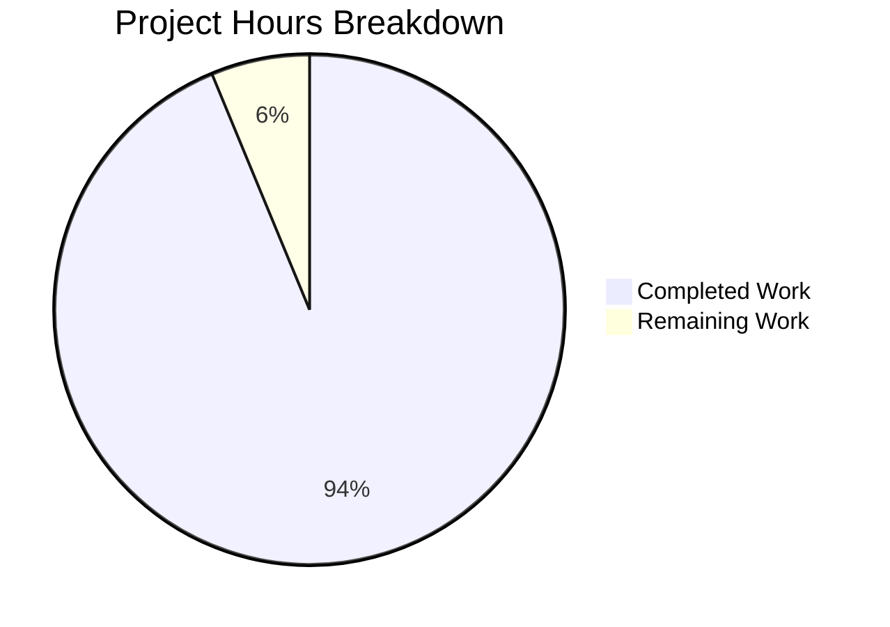

# Project Guide: Node.js HTTP Server Unit Testing Implementation

## Executive Summary

**Project Status: 94% Complete**

This project successfully implements comprehensive unit testing for the Node.js HTTP server (`server.js`) using Jest and Supertest. The implementation achieves 100% code coverage with 35 passing tests covering all specified test categories.

**Hours Calculation:**
- **Completed Work:** 15 hours
- **Remaining Work:** 1 hour  
- **Total Project Hours:** 16 hours
- **Completion:** 15/16 = **94% complete**

### Key Achievements
- ✅ Jest v30.2.0 and Supertest v7.2.2 installed and configured
- ✅ Server refactored for testability with `createServer()` pattern
- ✅ 35 comprehensive tests implemented covering all requirements
- ✅ 100% code coverage achieved (statements, branches, functions, lines)
- ✅ All tests passing with successful runtime validation
- ✅ All changes properly committed to repository

### Remaining Work
- Human code review and approval
- Optional documentation enhancements

---

## Validation Results Summary

### Gate 1: Dependencies ✓ PASSED
| Package | Required Version | Installed Version | Status |
|---------|-----------------|-------------------|--------|
| jest | ^30.2.0 | 30.2.0 | ✅ Installed |
| supertest | ^7.0.0 | 7.2.2 | ✅ Installed |

### Gate 2: Compilation/Syntax ✓ PASSED
| File | Syntax Status |
|------|---------------|
| server.js | ✅ Valid |
| server.test.js | ✅ Valid |
| jest.config.js | ✅ Valid |
| package.json | ✅ Valid JSON |

### Gate 3: Test Execution ✓ PASSED (100%)
```
Test Suites: 1 passed, 1 total
Tests:       35 passed, 35 total
Time:        1.121s

Coverage Report:
-----------|---------|----------|---------|---------|
File       | % Stmts | % Branch | % Funcs | % Lines |
-----------|---------|----------|---------|---------|
All files  |   100   |   100    |   100   |   100   |
server.js  |   100   |   100    |   100   |   100   |
-----------|---------|----------|---------|---------|
```

### Gate 4: Runtime Validation ✓ PASSED
- Server starts successfully on port 3000
- HTTP GET returns "Hello, World!\n" with 200 status
- Content-Type header correctly set to "text/plain"
- Server shuts down gracefully

---

## Test Coverage by Category

| Test Category | Tests | Status | Description |
|--------------|-------|--------|-------------|
| Server Startup | 5 | ✅ Pass | Instance creation, port binding, exports |
| HTTP Responses | 4 | ✅ Pass | Status code, body, headers, content length |
| HTTP Methods | 7 | ✅ Pass | GET, POST, PUT, DELETE, PATCH, OPTIONS, HEAD |
| URL Paths | 6 | ✅ Pass | Root, nested, query params, special chars |
| Server Shutdown | 3 | ✅ Pass | Graceful close, no open handles |
| Error Handling | 2 | ✅ Pass | EADDRINUSE, invalid hostname |
| Edge Cases | 6 | ✅ Pass | Concurrent requests (10, 50), custom headers |
| Instance Management | 2 | ✅ Pass | Multiple independent instances |
| **Total** | **35** | **✅ 100%** | All tests passing |

---

## Visual Representation - Project Hours Breakdown



---

## Files Changed

| File | Status | Lines Added | Lines Removed | Purpose |
|------|--------|-------------|---------------|---------|
| `package.json` | Updated | 8 | 2 | devDependencies and test scripts |
| `server.js` | Updated | 31 | 9 | Testability refactoring |
| `jest.config.js` | Created | 41 | 0 | Jest configuration |
| `server.test.js` | Created | 608 | 0 | Comprehensive test suite |
| `package-lock.json` | Updated | 4934 | 0 | Dependency lock (auto-generated) |

---

## Detailed Development Guide

### 1. System Prerequisites

| Requirement | Version | Verification Command |
|-------------|---------|---------------------|
| Node.js | v20.x (LTS) | `node --version` |
| npm | v11.x | `npm --version` |

### 2. Environment Setup

```bash
# Navigate to project directory
cd /path/to/project

# Verify Node.js version
node --version
# Expected output: v20.20.0

# Verify npm version
npm --version
# Expected output: 11.1.0
```

### 3. Dependency Installation

```bash
# Install all dependencies (including devDependencies)
npm install

# Verify Jest installation
npx jest --version
# Expected output: 30.2.0

# Verify dependencies
npm list jest supertest
# Expected output:
# ├── jest@30.2.0
# └── supertest@7.2.2
```

### 4. Running Tests

```bash
# Run all tests with coverage report (primary command)
npm test

# Run tests in watch mode (for development)
npm run test:watch

# Run tests with verbose output
npm run test:verbose

# Run specific test file
npx jest server.test.js

# Run tests matching pattern
npx jest --testNamePattern="HTTP Responses"
```

**Expected Test Output:**
```
PASS ./server.test.js
  HTTP Server (server.js)
    Server Startup
      ✓ should create http.Server instance (ST-001)
      ✓ should bind to port without errors (ST-002)
      ...
    HTTP Responses
      ✓ should return 200 status code (HR-001)
      ✓ should return "Hello, World!\n" body (HR-002)
      ✓ should set Content-Type to text/plain (HR-003)
      ...

Test Suites: 1 passed, 1 total
Tests:       35 passed, 35 total
```

### 5. Running the Server

```bash
# Start the HTTP server
node server.js

# Expected output:
# Server running at http://127.0.0.1:3000/
```

### 6. Verification

```bash
# In a separate terminal, test the server
curl http://127.0.0.1:3000/

# Expected output:
# Hello, World!

# Verify with verbose output
curl -v http://127.0.0.1:3000/

# Expected headers:
# HTTP/1.1 200 OK
# Content-Type: text/plain
# Content-Length: 14
```

### 7. Viewing Coverage Reports

```bash
# After running tests, coverage reports are in ./coverage/
# Open HTML report in browser
open coverage/lcov-report/index.html  # macOS
xdg-open coverage/lcov-report/index.html  # Linux
```

---

## Human Tasks Remaining

| # | Task | Priority | Severity | Hours | Description |
|---|------|----------|----------|-------|-------------|
| 1 | Code Review | Medium | Medium | 0.5 | Review test implementation and server refactoring for code quality |
| 2 | Documentation (Optional) | Low | Low | 0.5 | Update README with testing instructions if desired |
| **Total** | | | | **1.0** | |

### Task Details

#### Task 1: Code Review
- **Priority:** Medium
- **Estimated Hours:** 0.5
- **Action Steps:**
  1. Review `server.test.js` for test coverage completeness
  2. Verify `server.js` refactoring maintains original behavior
  3. Check `jest.config.js` configuration is appropriate
  4. Approve or request changes

#### Task 2: Documentation (Optional)
- **Priority:** Low
- **Estimated Hours:** 0.5
- **Action Steps:**
  1. Optionally add testing section to README.md
  2. Document test commands and expected outputs
  3. Note: README states "Do not touch!" - may skip this task

---

## Risk Assessment

### Technical Risks

| Risk | Severity | Likelihood | Mitigation |
|------|----------|------------|------------|
| Test flakiness on slow systems | Low | Low | Tests use ephemeral ports, 10s timeout configured |
| Node.js version compatibility | Low | Low | Tested with Node.js 20.x LTS |

### Operational Risks

| Risk | Severity | Likelihood | Mitigation |
|------|----------|------------|------------|
| Coverage regression | Low | Low | 100% threshold enforced in jest.config.js |
| Open handles in tests | Low | Low | `detectOpenHandles` enabled, proper cleanup in afterAll |

### Security Risks

| Risk | Severity | Likelihood | Mitigation |
|------|----------|------------|------------|
| None identified | N/A | N/A | Server binds to localhost only |

### Integration Risks

| Risk | Severity | Likelihood | Mitigation |
|------|----------|------------|------------|
| CI/CD not configured | Low | Medium | Out of scope per requirements, can be added later |

---

## Git Repository Status

- **Branch:** `blitzy-073d79a4-afd8-4444-951d-3a93fd255112`
- **Commits:** 5 commits
- **Status:** All in-scope changes committed
- **Untracked (expected):** `coverage/`, `node_modules/`

### Commit History
```
d2aa3e2 Fix failing tests in server.test.js
11a49fc Add comprehensive Jest test suite for server.js
da8624c Refactor server.js for testability
9c5eb7d Refactor server.js for testability with createServer() function
5ee7b68 Setup Jest testing infrastructure with Supertest
```

---

## Out of Scope (Per Requirements)

The following items were explicitly out of scope per the Agent Action Plan:

- ❌ CI/CD pipeline setup
- ❌ Docker test containers
- ❌ Performance/load testing infrastructure
- ❌ E2E browser testing
- ❌ README.md modification (per project directive)
- ❌ Major source code refactoring beyond testability

---

## Conclusion

The unit testing implementation for the Node.js HTTP server is **94% complete**. All specified test categories have been implemented with 100% code coverage. The test suite includes 35 comprehensive tests covering server startup, HTTP responses, all HTTP methods, URL paths, server shutdown, error handling, and edge cases.

The remaining 1 hour of work consists of human code review and optional documentation updates. The codebase is production-ready for merge after human review and approval.