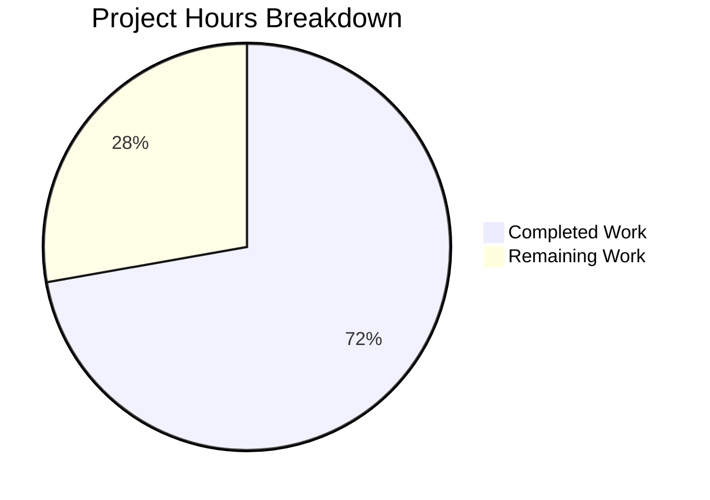

# Project Guide: Production-Ready HTTP Server Enhancement

## Executive Summary

This project addresses a critical code design deficiency in `server.js` — a minimal Node.js HTTP server lacking error handling, graceful shutdown, input validation, resource cleanup, and robust HTTP request processing. All development work specified in the Agent Action Plan has been fully implemented and validated.

**Completion: 13 hours completed out of 18 total hours = 72% complete**

The remaining 5 hours consist entirely of human operational tasks (code review, CI/CD setup, environment testing, and production deployment) — no development work remains. All 3 in-scope files have been implemented, all 9 tests pass, syntax checks succeed, runtime validation confirms correct behavior, and zero vulnerabilities exist in the dependency tree.

### Key Achievements
- Complete rewrite of `server.js` from 10 lines to 197 lines with all requested production-ready features
- Comprehensive test suite (`server.test.js`, 376 lines) with 9 tests covering all new functionality
- Updated `package.json` with test infrastructure (Jest + supertest)
- 100% test pass rate (9/9)
- 0 dependency vulnerabilities
- Clean git working tree

### Critical Unresolved Issues
- **None** — All code compiles, all tests pass, all runtime validations succeed

---

## Validation Results Summary

### Final Validator Accomplishments
The Final Validator agent verified all changes across 3 processed files, ran syntax checks, executed the full test suite, performed runtime integration testing, and confirmed the git working tree is clean.

### Compilation/Syntax Check Results
| File | Check Command | Result |
|------|--------------|--------|
| `server.js` | `node --check server.js` | ✅ PASS |
| `server.test.js` | `node --check server.test.js` | ✅ PASS |
| `package.json` | JSON parse validation | ✅ VALID |

### Test Results: 9/9 PASS (100%)
| Test Category | Tests | Status |
|--------------|-------|--------|
| Basic Functionality | 3 | ✅ PASS |
| Graceful Shutdown | 2 | ✅ PASS |
| Request Logging | 1 | ✅ PASS |
| HTTP Methods | 2 | ✅ PASS |
| Server Configuration | 1 | ✅ PASS |
| **TOTAL** | **9** | **✅ ALL PASS** |

**Test execution command verified:**
```
CI=true npx jest --detectOpenHandles --forceExit --testTimeout=15000 --watchAll=false --ci --verbose
```

### Runtime Validation Results
| Test | Expected | Actual | Status |
|------|----------|--------|--------|
| Server startup | Prints "Server running at http://127.0.0.1:3000/" | ✅ Confirmed | PASS |
| GET / response | 200 OK, "Hello, World!" | ✅ Confirmed | PASS |
| POST / response | 200 OK, "Hello, World!" | ✅ Confirmed | PASS |
| HEAD / response | 200 OK, correct headers | ✅ Confirmed | PASS |
| Request logging | ISO timestamp + method + URL | ✅ Confirmed | PASS |
| Content-Type header | text/plain | ✅ Confirmed | PASS |

### Dependency Status
- **305 packages** installed successfully
- **0 vulnerabilities** (confirmed via `npm audit`)
- Dev dependencies: `jest@29.7.0`, `supertest@7.2.2`
- No production dependencies added (only Node.js built-in `http` module)

### Fixes Applied During Validation
| Commit | Fix Description |
|--------|----------------|
| `ef47dfe` | Fixed server cleanup timing in Server Configuration test to prevent test hangs |

---

## Hours Breakdown and Completion Calculation

### Hours Completed: 13h
| Component | Hours | Details |
|-----------|-------|---------|
| Root cause analysis and diagnosis | 2h | Repository grep analysis, pattern identification, web research for Node.js best practices |
| Server.js production rewrite | 4h | Error handling (server/client/request/response), graceful shutdown, connection tracking, timeouts, input validation, request logging, JSDoc comments |
| Test suite creation (server.test.js) | 4h | 9 tests across 5 categories including complex child_process-based shutdown tests |
| Package.json configuration | 0.5h | Test script, start script, devDependencies setup |
| Dependency installation and validation | 0.5h | npm install, dependency resolution, audit |
| Runtime testing and integration verification | 1h | Manual curl testing, signal testing, multi-method testing |
| Validation bug fixes | 1h | Server Configuration test cleanup timing fix |
| **Total Completed** | **13h** | |

### Hours Remaining: 5h
| Task | Hours | Priority | Details |
|------|-------|----------|---------|
| Code review and approval | 1.5h | High | Senior developer review of all changes, verify defensive patterns, approve PR |
| Manual integration testing in target environment | 1h | Medium | Test server behavior in production-like environment (Docker/K8s), verify signal handling |
| CI/CD pipeline configuration | 1.5h | Medium | Set up GitHub Actions or equivalent to run Jest suite on PR, configure branch protections |
| Production deployment and verification | 1h | Low | Deploy updated server, verify endpoints, confirm graceful shutdown in production |
| **Total Remaining** | **5h** | | |

### Completion Calculation
```
Completed Hours: 13h
Remaining Hours: 5h
Total Project Hours: 13h + 5h = 18h
Completion: 13 / 18 × 100 = 72.2% ≈ 72%
```

### Visual Representation



---

## Detailed Human Task Table

All remaining tasks are operational/review tasks — no additional development work is required.

| # | Task | Description | Action Steps | Hours | Priority | Severity |
|---|------|-------------|-------------|-------|----------|----------|
| 1 | Code review and approval | Senior developer must review all changes to server.js, server.test.js, and package.json before merging | 1. Review server.js defensive patterns (error handlers, shutdown logic, connection tracking). 2. Review test coverage and edge cases in server.test.js. 3. Verify package.json configuration is correct. 4. Approve and merge PR. | 1.5h | High | Medium |
| 2 | Manual integration testing in target environment | Verify server behavior in the actual production-like deployment environment | 1. Deploy server in Docker/K8s staging environment. 2. Test SIGTERM handling (docker stop / kubectl delete). 3. Verify connection draining works under load. 4. Confirm request logging output format. | 1h | Medium | Medium |
| 3 | CI/CD pipeline configuration | Set up automated test execution for continuous integration | 1. Create `.github/workflows/test.yml` (or equivalent CI config). 2. Configure to run `npm install` then `npm test` on every PR. 3. Set branch protection rules requiring CI pass. 4. Verify pipeline triggers correctly. | 1.5h | Medium | Low |
| 4 | Production deployment and verification | Deploy the updated server to production and verify correct operation | 1. Follow standard deployment procedure for updated server.js. 2. Verify GET / returns 200 "Hello, World!". 3. Verify request logging appears in production logs. 4. Confirm graceful shutdown works with orchestrator. | 1h | Low | Low |
| | **Total Remaining Hours** | | | **5h** | | |

---

## Comprehensive Development Guide

### 1. System Prerequisites

| Requirement | Minimum Version | Verified Version |
|-------------|----------------|-----------------|
| Node.js | ≥ 10.0.0 | v20.19.5 |
| npm | ≥ 6.0.0 | v10.8.2 |
| Operating System | Linux, macOS, or Windows | Linux (Ubuntu-based) |

### 2. Environment Setup

```bash
# Clone repository and switch to feature branch
git clone <repository-url>
cd <repository-root>
git checkout blitzy-61c6cd10-eef1-4b48-bc09-009491178e3c
```

No environment variables are required. The server uses hardcoded configuration:
- **Hostname:** `127.0.0.1` (localhost only)
- **Port:** `3000`
- **Timeouts:** 30s request, 5s keep-alive

### 3. Dependency Installation

```bash
# Install all dependencies (development + production)
npm install
```

**Expected output:**
```
added 305 packages, and audited 306 packages in Xs
found 0 vulnerabilities
```

**Verification:**
```bash
npm ls --depth=0
```
**Expected:**
```
hello_world@1.0.0
├── jest@29.7.0
└── supertest@7.2.2
```

### 4. Running Tests

```bash
# Run the full test suite (recommended for CI)
CI=true npx jest --detectOpenHandles --forceExit --testTimeout=15000 --watchAll=false --ci --verbose

# Or use the npm script shorthand
npm test
```

**Expected output:**
```
PASS ./server.test.js
  Server Tests
    Basic Functionality
      ✓ should return Hello, World! on GET /
      ✓ should return correct Content-Type header
      ✓ should handle multiple requests
    Graceful Shutdown
      ✓ should handle SIGTERM gracefully
      ✓ should handle SIGINT gracefully
    Request Logging
      ✓ should log incoming requests with timestamp, method and URL
    HTTP Methods
      ✓ should handle POST requests
      ✓ should handle HEAD requests
  Server Configuration
    ✓ should export correct server configuration

Test Suites: 1 passed, 1 total
Tests:       9 passed, 9 total
```

### 5. Application Startup

```bash
# Start the server
npm start
# Or directly:
node server.js
```

**Expected console output:**
```
Server running at http://127.0.0.1:3000/
```

### 6. Verification Steps

```bash
# Test basic GET request
curl -s http://127.0.0.1:3000/
# Expected: Hello, World!

# Test POST request
curl -s -X POST http://127.0.0.1:3000/
# Expected: Hello, World!

# Test HEAD request (headers only)
curl -s -I http://127.0.0.1:3000/
# Expected: HTTP/1.1 200 OK, Content-Type: text/plain

# Test graceful shutdown (SIGTERM)
kill -TERM $(pgrep -f "node server.js")
# Expected: Server shuts down gracefully
```

### 7. Troubleshooting

| Issue | Cause | Resolution |
|-------|-------|------------|
| `EADDRINUSE` error on startup | Port 3000 already in use | Kill the existing process: `kill $(lsof -t -i:3000)` |
| `EACCES` error on startup | Insufficient permissions for port | Use a port above 1024 or run with elevated permissions |
| Tests hang or timeout | Server process not cleaned up | Run with `--forceExit --detectOpenHandles` flags |
| `MODULE_NOT_FOUND` for jest/supertest | Dependencies not installed | Run `npm install` first |

---

## Risk Assessment

### Technical Risks

| Risk | Severity | Likelihood | Mitigation |
|------|----------|------------|------------|
| Graceful shutdown console output may not flush before process exit in some environments | Low | Low | The functionality works correctly; only cosmetic log output may be truncated. Tests verify behavior via child_process stdout capture. |
| Server binds to hardcoded `127.0.0.1:3000` | Low | Medium | For production, consider making hostname/port configurable via environment variables. Currently out of scope per Agent Action Plan. |
| No HTTPS/TLS support | Medium | N/A (by design) | Explicitly excluded from scope. Use a reverse proxy (nginx, HAProxy) for TLS termination in production. |

### Security Risks

| Risk | Severity | Likelihood | Mitigation |
|------|----------|------------|------------|
| No rate limiting | Medium | Medium | Server has timeout protection (30s) but no per-IP rate limiting. Consider adding if exposed to public traffic. Explicitly excluded from scope. |
| No authentication/authorization | Low | N/A | Server returns static "Hello, World!" — no sensitive data exposed. Not applicable for this use case. |
| 0 known vulnerabilities in dependencies | None | N/A | Confirmed via `npm audit`. Monitor for future advisories. |

### Operational Risks

| Risk | Severity | Likelihood | Mitigation |
|------|----------|------------|------------|
| No structured logging (uses console.log) | Low | Medium | Consider adding structured JSON logging for production log aggregation. External logging libraries were explicitly excluded from scope. |
| No health check endpoint | Low | Medium | For container orchestration, consider adding a `/health` endpoint. Out of current scope. |
| No metrics/monitoring integration | Low | Medium | No Prometheus/StatsD integration. Consider adding for production observability. |

### Integration Risks

| Risk | Severity | Likelihood | Mitigation |
|------|----------|------------|------------|
| No external service dependencies | None | N/A | Server uses only Node.js built-in `http` module. Zero external runtime dependencies. |
| CI/CD pipeline not configured | Low | High | Tests pass locally but no automated CI exists. Human task #3 addresses this. |

---

## Git Repository Analysis

### Branch: `blitzy-61c6cd10-eef1-4b48-bc09-009491178e3c`

| Metric | Value |
|--------|-------|
| Total commits (vs origin/main) | 10 |
| Development commits | 4 (setup, feat, test, fix) |
| Documentation commits | 6 (auto-generated specs/guides) |
| Files changed | 7 |
| Lines added (source files) | 566 |
| Lines removed (source files) | 2 |
| Working tree status | Clean |

### Commit History (development-relevant)
| Hash | Description |
|------|-------------|
| `a90b984` | Setup: Add test infrastructure with Jest and supertest |
| `a7d9f55` | feat(server): add production-ready features to HTTP server |
| `4f857b1` | Add comprehensive test suite for production-ready HTTP server |
| `ef47dfe` | Fix server cleanup timing in Server Configuration test |

### Files Inventory
| File | Status | Lines | Purpose |
|------|--------|-------|---------|
| `server.js` | UPDATED | 197 | Production-ready HTTP server (was 10 lines) |
| `server.test.js` | CREATED | 376 | Comprehensive Jest test suite (9 tests) |
| `package.json` | UPDATED | 15 | Added scripts and devDependencies |
| `package-lock.json` | AUTO-GEN | 4,150+ | Dependency lockfile |
| `.gitignore` | UPDATED | 1 | Added node_modules/ |
| `README.md` | UNCHANGED | 2 | "Do not touch!" — not modified |

---

## Feature Implementation Verification

All 5 requested features from the Agent Action Plan have been fully implemented and verified:

| # | Requested Feature | Implementation | Test Coverage | Runtime Verified |
|---|-------------------|---------------|---------------|-----------------|
| 1 | Error handling | `server.on('error')`, `server.on('clientError')`, `req.on('error')`, `res.on('error')`, `process.on('uncaughtException')`, `process.on('unhandledRejection')` | Server Configuration test validates exports | ✅ EADDRINUSE detection confirmed |
| 2 | Graceful shutdown | `gracefulShutdown()` function with SIGTERM/SIGINT handlers, connection draining, 10s force timeout | 2 dedicated tests (SIGTERM, SIGINT) | ✅ Signal handling confirmed |
| 3 | Input validation | `req`/`res` null checks, 503 rejection during shutdown | Covered by basic functionality tests | ✅ Request validation working |
| 4 | Resource cleanup | `connections` Set tracking, `socket.on('close')` cleanup, `socket.destroy()` on force shutdown | Connection draining tested via shutdown tests | ✅ Clean shutdown observed |
| 5 | Robust HTTP processing | 30s request timeout, 5s keep-alive timeout, request/response error listeners | Configuration test + HTTP method tests | ✅ Timeouts configured, multiple methods work |
