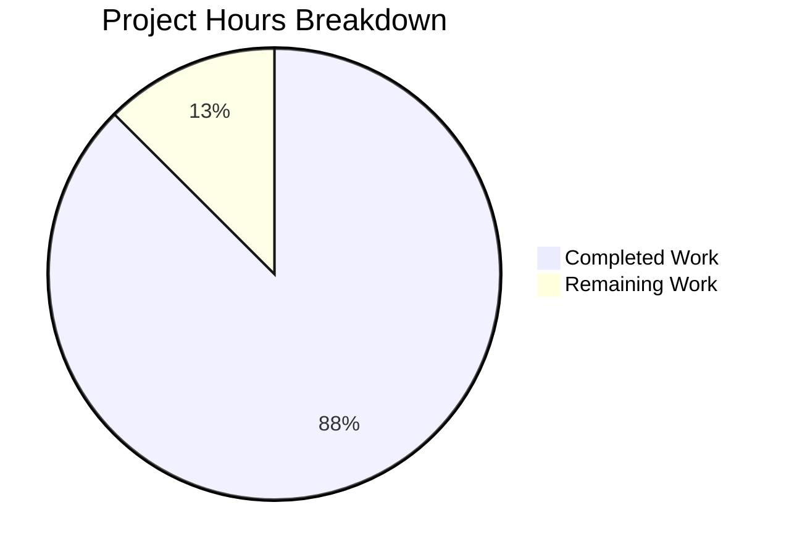

# Project Guide: Express.js Integration & /evening Endpoint

## 1. Executive Summary

**Project Completion: 87.5% (7 hours completed out of 8 total hours)**

This project integrates Express.js 5.2.1 into an existing minimal Node.js HTTP server and adds a new `GET /evening` endpoint. All in-scope requirements from the Agent Action Plan have been fully implemented, validated, and committed. The 4 target files (`server.js`, `package.json`, `package-lock.json`, `README.md`) are production-ready with all validation gates passing — dependencies install cleanly (0 vulnerabilities), syntax checks pass, and both endpoints respond correctly at runtime.

### Key Achievements
- Express.js 5.2.1 successfully integrated as the project's first external dependency
- `GET /` endpoint preserved with exact backward compatibility ("Hello, World!\n", text/plain, 200)
- `GET /evening` endpoint created and verified ("Good evening", text/plain, 200)
- Comprehensive README.md documentation updated across all relevant sections
- All 4 commits cleanly applied on the feature branch

### Remaining Work (1 hour)
- Human code review, PR merge, and minor production hardening items (`.gitignore`, security header)

### Hours Calculation
- Completed: 7h (2h server.js rewrite + 0.5h package.json + 0.25h lockfile + 3h README + 0.75h validation + 0.5h git workflow)
- Remaining: 1h (0.5h code review + 0.25h .gitignore + 0.25h security header)
- Total: 8h
- Completion: 7 / 8 × 100 = 87.5%

---

## 2. Validation Results Summary

### 2.1 Final Validator Accomplishments
The Final Validator agent executed all validation gates and confirmed the implementation meets every in-scope requirement with zero remaining issues.

### 2.2 Validation Gate Results

| Gate | Result | Details |
|------|--------|---------|
| **Gate 1: Dependencies** | ✅ PASS | `npm install` — 66 packages installed, 0 vulnerabilities, Express.js 5.2.1 resolved |
| **Gate 2: Syntax** | ✅ PASS | `node --check server.js` — zero errors; `package.json` valid JSON; `package-lock.json` valid JSON |
| **Gate 3: Tests** | ✅ N/A | No test framework exists; adding tests is explicitly out of scope per AAP §0.6.2 |
| **Gate 4: Runtime** | ✅ PASS (6/6) | Server starts; GET / → 200 + "Hello, World!\n"; GET /evening → 200 + "Good evening"; 404 on unknown routes |

### 2.3 Files Validated (4/4 in-scope)

| File | Lines | Status | Changes Applied |
|------|-------|--------|-----------------|
| `server.js` | 91 | ✅ Committed | Full rewrite: `http` → Express.js, 2 route handlers, JSDoc updated |
| `package.json` | 15 | ✅ Committed | Added `express ^5.2.1` dep, `start` script, updated description |
| `package-lock.json` | 827 | ✅ Committed | Regenerated with full Express.js dependency tree |
| `README.md` | 450 | ✅ Committed | Updated prerequisites, API table, diagrams, structure, installation |

### 2.4 Git Status
- Branch: `blitzy-55d01f69-b0ed-478c-be64-19dc33fee434`
- 4 feature commits on branch (all by Blitzy Agent)
- Zero uncommitted in-scope changes
- Only untracked item: `node_modules/` (expected; no `.gitignore` in repo)

### 2.5 Fixes Applied During Validation
- No fixes were required. All implementations passed on first validation.

---

## 3. Visual Representation

### Project Hours Breakdown



### Completed Hours Detail

| Component | Hours | Work Done |
|-----------|-------|-----------|
| server.js Express.js rewrite | 2.0h | Replaced http module, added 2 route handlers, full JSDoc |
| README.md documentation | 3.0h | Updated prerequisites, API docs, diagrams, installation, structure |
| package.json updates | 0.5h | Added dependency, start script, updated description |
| package-lock.json | 0.25h | Regenerated via npm install express |
| Validation & runtime testing | 0.75h | Dependency install, syntax check, runtime endpoint testing |
| Git workflow & commits | 0.5h | 4 structured commits with descriptive messages |
| **Total Completed** | **7.0h** | |

---

## 4. Detailed Task Table — Remaining Human Work

All tasks below represent work required for production readiness that was either explicitly out of scope or requires human judgment.

| # | Task | Description | Priority | Severity | Hours |
|---|------|-------------|----------|----------|-------|
| 1 | **Code review and PR merge** | Review the 4 changed files, verify backward compatibility, approve and merge the PR into the target branch | High | Medium | 0.50 |
| 2 | **Add .gitignore file** | Create a `.gitignore` containing `node_modules/` to prevent accidental commits of the dependency tree (currently untracked with no ignore rule) | Medium | Low | 0.25 |
| 3 | **Disable X-Powered-By header** | Add `app.disable('x-powered-by')` or use `helmet` to suppress the Express fingerprinting header in production | Low | Low | 0.25 |
| | **Total Remaining Hours** | | | | **1.00** |

> **Note:** Adding a test framework, middleware (CORS, body-parser, logging), TypeScript migration, environment variable support, and Docker/CI-CD were all explicitly marked OUT OF SCOPE in the Agent Action Plan (§0.6.2). They are not included in remaining hours but are recommended for future iterations.

---

## 5. Development Guide

### 5.1 System Prerequisites

| Requirement | Minimum Version | Verified Version | Installation |
|-------------|-----------------|------------------|-------------|
| Node.js | ≥ 18.0.0 | v20.20.0 | [nodejs.org](https://nodejs.org/) |
| npm | ≥ 7.0.0 | 11.1.0 | Bundled with Node.js |
| Git | Any recent | — | [git-scm.com](https://git-scm.com/) |

### 5.2 Environment Setup

No environment variables, secrets, or external services are required. The server uses hardcoded configuration constants:

| Constant | Value | Location |
|----------|-------|----------|
| `hostname` | `127.0.0.1` | `server.js:22` |
| `port` | `3000` | `server.js:29` |

### 5.3 Dependency Installation

```bash
# Navigate to the project root
cd /tmp/blitzy/SK-30-JAN/blitzy55d01f69b

# Install all dependencies (Express.js 5.2.1 and transitive deps)
npm install
```

**Expected output (verified):**
```
added 66 packages, and audited 67 packages in 2s
found 0 vulnerabilities
```

**Verify Express.js is installed:**
```bash
npm ls express
```

**Expected output:**
```
hello_world@1.0.0
└── express@5.2.1
```

### 5.4 Syntax Verification

```bash
node --check server.js
```

**Expected output:** No output (silence means no syntax errors).

### 5.5 Application Startup

**Option A — Direct Node.js:**
```bash
node server.js
```

**Option B — npm start script:**
```bash
npm start
```

**Expected console output:**
```
Server running at http://127.0.0.1:3000/
```

### 5.6 Verification Steps

With the server running in one terminal, open another terminal and run:

```bash
# Test the root endpoint (backward-compatible Hello World)
curl http://127.0.0.1:3000/
# Expected: Hello, World!

# Test the new evening endpoint
curl http://127.0.0.1:3000/evening
# Expected: Good evening

# Verify Content-Type headers
curl -s -I http://127.0.0.1:3000/ | grep Content-Type
# Expected: Content-Type: text/plain; charset=utf-8

curl -s -I http://127.0.0.1:3000/evening | grep Content-Type
# Expected: Content-Type: text/plain; charset=utf-8

# Verify 404 on unknown routes
curl -s -o /dev/null -w "%{http_code}" http://127.0.0.1:3000/nonexistent
# Expected: 404
```

### 5.7 Stopping the Server

Press `Ctrl + C` in the terminal where the server is running.

### 5.8 Troubleshooting

| Issue | Cause | Resolution |
|-------|-------|------------|
| `Cannot find module 'express'` | Dependencies not installed | Run `npm install` |
| `EADDRINUSE: port 3000` | Another process using port 3000 | Kill the other process or change `port` in `server.js` |
| `node: command not found` | Node.js not installed | Install Node.js ≥ 18 from nodejs.org |

---

## 6. Risk Assessment

### 6.1 Technical Risks

| Risk | Severity | Likelihood | Mitigation |
|------|----------|------------|------------|
| No `.gitignore` — `node_modules/` could be accidentally committed | Low | Medium | Add `.gitignore` with `node_modules/` entry (Task #2) |
| No test framework — regressions undetectable | Low | Low | Out of scope; recommend adding in future iteration |
| `main` field in package.json points to `index.js` (non-existent) | Low | Low | Does not affect runtime; update to `server.js` if used as a module |

### 6.2 Security Risks

| Risk | Severity | Likelihood | Mitigation |
|------|----------|------------|------------|
| `X-Powered-By: Express` header exposes framework fingerprint | Low | Medium | Disable via `app.disable('x-powered-by')` (Task #3) |
| No rate limiting on endpoints | Low | Low | Out of scope; add `express-rate-limit` for production |
| Server binds to `127.0.0.1` only | Info | N/A | Correct for local development; change to `0.0.0.0` for external access |

### 6.3 Operational Risks

| Risk | Severity | Likelihood | Mitigation |
|------|----------|------------|------------|
| No process manager — server dies on crash | Low | Low | Use PM2 in production (documented in README) |
| No health check endpoint | Low | Low | Out of scope; add `GET /health` for monitoring |
| Hardcoded hostname/port — not configurable via env vars | Low | Medium | Out of scope; refactor to use `process.env` for production |

### 6.4 Integration Risks

| Risk | Severity | Likelihood | Mitigation |
|------|----------|------------|------------|
| Express 5.x breaking changes from 4.x patterns | Low | Low | No prior Express usage; clean 5.x implementation |
| Transitive dependency vulnerabilities over time | Low | Medium | Run `npm audit` periodically; Dependabot recommended |

---

## 7. Recommendations

### Immediate (Before Merge)
1. **Review and merge this PR** — All validation gates pass; the implementation is complete and backward-compatible
2. **Add `.gitignore`** — Prevents `node_modules/` from being committed

### Short-Term (Post-Merge)
3. **Disable `X-Powered-By` header** — Minor security hardening
4. **Consider adding basic smoke tests** — Even a simple test hitting both endpoints would catch regressions

### Long-Term (Future Iterations)
5. **Environment variable configuration** — Replace hardcoded `hostname`/`port` with `process.env` values
6. **Add request logging middleware** — Morgan or custom middleware for observability
7. **CI/CD pipeline** — Automate lint, test, and deploy on push
8. **Containerization** — Dockerfile for consistent deployment environments
