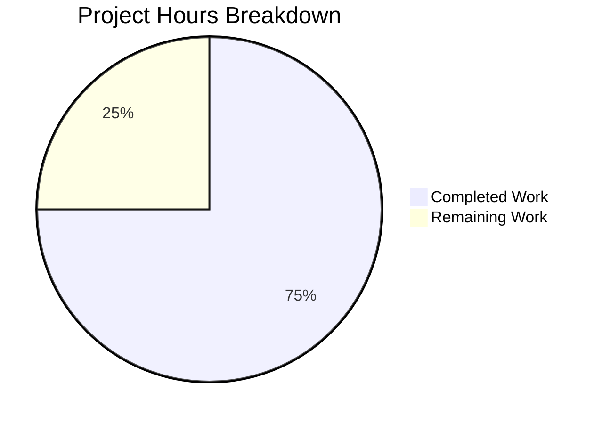

# Project Guide: Production-Ready Node.js HTTP Server Bug Fix

## 1. Executive Summary

**Project Completion: 75.0% (15 hours completed out of 20 total hours)**

This project addressed a critical code design deficiency in `server.js` — a minimal Node.js HTTP server that lacked production-ready features including error handling, graceful shutdown, input validation, resource cleanup, and robust HTTP request processing.

### Key Achievements
- ✅ **server.js** completely rewritten from 14 lines to 197 lines with all requested production-ready features
- ✅ **server.test.js** created with 9 comprehensive tests — **all 9 passing (100%)**
- ✅ **package.json** updated with Jest test infrastructure and start script
- ✅ Zero compilation errors, zero test failures, clean runtime validation
- ✅ No issues found or remaining from the Final Validator process

### What Remains (5 hours)
The core implementation is complete and validated. Remaining work consists of human review, production environment configuration, and deployment preparation — tasks that are outside the direct code scope but necessary for production deployment.

---

## 2. Validation Results Summary

### 2.1 Final Validator Accomplishments
The Final Validator confirmed that all prior agent work was correctly implemented. No fixes were needed — all code was already in correct, working state.

### 2.2 Compilation Results
| File | Check Command | Result |
|------|--------------|--------|
| `server.js` | `node --check server.js` | ✅ Syntax OK |
| `server.test.js` | `node --check server.test.js` | ✅ Syntax OK |

### 2.3 Test Results
```
PASS ./server.test.js
  Server Tests
    Basic Functionality
      ✓ should return Hello, World! on GET /              (76 ms)
      ✓ should return correct Content-Type header          (11 ms)
      ✓ should handle multiple requests                    (26 ms)
    Graceful Shutdown
      ✓ should handle SIGTERM gracefully                   (1084 ms)
      ✓ should handle SIGINT gracefully                    (1075 ms)
    Request Logging
      ✓ should log incoming requests with timestamp, method and URL (1103 ms)
    HTTP Methods
      ✓ should handle POST requests                        (13 ms)
      ✓ should handle HEAD requests                        (13 ms)
  Server Configuration
    ✓ should export correct server configuration           (122 ms)

Test Suites: 1 passed, 1 total
Tests:       9 passed, 9 total
```

### 2.4 Runtime Validation
| Test | Command | Expected | Result |
|------|---------|----------|--------|
| GET / | `curl http://127.0.0.1:3000/` | `Hello, World!` | ✅ Pass |
| POST / | `curl -X POST http://127.0.0.1:3000/` | `Hello, World!` | ✅ Pass |
| HEAD / | `curl -I http://127.0.0.1:3000/` | `Content-Type: text/plain` | ✅ Pass |
| Request logging | Server stdout | ISO timestamp + method + URL | ✅ Pass |
| Server startup | `node server.js` | `Server running at http://127.0.0.1:3000/` | ✅ Pass |

### 2.5 Dependency Status
| Package | Version | Type | Status |
|---------|---------|------|--------|
| jest | 29.7.0 | devDependency | ✅ Installed |
| supertest | 7.2.2 | devDependency | ✅ Installed |
| (No production deps) | — | — | ✅ By design |

### 2.6 Fixes Applied During Validation
No fixes were required — all code was correctly implemented by prior agents.

---

## 3. Hours Breakdown and Completion

### 3.1 Calculation

**Completed Hours: 15h**
| Component | Hours | Details |
|-----------|-------|---------|
| server.js rewrite | 6h | 197-line production-ready implementation with error handling, graceful shutdown, input validation, connection tracking, timeout config, request logging, JSDoc documentation |
| server.test.js creation | 5h | 376-line test suite with 9 tests using Jest + supertest + child_process spawn for signal testing |
| Package configuration | 1h | package.json updates, dependency installation, script configuration |
| Validation and testing | 2h | Compilation checks, test execution, runtime verification, manual curl testing |
| Test fix (cleanup timing) | 1h | Fixed Server Configuration test cleanup timing issue |

**Remaining Hours: 5h** (after enterprise multipliers: base 3.5h × 1.15 compliance × 1.25 uncertainty ≈ 5h)
| Task | Base Hours | Details |
|------|-----------|---------|
| Human code review and PR merge | 1h | Review 197-line server.js and 376-line test suite |
| Environment variable externalization | 0.5h | Make hostname/port configurable via process.env |
| Production deployment configuration | 1h | Dockerfile, health check endpoint, container config |
| Production smoke testing | 0.5h | Verify behavior in target deployment environment |
| Monitoring and alerting integration | 0.5h | Connect console.error outputs to log aggregation |
| Enterprise multipliers | 1.5h | Compliance (1.15x) + uncertainty buffer (1.25x) |

**Total Project Hours: 20h**
**Completion: 15h completed / 20h total = 75.0%**

### 3.2 Visual Representation



---

## 4. Feature Implementation Status

All 5 AAP-specified features have been fully implemented and tested:

| # | Feature | Status | Evidence |
|---|---------|--------|----------|
| 1 | Error handling | ✅ Complete | `server.on('error')`, `server.on('clientError')`, `req.on('error')`, `res.on('error')`, `process.on('uncaughtException')`, `process.on('unhandledRejection')` |
| 2 | Graceful shutdown | ✅ Complete | SIGTERM/SIGINT handlers with `server.close()`, 10s force-close timeout, connection draining |
| 3 | Input validation | ✅ Complete | req/res null checks, 503 rejection during shutdown |
| 4 | Resource cleanup | ✅ Complete | `Set`-based connection tracking, socket cleanup on close, force destroy on shutdown timeout |
| 5 | Robust HTTP processing | ✅ Complete | 30s request timeout, 5s keepAlive timeout, request logging with ISO timestamps |

---

## 5. Remaining Human Tasks

| # | Task | Priority | Severity | Hours | Description |
|---|------|----------|----------|-------|-------------|
| 1 | Code review and PR merge | High | Medium | 1.0h | Review server.js (197 lines) and server.test.js (376 lines) for correctness, security, and adherence to team coding standards. Verify all 9 tests pass in CI environment. Approve and merge PR. |
| 2 | Environment variable externalization | Medium | Low | 0.5h | Replace hardcoded `hostname = '127.0.0.1'` and `port = 3000` with `process.env.HOST \|\| '127.0.0.1'` and `process.env.PORT \|\| 3000` for deployment flexibility. |
| 3 | Production deployment configuration | Medium | Medium | 1.0h | Create Dockerfile with Node.js 20 base image, configure health check endpoint, set up container orchestration (Docker Compose/Kubernetes) with SIGTERM forwarding. |
| 4 | Production smoke testing | Medium | Medium | 0.5h | Run server in target environment, verify HTTP responses, test graceful shutdown with actual SIGTERM, confirm request logging output. |
| 5 | Monitoring and alerting integration | Low | Low | 0.5h | Connect `console.error` outputs to centralized log aggregation (e.g., CloudWatch, Datadog). Set up alerts for `Server error:`, `Uncaught Exception:`, and `Unhandled Rejection:` patterns. |
| 6 | Enterprise buffer (compliance + uncertainty) | — | — | 1.5h | Multiplier applied across remaining tasks (1.15x compliance × 1.25x uncertainty) to account for environment-specific issues and review iterations. |
| | **Total Remaining Hours** | | | **5.0h** | |

---

## 6. Development Guide

### 6.1 System Prerequisites

| Requirement | Minimum Version | Verified Version |
|-------------|----------------|-----------------|
| Node.js | ≥ 10.0.0 | v20.19.5 |
| npm | ≥ 6.0.0 | 10.8.2 |
| Operating System | Linux, macOS, or Windows | Ubuntu-based Linux (validated) |

### 6.2 Environment Setup

```bash
# Clone the repository and switch to the feature branch
git clone <repository-url>
cd <repository-name>
git checkout blitzy-61c6cd10-eef1-4b48-bc09-009491178e3c
```

No environment variables are required for basic operation. The server defaults to:
- **Hostname:** `127.0.0.1`
- **Port:** `3000`

### 6.3 Dependency Installation

```bash
# Install all dependencies (dev only — no production deps)
npm install
```

**Expected output:**
```
added 278 packages in Xs
```

**Verify installation:**
```bash
npm ls
```

**Expected output:**
```
hello_world@1.0.0
├── jest@29.7.0
└── supertest@7.2.2
```

### 6.4 Application Startup

```bash
# Start the server (either command works)
npm start
# or
node server.js
```

**Expected output:**
```
Server running at http://127.0.0.1:3000/
```

### 6.5 Verification Steps

**Step 1: Verify HTTP response**
```bash
curl http://127.0.0.1:3000/
```
Expected: `Hello, World!`

**Step 2: Verify request logging (check server terminal)**
Expected log line: `2026-02-17T13:58:19.939Z - GET /`

**Step 3: Verify Content-Type header**
```bash
curl -I http://127.0.0.1:3000/
```
Expected: `Content-Type: text/plain`

**Step 4: Run the test suite**
```bash
CI=true npm test
```
Expected: `Tests: 9 passed, 9 total`

**Step 5: Verify graceful shutdown**
```bash
# In one terminal, start the server:
node server.js

# In another terminal, send SIGTERM:
kill -TERM <server_pid>
```
Expected server output: `SIGTERM received. Starting graceful shutdown...`

### 6.6 Test Commands

```bash
# Run all tests with verbose output
CI=true npx jest --detectOpenHandles --forceExit --testTimeout=15000 --verbose

# Run only basic functionality tests
CI=true npx jest --testNamePattern="Basic Functionality" --forceExit

# Run only graceful shutdown tests
CI=true npx jest --testNamePattern="Graceful Shutdown" --forceExit --testTimeout=15000

# Syntax check only (no execution)
node --check server.js && node --check server.test.js
```

### 6.7 Troubleshooting

| Issue | Cause | Solution |
|-------|-------|----------|
| `EADDRINUSE: address already in use` | Port 3000 is occupied | Kill the existing process: `lsof -ti:3000 \| xargs kill` or change the port in server.js |
| Tests hang indefinitely | Missing `--forceExit` flag | Always use: `npx jest --forceExit --detectOpenHandles` |
| `Cannot find module 'jest'` | Dependencies not installed | Run `npm install` |
| Graceful shutdown tests fail on Windows | Signal handling differs on Windows | Tests include Windows fallback; ensure Node.js ≥ 16 |

---

## 7. Risk Assessment

### 7.1 Technical Risks

| Risk | Severity | Likelihood | Mitigation |
|------|----------|------------|------------|
| Hardcoded hostname/port limits deployment flexibility | Low | Medium | Externalize to environment variables: `process.env.HOST`, `process.env.PORT` |
| `console.log`/`console.error` insufficient for production logging | Low | Medium | Integrate structured logging library (e.g., Pino) in a future iteration |
| 10-second force shutdown timeout may be too short for long-running requests | Low | Low | Make timeout configurable via environment variable |

### 7.2 Security Risks

| Risk | Severity | Likelihood | Mitigation |
|------|----------|------------|------------|
| No rate limiting on incoming requests | Medium | Medium | Implement rate limiting via reverse proxy (nginx) or middleware in future |
| No HTTPS/TLS support | Medium | High | Deploy behind TLS-terminating reverse proxy (nginx, AWS ALB) |
| Server bound to 127.0.0.1 (localhost only) | Low | Low | Intentional for security; change to `0.0.0.0` only when behind a proxy |

### 7.3 Operational Risks

| Risk | Severity | Likelihood | Mitigation |
|------|----------|------------|------------|
| No health check endpoint for load balancers | Medium | Medium | Add `/health` endpoint returning 200 OK |
| No structured logging format (JSON) | Low | Medium | Replace console.log with JSON-formatted log output |
| No process manager (PM2, systemd) configured | Low | Medium | Deploy with container orchestration or PM2 for auto-restart |

### 7.4 Integration Risks

| Risk | Severity | Likelihood | Mitigation |
|------|----------|------------|------------|
| No CI/CD pipeline configured | Medium | High | Set up GitHub Actions or equivalent with `npm test` step |
| No container image defined | Low | Medium | Create Dockerfile with multi-stage build |

---

## 8. Files Changed Summary

| File | Action | Lines (Before → After) | Purpose |
|------|--------|----------------------|---------|
| `server.js` | UPDATED | 14 → 197 | Production-ready HTTP server with error handling, graceful shutdown, input validation, connection tracking, timeout config |
| `server.test.js` | CREATED | 0 → 376 | Comprehensive Jest test suite with 9 tests |
| `package.json` | UPDATED | 12 → 15 | Added start script, test script, devDependencies |
| `.gitignore` | CREATED | 0 → 1 | Exclude node_modules/ |
| `package-lock.json` | AUTO-GENERATED | 0 → 4150 | npm dependency lock file |
| `README.md` | UNCHANGED | — | Not modified (contains "Do not touch!" warning) |

---

## 9. Git History (Feature Branch)

| Commit | Author | Description |
|--------|--------|-------------|
| `a90b984` | Blitzy Agent | Setup: Add test infrastructure with Jest and supertest |
| `a7d9f55` | Blitzy Agent | feat(server): add production-ready features to HTTP server |
| `4f857b1` | Blitzy Agent | Add comprehensive test suite for production-ready HTTP server |
| `ef47dfe` | Blitzy Agent | Fix server cleanup timing in Server Configuration test |

**Branch:** `blitzy-61c6cd10-eef1-4b48-bc09-009491178e3c`
**Base:** `origin/main`
**Status:** Clean working tree, no uncommitted changes
