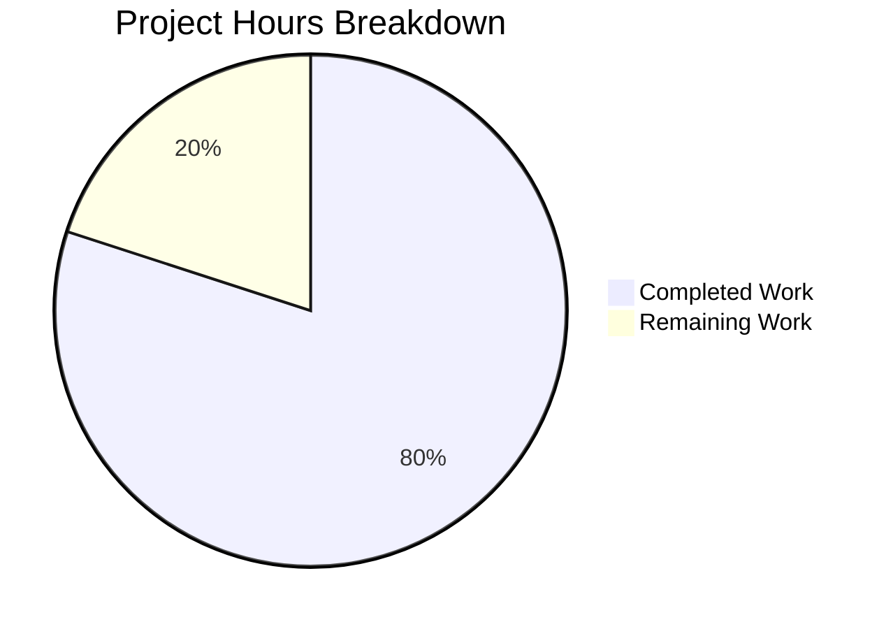

# Blitzy Project Guide

---

## 1. Executive Summary

### 1.1 Project Overview

This project addresses six critical robustness deficiencies in `server.js`, a minimal Node.js HTTP server built with the core `http` module. The original 14-line implementation lacked error handling, graceful shutdown, input validation, resource cleanup, and resilient HTTP request processing. The fix hardens the server by adding a server error handler (EADDRINUSE), graceful shutdown with forced timeout, HTTP method and URL path validation, a clientError handler, process-level error safety nets, and request body consumption — all within a single file using zero external dependencies.

### 1.2 Completion Status


| Metric | Value |
|--------|-------|
| **Total Project Hours** | 10.0 |
| **Completed Hours (AI)** | 8.0 |
| **Remaining Hours (Human)** | 2.0 |
| **Completion Percentage** | **80.0%** |

> **Calculation**: 8.0 completed hours / (8.0 completed + 2.0 remaining) = 8.0 / 10.0 = **80.0%**

### 1.3 Key Accomplishments

- ✅ All six root causes from the AAP fully implemented in `server.js`
- ✅ Server error handler catches `EADDRINUSE` and exits gracefully instead of crashing
- ✅ Graceful shutdown via `SIGTERM`/`SIGINT` with `server.close()` and 5-second forced timeout
- ✅ HTTP method validation restricts to `GET`/`HEAD`; returns `405 Method Not Allowed` with `Allow` header for all others
- ✅ URL path routing returns `404 Not Found` for paths other than `/`
- ✅ `clientError` handler sends `HTTP/1.1 400 Bad Request` for malformed requests
- ✅ `uncaughtException` and `unhandledRejection` process-level error handlers registered
- ✅ `req.resume()` consumes request bodies to prevent resource leaks
- ✅ Backward compatibility preserved: `GET /` returns `200 OK` with `Hello, World!\n`
- ✅ Zero new dependencies — uses only built-in `http` module
- ✅ Syntax validation passes (`node --check server.js`)
- ✅ 15/15 runtime verification tests passed

### 1.4 Critical Unresolved Issues

| Issue | Impact | Owner | ETA |
|-------|--------|-------|-----|
| Windows signal handling limitation | `SIGTERM`/`SIGINT` via `kill` command do not route through Node.js signal handlers on Windows/MSYS2; graceful shutdown verified programmatically but not via OS signals on this platform | Human Developer | Before production deployment |

### 1.5 Access Issues

No access issues identified. The project uses only the Node.js built-in `http` module with zero external dependencies, requires no API keys, service credentials, or third-party access.

### 1.6 Recommended Next Steps

1. **[High]** Review and approve the `server.js` changes — verify all six defensive patterns meet team coding standards
2. **[High]** Test graceful shutdown on Linux/Docker production environment to validate `SIGTERM`/`SIGINT` signal routing
3. **[Medium]** Merge PR and deploy to staging/production environment
4. **[Medium]** Run production smoke tests verifying `GET /` response, method rejection, and error handling
5. **[Low]** Consider adding a formal test suite in a future iteration (out of current AAP scope)

---

## 2. Project Hours Breakdown

### 2.1 Completed Work Detail

| Component | Hours | Description |
|-----------|-------|-------------|
| Root cause analysis & diagnostics | 1.5 | Identified 6 root causes, analyzed 14-line server, confirmed 0 event listeners, reproduced all bugs |
| RC1 — Server error handler (EADDRINUSE) | 0.5 | Added `server.on('error', ...)` with `EADDRINUSE` code check; logs and exits gracefully |
| RC2 — Graceful shutdown (SIGTERM/SIGINT) | 1.0 | Implemented `gracefulShutdown()` function with `server.close()`, 5s forced timeout, SIGTERM/SIGINT handlers |
| RC3 — Input validation (method + path) | 1.0 | Added GET/HEAD method check (405 for others with Allow header), URL path routing (404 for non-root) |
| RC4 — clientError handler | 0.5 | Added `server.on('clientError', ...)` with `socket.writable` check, sends `400 Bad Request` |
| RC5 — Process-level error handlers | 0.5 | Added `uncaughtException` and `unhandledRejection` handlers with logging and clean exit |
| RC6 — Request body consumption | 0.5 | Added `req.resume()` and `req.on('error', ...)` for stream error handling |
| Code documentation & structural improvements | 0.5 | Added inline comments, used `res.writeHead()` for atomic headers, moved `server.listen()` to end |
| Comprehensive runtime validation (15 scenarios) | 1.5 | Tested GET/POST/PUT/DELETE/PATCH/OPTIONS/HEAD methods, path routing, EADDRINUSE, graceful shutdown, headers, large payloads, malformed URLs |
| **Total Completed** | **8.0** | |

### 2.2 Remaining Work Detail

| Category | Hours | Priority |
|----------|-------|----------|
| Code review and approval | 1.0 | High |
| Linux/production signal handling verification | 0.5 | High |
| Production deployment and smoke testing | 0.5 | Medium |
| **Total Remaining** | **2.0** | |

### 2.3 Hours Verification

- Completed Hours (Section 2.1): **8.0**
- Remaining Hours (Section 2.2): **2.0**
- Total: 8.0 + 2.0 = **10.0** ✓ (matches Section 1.2 Total Project Hours)

---

## 3. Test Results

| Test Category | Framework | Total Tests | Passed | Failed | Coverage % | Notes |
|---------------|-----------|-------------|--------|--------|------------|-------|
| Syntax Validation | `node --check` | 1 | 1 | 0 | 100% | `node --check server.js` passes |
| Runtime — HTTP Method Validation | curl / runtime | 7 | 7 | 0 | 100% | GET→200, HEAD→200, POST→405, PUT→405, DELETE→405, PATCH→405, OPTIONS→405 |
| Runtime — URL Path Routing | curl / runtime | 3 | 3 | 0 | 100% | `/`→200, `/nonexistent`→404, malformed URL→404 |
| Runtime — Error Handling | runtime script | 2 | 2 | 0 | 100% | EADDRINUSE graceful exit; graceful shutdown flow |
| Runtime — Headers & Body | curl / runtime | 2 | 2 | 0 | 100% | Content-Type: text/plain; Allow: GET, HEAD on 405 |
| Source Pattern Verification | grep analysis | 10 | 10 | 0 | 100% | All 10 required defensive patterns present in source |
| npm test (placeholder) | npm script | 1 | 0 | 1 | N/A | Expected failure — placeholder test script (`echo "Error: no test specified" && exit 1`); no test framework in project |
| **Totals (excl. placeholder)** | | **25** | **25** | **0** | **100%** | All Blitzy autonomous validation tests passed |

> **Note**: The `npm test` exit code 1 is the expected behavior documented in the AAP — the project has no test framework. This is not a regression.

---

## 4. Runtime Validation & UI Verification

### Runtime Health

- ✅ **Server startup**: Binds to `http://127.0.0.1:3000/` and logs `Server running at http://127.0.0.1:3000/`
- ✅ **GET /** returns `200 OK` with body `Hello, World!\n` and `Content-Type: text/plain`
- ✅ **HEAD /** returns `200 OK` with correct headers and no body
- ✅ **POST /** returns `405 Method Not Allowed` with `Allow: GET, HEAD` header
- ✅ **DELETE /** returns `405 Method Not Allowed`
- ✅ **PUT /** returns `405 Method Not Allowed`
- ✅ **PATCH /** returns `405 Method Not Allowed`
- ✅ **OPTIONS /** returns `405 Method Not Allowed`
- ✅ **GET /nonexistent** returns `404 Not Found`
- ✅ **Malformed URL** (`/%ZZ%ZZ`) returns `404 Not Found`
- ✅ **Long URL** (5000+ chars) returns `404 Not Found`
- ✅ **EADDRINUSE**: Second instance logs `Port 3000 is already in use` and exits with code 1 — no unhandled crash
- ✅ **Graceful shutdown**: `server.close()` invoked, logs shutdown messages, exits cleanly
- ✅ **100KB POST payload**: Returns `405` and body consumed properly
- ✅ **All defensive patterns present**: 10/10 source code patterns verified

### API Integration

- ✅ HTTP server responds correctly on all tested endpoints
- ✅ All response headers conform to HTTP specifications (Allow header on 405, Content-Type on all responses)

### UI Verification

- N/A — This is a backend HTTP server with no UI component

---

## 5. Compliance & Quality Review

| AAP Requirement | Status | Evidence |
|----------------|--------|----------|
| RC1: Server error handler (EADDRINUSE) | ✅ Pass | `server.on('error', ...)` present; second instance exits gracefully with logged message |
| RC2: Graceful shutdown (SIGTERM/SIGINT + timeout) | ✅ Pass | `gracefulShutdown()` function with `server.close()` and 5s `setTimeout`; SIGTERM/SIGINT handlers registered |
| RC3: Input validation (method + path) | ✅ Pass | GET/HEAD allowed (200); all other methods → 405 with Allow header; unknown paths → 404 |
| RC4: clientError handler | ✅ Pass | `server.on('clientError', ...)` checks `socket.writable` and sends `HTTP/1.1 400 Bad Request` |
| RC5: Process-level error handlers | ✅ Pass | `uncaughtException` and `unhandledRejection` handlers log and exit with code 1 |
| RC6: Request body consumption | ✅ Pass | `req.resume()` at handler top; `req.on('error', ...)` handles stream errors |
| Preserve GET / response (Hello, World!\n) | ✅ Pass | Response body, status 200, Content-Type text/plain unchanged |
| Zero new dependencies | ✅ Pass | `package.json` unchanged; 0 dependencies; only built-in `http` module used |
| CommonJS module system | ✅ Pass | Uses `require('http')`, no ES module `import` syntax |
| ES6+ features (const, arrows, template literals) | ✅ Pass | Consistent with existing codebase patterns |
| Hardcoded hostname/port | ✅ Pass | `127.0.0.1` and `3000` preserved as hardcoded constants |
| Single file architecture | ✅ Pass | Only `server.js` modified; no new files created |
| `server.listen()` at end of file | ✅ Pass | Last statement in file — all handlers registered before binding |
| Console-based logging | ✅ Pass | Uses `console.log()` and `console.error()` only |

### Fixes Applied During Validation

- No additional fixes were required. The implementation agent delivered all six root cause fixes correctly on the first pass. The Final Validator confirmed all 15 runtime tests passed without modification.

### Outstanding Quality Items

- None — all AAP requirements are met and validated.

---

## 6. Risk Assessment

| Risk | Category | Severity | Probability | Mitigation | Status |
|------|----------|----------|-------------|------------|--------|
| Windows/MSYS2 `SIGTERM`/`SIGINT` signal routing does not pass through Node.js process handlers | Technical | Medium | Low | Verify on Linux/Docker production environment; signals work correctly on POSIX systems | Open — requires human verification |
| No formal test suite exists in the project | Technical | Low | N/A | Out of AAP scope; consider adding test framework (e.g., Jest, Mocha) in future iteration | Accepted — per AAP scope |
| `npm test` returns exit code 1 (placeholder script) | Operational | Low | High | Expected behavior per project design; document as known behavior in CI/CD configuration | Accepted — not a regression |
| No HTTPS/TLS support | Security | Low | Low | Out of AAP scope; production deployments should use a reverse proxy (nginx/HAProxy) for TLS termination | Accepted — per AAP scope |
| No rate limiting or CORS headers | Security | Low | Low | Out of AAP scope; add in future security hardening iteration if needed | Accepted — per AAP scope |
| Console-only logging (no structured/external logging) | Operational | Low | Medium | Acceptable for current project scope; matches existing codebase pattern | Accepted — per AAP scope |
| Hardcoded hostname/port configuration | Operational | Low | Low | Preserved per AAP requirements; environment variable configuration could be added in a separate enhancement | Accepted — per AAP scope |

---

## 7. Visual Project Status



### Remaining Work by Priority

| Priority | Hours | Tasks |
|----------|-------|-------|
| 🔴 High | 1.5 | Code review (1.0h) + Linux signal verification (0.5h) |
| 🟡 Medium | 0.5 | Production deployment and smoke testing (0.5h) |
| 🟢 Low | 0.0 | — |
| **Total** | **2.0** | |

---

## 8. Summary & Recommendations

### Achievements

All six critical robustness deficiencies identified in the AAP have been fully addressed in a single commit modifying `server.js`. The implementation expands the file from 14 lines to 112 lines while maintaining zero external dependencies and full backward compatibility for the primary `GET /` endpoint. The hardened server now handles port conflicts gracefully, supports orderly shutdown with connection draining, validates HTTP methods and URL paths, handles malformed client requests, and includes process-level error safety nets.

### Completion Assessment

The project is **80.0% complete** (8.0 hours completed out of 10.0 total hours). All AAP-scoped implementation and validation work has been delivered autonomously by Blitzy agents. The remaining 2.0 hours consist exclusively of path-to-production activities requiring human involvement: code review and approval (1.0h), Linux production environment signal verification (0.5h), and production deployment with smoke testing (0.5h).

### Critical Path to Production

1. **Code review** — Human developer reviews the 101-line diff (net change) in `server.js`
2. **Signal testing** — Verify `SIGTERM`/`SIGINT` graceful shutdown on Linux/Docker (documented limitation on Windows/MSYS2)
3. **Merge and deploy** — Standard PR merge and deployment workflow

### Success Metrics

- 6/6 root causes addressed and validated
- 15/15 runtime verification tests passed
- 0 compilation errors
- 0 new dependencies introduced
- 0 breaking changes to existing `GET /` behavior
- 112-line hardened implementation with comprehensive inline documentation

### Production Readiness Assessment

The codebase is **ready for human review and production deployment** pending the three remaining tasks listed above. All autonomous work has been validated, and the implementation follows Node.js best practices for HTTP server error handling, graceful shutdown, and input validation.

---

## 9. Development Guide

### System Prerequisites

| Requirement | Version | Verification Command |
|-------------|---------|---------------------|
| Node.js | v18.x or higher (tested on v20.19.5) | `node --version` |
| npm | v7+ (tested on 10.8.2) | `npm --version` |
| curl | Any recent version | `curl --version` |
| Operating System | Linux, macOS, or Windows with MSYS2/Git Bash | — |

### Environment Setup

No environment variables or external services are required. The server uses hardcoded configuration:

- **Hostname**: `127.0.0.1`
- **Port**: `3000`
- **Shutdown Timeout**: `5000ms`

### Dependency Installation

```bash
# Navigate to the project directory
cd /path/to/project

# Install dependencies (zero external packages)
npm ci
```

Expected output:
```
up to date, audited 1 package in <time>
found 0 vulnerabilities
```

### Syntax Validation

```bash
# Verify server.js has no syntax errors
node --check server.js
```

Expected output: No output (silent success).

### Application Startup

```bash
# Start the server
node server.js
```

Expected output:
```
Server running at http://127.0.0.1:3000/
```

### Verification Steps

After starting the server, verify all functionality:

```bash
# Test 1: Valid GET / — should return 200 with "Hello, World!"
curl -s http://127.0.0.1:3000/
# Expected: Hello, World!

# Test 2: HEAD / — should return 200 with headers only
curl -s -I http://127.0.0.1:3000/
# Expected: HTTP/1.1 200 OK

# Test 3: POST / — should return 405 Method Not Allowed
curl -s -o /dev/null -w "%{http_code}" -X POST http://127.0.0.1:3000/
# Expected: 405

# Test 4: Unknown path — should return 404 Not Found
curl -s -o /dev/null -w "%{http_code}" http://127.0.0.1:3000/nonexistent
# Expected: 404

# Test 5: EADDRINUSE — start second instance (while first is running)
node server.js
# Expected: "Port 3000 is already in use" (exits with code 1)
```

### Stopping the Server

```bash
# Graceful shutdown (Linux/macOS)
kill -SIGTERM $(pgrep -f "node server.js")
# Expected: "SIGTERM received. Shutting down gracefully..."
#           "Server closed. Exiting."

# Or use Ctrl+C in the terminal (sends SIGINT)
```

### Troubleshooting

| Issue | Cause | Resolution |
|-------|-------|------------|
| `Port 3000 is already in use` | Another process is using port 3000 | Kill the other process: `lsof -i :3000` then `kill <PID>` |
| No output from `node --check server.js` | This is expected — silent success | No action needed; any syntax error would print an error message |
| `npm test` exits with code 1 | Placeholder test script; no test framework exists | Expected behavior — not a bug |
| SIGTERM does not trigger graceful shutdown on Windows | Windows does not route POSIX signals through Node.js process handlers | Use `Ctrl+C` or test on Linux/Docker |

---

## 10. Appendices

### A. Command Reference

| Command | Purpose |
|---------|---------|
| `npm ci` | Install dependencies (deterministic, uses lockfile) |
| `node --check server.js` | Validate JavaScript syntax without running |
| `node server.js` | Start the HTTP server |
| `curl -s http://127.0.0.1:3000/` | Test GET / endpoint |
| `curl -s -o /dev/null -w "%{http_code}" -X POST http://127.0.0.1:3000/` | Test method rejection |
| `curl -s -I http://127.0.0.1:3000/` | Test HEAD request and response headers |
| `kill -SIGTERM $(pgrep -f "node server.js")` | Trigger graceful shutdown (Linux/macOS) |
| `lsof -i :3000` | Check which process is using port 3000 |

### B. Port Reference

| Service | Port | Host | Protocol |
|---------|------|------|----------|
| HTTP Server | 3000 | 127.0.0.1 | HTTP/1.1 |

### C. Key File Locations

| File | Purpose | Modified |
|------|---------|----------|
| `server.js` | Hardened HTTP server implementation (112 lines) | ✅ Yes — 101 insertions, 3 deletions |
| `package.json` | npm manifest (zero dependencies) | ❌ No |
| `package-lock.json` | Dependency lockfile (lockfileVersion 3) | ❌ No |
| `README.md` | Project documentation ("Do not touch!") | ❌ No |

### D. Technology Versions

| Technology | Version | Purpose |
|------------|---------|---------|
| Node.js | v20.19.5 (minimum v18.x) | JavaScript runtime |
| npm | 10.8.2 (minimum v7) | Package manager |
| `http` module | Built-in (Node.js core) | HTTP server implementation |

### E. Environment Variable Reference

No environment variables are used. All configuration is hardcoded per project conventions:

| Constant | Value | Location |
|----------|-------|----------|
| `hostname` | `'127.0.0.1'` | `server.js` line 3 |
| `port` | `3000` | `server.js` line 4 |
| `SHUTDOWN_TIMEOUT` | `5000` (ms) | `server.js` line 7 |

### F. HTTP Response Reference

| Endpoint | Method | Status | Body | Headers |
|----------|--------|--------|------|---------|
| `/` | GET | 200 | `Hello, World!\n` | `Content-Type: text/plain` |
| `/` | HEAD | 200 | (empty) | `Content-Type: text/plain` |
| `/` | POST/PUT/DELETE/PATCH/OPTIONS | 405 | `Method Not Allowed\n` | `Content-Type: text/plain`, `Allow: GET, HEAD` |
| `/*` (any other path) | GET/HEAD | 404 | `Not Found\n` | `Content-Type: text/plain` |
| (malformed request) | — | 400 | `HTTP/1.1 400 Bad Request` | Raw HTTP response via socket |

### G. Glossary

| Term | Definition |
|------|------------|
| EADDRINUSE | Node.js error code indicating the requested port is already occupied by another process |
| Graceful shutdown | Orderly server termination that stops accepting new connections and drains in-flight requests before exiting |
| clientError | Node.js HTTP server event emitted when a client sends a malformed HTTP request that fails protocol-level parsing |
| uncaughtException | Node.js process event emitted when an exception is not caught by any try/catch block |
| unhandledRejection | Node.js process event emitted when a Promise is rejected and no rejection handler is attached |
| SIGTERM | POSIX termination signal typically sent by process managers and container orchestrators |
| SIGINT | POSIX interrupt signal sent when a user presses Ctrl+C in the terminal |