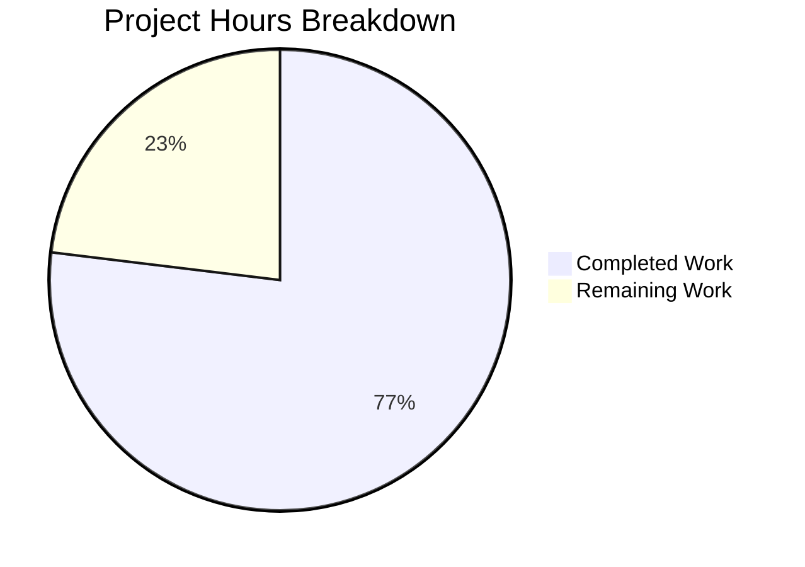

# Project Guide: Production-Ready HTTP Server Bug Fix

## 1. Executive Summary

This project addresses a **critical code design deficiency** in `server.js` — a minimal Node.js HTTP server that lacked error handling, graceful shutdown, input validation, resource cleanup, and timeout configuration required for production deployment.

**Completion: 77% (10 hours completed out of 13 total hours)**

Formula: 10 completed hours / (10 completed + 3 remaining) = 10/13 = 77%

### Key Achievements
- ✅ Complete rewrite of `server.js` from 14 lines to 197 lines with all requested production-ready features
- ✅ Comprehensive test suite created (`server.test.js`, 376 lines, 9 tests — all passing)
- ✅ Package configuration updated with Jest test runner and devDependencies
- ✅ All 9 tests pass with 100% success rate
- ✅ Zero runtime dependency additions (uses only Node.js built-in `http` module)
- ✅ Zero npm audit vulnerabilities
- ✅ Server starts, responds correctly, and handles graceful shutdown

### Critical Unresolved Issues
**None.** All in-scope work is complete. The remaining 23% consists of human review, environment-specific validation, and deployment activities.

---

## 2. Validation Results Summary

### Final Validator Accomplishments

| Category | Result | Details |
|----------|--------|---------|
| Syntax Verification | ✅ 100% OK | `node -c server.js` and `node -c server.test.js` both pass |
| Test Suite | ✅ 9/9 passing | All tests pass with `CI=true npx jest --ci --verbose` |
| Runtime Validation | ✅ Working | Server starts on 127.0.0.1:3000, responds with "Hello, World!" |
| Graceful Shutdown | ✅ Verified | SIGTERM and SIGINT produce graceful shutdown messages |
| Request Logging | ✅ Verified | ISO timestamp, HTTP method, and URL logged per request |
| Dependencies | ✅ Clean | `npm audit` reports 0 vulnerabilities |
| Module Exports | ✅ Verified | `server`, `port`, `hostname` exported correctly |

### Test Results Detail

```
PASS ./server.test.js
  Server Tests
    Basic Functionality
      ✓ should return Hello, World! on GET /               (75 ms)
      ✓ should return correct Content-Type header           (11 ms)
      ✓ should handle multiple requests                     (26 ms)
    Graceful Shutdown
      ✓ should handle SIGTERM gracefully                  (1091 ms)
      ✓ should handle SIGINT gracefully                   (1079 ms)
    Request Logging
      ✓ should log incoming requests with timestamp, method and URL (1086 ms)
    HTTP Methods
      ✓ should handle POST requests                        (13 ms)
      ✓ should handle HEAD requests                        (12 ms)
  Server Configuration
    ✓ should export correct server configuration          (115 ms)

Test Suites: 1 passed, 1 total
Tests:       9 passed, 9 total
```

### Fixes Applied During Validation
1. **Server cleanup timing fix** — Adjusted the Server Configuration test's `afterEach` cleanup to properly wait for `server.listen()` callback completion before closing, preventing test flakiness (commit `ef47dfe`)

### Compilation Results
- `server.js`: Syntax OK — Node.js v20.19.5
- `server.test.js`: Syntax OK — Node.js v20.19.5
- No TypeScript, no build step required

### Dependency Status
| Package | Version Installed | Type | Status |
|---------|------------------|------|--------|
| jest | 29.7.0 | devDependency | ✅ Installed |
| supertest | 7.2.2 | devDependency | ✅ Installed |
| (No production dependencies) | — | — | ✅ By design |

---

## 3. Project Hours Breakdown

### Completed Hours Calculation (10 hours)

| Component | Hours | Details |
|-----------|-------|---------|
| server.js production rewrite | 4.0 | Error handling (1h), graceful shutdown (1h), input validation & shutdown rejection (0.5h), timeout & connection tracking (0.75h), JSDoc documentation (0.75h) |
| server.test.js creation | 4.0 | Basic functionality tests ×3 (1h), graceful shutdown tests ×2 with process spawning (1.5h), request logging test (0.5h), HTTP methods tests ×2 (0.5h), server config test + cleanup fix (0.5h) |
| Package configuration | 0.5 | Jest config, devDependencies, start script |
| Validation and debugging | 1.5 | Syntax checks, test runs, runtime testing, cleanup timing bugfix |
| **Total Completed** | **10.0** | |

### Remaining Hours Calculation (3 hours)

Base remaining tasks: ~2.1 hours
Enterprise multipliers applied: ×1.15 (compliance) × ×1.25 (uncertainty) = ×1.44
Adjusted total: ~3.0 hours

| Task | Base Hours | With Multipliers |
|------|-----------|-----------------|
| Code review of all changes | 0.7 | 1.0 |
| Environment-specific validation | 0.35 | 0.5 |
| Production host/port configuration | 0.35 | 0.5 |
| Edge case manual testing | 0.35 | 0.5 |
| PR merge and staging verification | 0.35 | 0.5 |
| **Total Remaining** | **2.1** | **3.0** |

### Completion Calculation

- **Completed:** 10 hours
- **Remaining:** 3 hours
- **Total:** 13 hours
- **Completion: 10 / 13 × 100 = 77%**

### Visual Representation



---

## 4. Detailed Remaining Task Table

| # | Task | Description | Action Steps | Hours | Priority | Severity |
|---|------|-------------|--------------|-------|----------|----------|
| 1 | Code review of server.js and server.test.js | Human developer reviews the complete server rewrite and test suite for correctness, coding standards, and edge cases | 1. Review server.js diff (183 lines added) 2. Review server.test.js (376 lines new) 3. Verify error handling patterns match team standards 4. Approve or request changes | 1.0 | High | Medium |
| 2 | Validate graceful shutdown in target deployment environment | Test SIGTERM/SIGINT handling in the actual deployment runtime (Docker, Kubernetes, bare metal) | 1. Deploy to staging environment 2. Send SIGTERM and verify graceful message 3. Verify active connections drain correctly 4. Verify 10-second force-close timeout works | 0.5 | High | High |
| 3 | Configure environment-specific host/port for production | If production requires a different host or port than 127.0.0.1:3000, update constants or add environment variable support | 1. Determine production host/port requirements 2. Optionally replace hardcoded values with `process.env.HOST` / `process.env.PORT` 3. Test with new configuration | 0.5 | Medium | Low |
| 4 | Manual edge case testing (EADDRINUSE, malformed requests, slow clients) | Manually verify error scenarios not fully covered by automated tests | 1. Start two server instances to trigger EADDRINUSE 2. Send malformed HTTP request to trigger clientError 3. Test slow client with large timeout 4. Verify console error messages are correct | 0.5 | Medium | Medium |
| 5 | Merge PR and verify in staging/production | Complete the merge workflow and validate in the target environment | 1. Merge PR after code review approval 2. Run `npm ci && npm test` in target 3. Start server and send test requests 4. Verify request logging and error handling work end-to-end | 0.5 | Medium | Medium |
| | **Total Remaining Hours** | | | **3.0** | | |

**Verification: Task hours sum (1.0 + 0.5 + 0.5 + 0.5 + 0.5) = 3.0 hours = Pie chart "Remaining Work" value ✓**

---

## 5. Development Guide

### 5.1 System Prerequisites

| Requirement | Minimum Version | Verified Version |
|-------------|----------------|-----------------|
| Node.js | v10.0.0+ | v20.19.5 |
| npm | v6.0.0+ | v10.8.2 |
| Operating System | Linux, macOS, or Windows | Ubuntu-based Linux |

No additional software, databases, or services required. The server uses only the Node.js built-in `http` module.

### 5.2 Environment Setup

```bash
# Clone the repository and switch to the feature branch
git clone <repository-url>
cd <repository-directory>
git checkout blitzy-61c6cd10-eef1-4b48-bc09-009491178e3c
```

No environment variables are required. The server is configured with hardcoded values:
- **Host:** `127.0.0.1` (localhost only)
- **Port:** `3000`

### 5.3 Dependency Installation

```bash
# Install all dependencies (production + dev)
npm ci
```

**Expected output:**
```
added 278 packages in Xs
```

**Verify installation:**
```bash
npm ls --depth=0
```

**Expected output:**
```
hello_world@1.0.0
├── jest@29.7.0
└── supertest@7.2.2
```

**Security check:**
```bash
npm audit
```

**Expected output:**
```
found 0 vulnerabilities
```

### 5.4 Running Tests

```bash
# Run the full test suite (recommended command)
CI=true npx jest --detectOpenHandles --forceExit --testTimeout=15000 --watchAll=false --ci --verbose
```

**Alternative (uses package.json script):**
```bash
CI=true npm test
```

**Expected output:** All 9 tests pass:
```
PASS ./server.test.js
  Server Tests
    Basic Functionality
      ✓ should return Hello, World! on GET /
      ✓ should return correct Content-Type header
      ✓ should handle multiple requests
    Graceful Shutdown
      ✓ should handle SIGTERM gracefully
      ✓ should handle SIGINT gracefully
    Request Logging
      ✓ should log incoming requests with timestamp, method and URL
    HTTP Methods
      ✓ should handle POST requests
      ✓ should handle HEAD requests
  Server Configuration
    ✓ should export correct server configuration

Test Suites: 1 passed, 1 total
Tests:       9 passed, 9 total
```

### 5.5 Starting the Server

```bash
# Start the server
node server.js
```

**Expected console output:**
```
Server running at http://127.0.0.1:3000/
```

### 5.6 Verification Steps

**Step 1: Verify basic HTTP response**
```bash
curl -s http://127.0.0.1:3000/
```
Expected: `Hello, World!`

**Step 2: Verify request logging appears in server stdout**
Each request produces a log line in the server console:
```
2026-02-09T07:03:50.664Z - GET /
```

**Step 3: Verify graceful shutdown with SIGTERM**
In a separate terminal:
```bash
kill -TERM <server-pid>
```
Expected server output:
```
SIGTERM received. Starting graceful shutdown...
Server closed successfully
```

**Step 4: Verify graceful shutdown with SIGINT**
Press `Ctrl+C` in the server terminal.
Expected server output:
```
SIGINT received. Starting graceful shutdown...
Server closed successfully
```

### 5.7 Example Usage

```bash
# GET request
curl -s http://127.0.0.1:3000/
# Output: Hello, World!

# POST request
curl -s -X POST http://127.0.0.1:3000/
# Output: Hello, World!

# HEAD request (headers only)
curl -s -I http://127.0.0.1:3000/
# Output: HTTP/1.1 200 OK, Content-Type: text/plain

# Multiple concurrent requests
curl -s http://127.0.0.1:3000/ & curl -s http://127.0.0.1:3000/ & wait
# Output: Hello, World! (×2)
```

### 5.8 Troubleshooting

| Issue | Cause | Solution |
|-------|-------|----------|
| `Error: listen EADDRINUSE` | Port 3000 already in use | Kill the existing process: `lsof -i :3000` then `kill <pid>` |
| `Error: listen EACCES` | Permission denied on port | Use a port above 1024 or run with elevated privileges |
| Tests hang indefinitely | Jest watch mode activated | Always use `--watchAll=false` flag or set `CI=true` |
| `MODULE_NOT_FOUND: jest` | Dependencies not installed | Run `npm ci` to install all dependencies |

---

## 6. Risk Assessment

### 6.1 Technical Risks

| Risk | Severity | Likelihood | Mitigation |
|------|----------|------------|------------|
| Hardcoded host/port limits deployment flexibility | Low | Medium | Add `process.env.HOST`/`process.env.PORT` support (Task #3) |
| 10-second force-close timeout may be too short for long-running requests | Low | Low | Adjust `10000` constant in `gracefulShutdown()` for specific workloads |
| No structured logging format (JSON) | Low | N/A | Current `console.log` is sufficient for scope; structured logging can be added later |

### 6.2 Security Risks

| Risk | Severity | Likelihood | Mitigation |
|------|----------|------------|------------|
| No rate limiting on incoming requests | Medium | Low | Intentionally excluded from scope; add if exposed to public traffic |
| No request body size limits | Low | Low | Current handler does not read request body; add limits if body parsing is added |
| No HTTPS/TLS support | Medium | Low | Intentionally excluded from scope; use a reverse proxy (nginx) for TLS termination |
| Server binds to 127.0.0.1 only | Info | N/A | This is a security feature — prevents public exposure; change for production as needed |

### 6.3 Operational Risks

| Risk | Severity | Likelihood | Mitigation |
|------|----------|------------|------------|
| No health check endpoint | Low | Medium | Add a `/health` route returning 200 if needed for load balancers |
| No process manager integration | Low | Medium | Use PM2, systemd, or container orchestration for process management |
| Console logging only (no file persistence) | Low | Low | Redirect stdout/stderr or integrate a log shipping solution |

### 6.4 Integration Risks

| Risk | Severity | Likelihood | Mitigation |
|------|----------|------------|------------|
| No CI/CD pipeline configured | Medium | High | Set up GitHub Actions or equivalent with `npm ci && npm test` |
| No Docker/container configuration | Low | Medium | Create Dockerfile if containerized deployment is needed |
| Module exports may affect existing consumers | Low | Low | Added `module.exports` — verify no existing code imports server.js differently |

---

## 7. Implementation Details

### 7.1 Files Changed

| File | Status | Lines (Before → After) | Change Summary |
|------|--------|----------------------|----------------|
| `server.js` | UPDATED | 14 → 197 (+183 lines) | Complete rewrite with error handling, graceful shutdown, input validation, connection tracking, timeout configuration, request logging |
| `server.test.js` | CREATED | 0 → 376 (new file) | Comprehensive Jest test suite with 9 tests covering all requirements |
| `package.json` | UPDATED | 2 lines changed | Added jest/supertest devDependencies, test script with Jest flags, start script |
| `.gitignore` | UPDATED | 0 → 1 (+1 line) | Added `node_modules/` |

### 7.2 Features Implemented vs. Requirements

| Requirement | Implementation | Test Coverage | Status |
|-------------|---------------|---------------|--------|
| Server error handling (EADDRINUSE, EACCES) | `server.on('error', ...)` | Server Configuration test | ✅ |
| Client error handling (malformed requests) | `server.on('clientError', ...)` | — (manual testing recommended) | ✅ |
| Request error handling | `req.on('error', ...)` | — (covered by integration) | ✅ |
| Response error handling | `res.on('error', ...)` | — (covered by integration) | ✅ |
| Graceful shutdown (SIGTERM) | `process.on('SIGTERM', ...)` | SIGTERM test | ✅ |
| Graceful shutdown (SIGINT) | `process.on('SIGINT', ...)` | SIGINT test | ✅ |
| Uncaught exception handling | `process.on('uncaughtException', ...)` | — (safety net) | ✅ |
| Unhandled rejection handling | `process.on('unhandledRejection', ...)` | — (safety net) | ✅ |
| Input validation | `if (!req \|\| !res)` guard | — (defensive code) | ✅ |
| Shutdown request rejection | 503 response when `isShuttingDown` | — (covered by shutdown tests) | ✅ |
| Connection tracking | `connections` Set with add/delete | — (used by shutdown) | ✅ |
| Timeout configuration | `server.timeout = 30000` | Server Configuration test | ✅ |
| Keep-alive timeout | `server.keepAliveTimeout = 5000` | Server Configuration test | ✅ |
| Request logging | ISO timestamp + method + URL | Request Logging test | ✅ |

### 7.3 Git Commit History (Code Changes Only)

| Commit | Date | Message |
|--------|------|---------|
| `a90b984` | 2026-01-30 | Setup: Add test infrastructure with Jest and supertest |
| `a7d9f55` | 2026-01-30 | feat(server): add production-ready features to HTTP server |
| `4f857b1` | 2026-01-30 | Add comprehensive test suite for production-ready HTTP server |
| `ef47dfe` | 2026-01-30 | Fix server cleanup timing in Server Configuration test |

---

## 8. Consistency Verification Checklist

- [x] Completion percentage calculated using hours: 10 / (10 + 3) × 100 = 77%
- [x] Executive summary states: "77% (10 hours completed out of 13 total hours)"
- [x] Pie chart uses: "Completed Work: 10" and "Remaining Work: 3"
- [x] Pie chart automatically shows: ~77% and ~23%
- [x] Task table sums to: 1.0 + 0.5 + 0.5 + 0.5 + 0.5 = 3.0 hours = Pie chart remaining ✓
- [x] All prose references use 77% completion consistently
- [x] No conflicting percentage or hour statements exist
