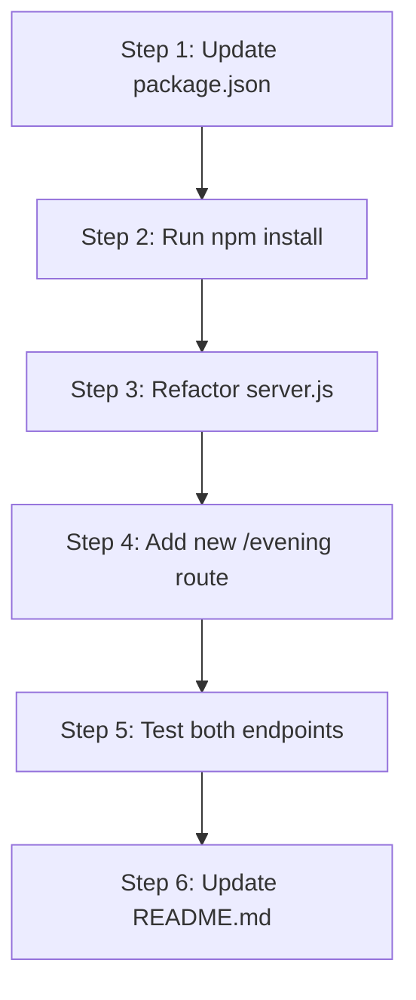

# Technical Specification

# 0. Agent Action Plan

## 0.1 Intent Clarification

### 0.1.1 Core Feature Objective

Based on the prompt, the Blitzy platform understands that the new feature requirement is to:

- **Add Express.js Framework Integration**: Migrate the existing Node.js HTTP server from using the native `http` module to the Express.js framework
- **Create New "Good Evening" Endpoint**: Add a second endpoint to the server that returns the response "Good evening" when accessed
- **Preserve Existing "Hello World" Functionality**: Maintain the current endpoint that returns "Hello, World!" ensuring backward compatibility

**Implicit Requirements Detected:**

- The Express.js package must be added as a project dependency in `package.json`
- The `package-lock.json` file will need to be updated to reflect the new dependency tree
- The server binding configuration (hostname: 127.0.0.1, port: 3000) should be preserved
- The response content types should remain `text/plain` to maintain consistency
- Error handling should follow Express.js conventions

**Feature Dependencies and Prerequisites:**

- Node.js runtime (v18+ required for Express 5.x compatibility)
- npm package manager for dependency installation
- Express.js framework (latest stable version 5.2.1)

### 0.1.2 Special Instructions and Constraints

**Architectural Requirements:**

- Use the existing service pattern with minimal structural changes
- Follow Express.js conventions for route definition and middleware usage
- Maintain the single-file server architecture given the project's tutorial nature

**Directives:**

- Integrate Express.js as the primary HTTP framework
- Keep the implementation simple and educational, appropriate for a tutorial project
- Preserve the existing endpoint path semantics (root path `/` for "Hello World")

### 0.1.3 Technical Interpretation

These feature requirements translate to the following technical implementation strategy:

- **To integrate Express.js**, we will modify `package.json` to add Express as a dependency and run `npm install`
- **To preserve the "Hello World" endpoint**, we will create an Express route handler at the root path (`/`) that responds with "Hello, World!\n"
- **To add the "Good evening" endpoint**, we will create a new Express route handler at a designated path (e.g., `/evening`) that responds with "Good evening"
- **To maintain server configuration**, we will use the same hostname (127.0.0.1) and port (3000) values in the Express server configuration

## 0.2 Repository Scope Discovery

### 0.2.1 Comprehensive File Analysis

**Existing Files Requiring Modification:**

| File Path | Type | Current Purpose | Required Changes |
|-----------|------|-----------------|------------------|
| `server.js` | Source | Node.js HTTP server with native http module | Refactor to use Express.js framework and add new route |
| `package.json` | Configuration | npm manifest with no dependencies | Add Express.js dependency |
| `package-lock.json` | Lock File | Empty dependency lock | Will be auto-updated when Express is installed |
| `README.md` | Documentation | Project description | Update to document new endpoint |

**Current Repository Structure:**

```
/
├── README.md           # Project documentation
├── package.json        # npm manifest (main: index.js)
├── package-lock.json   # Dependency lock file
└── server.js           # Main server application
```

### 0.2.2 Integration Point Discovery

**Direct Integration Points:**

- `server.js:1` - Import statement change from `http` to `express`
- `server.js:6-10` - Server creation block replacement with Express app initialization
- `server.js:12-14` - Server listen configuration update

**API Endpoints Analysis:**

| Endpoint | Current Status | Method | Response |
|----------|---------------|--------|----------|
| `/` | Exists (implicit) | GET | "Hello, World!\n" |
| `/evening` | New | GET | "Good evening" |

**Configuration Touchpoints:**

- `package.json:dependencies` - New Express dependency entry
- `package.json:scripts` - Consider adding start script for convenience

### 0.2.3 New File Requirements

Given the simplicity of this tutorial project, no new files need to be created. All changes will be made to existing files:

**Modified Source Files:**
- `server.js` - Refactored to use Express.js with two routes

**Modified Configuration:**
- `package.json` - Express.js dependency added
- `package-lock.json` - Dependency tree updated (auto-generated)

**Modified Documentation:**
- `README.md` - Updated endpoint documentation

### 0.2.4 Web Search Research Conducted

**Research Findings:**

- Express.js 5.2.1 is the latest stable version available on npm
- Express 5.x requires Node.js 18 or higher (current environment has Node.js 20.20.0)
- Express 5.x includes native async/await middleware support
- Express 5.x dropped support for legacy Node.js versions for improved performance

## 0.3 Dependency Inventory

### 0.3.1 Private and Public Packages

**Current Dependencies (Before Change):**

| Registry | Package Name | Version | Purpose |
|----------|--------------|---------|---------|
| - | None | - | Project has no external dependencies |

**New Dependencies to Add:**

| Registry | Package Name | Version | Purpose |
|----------|--------------|---------|---------|
| npm | express | ^5.2.1 | Fast, unopinionated, minimalist web framework for Node.js |

**Runtime Requirements:**

| Requirement | Current | Required | Status |
|-------------|---------|----------|--------|
| Node.js | 20.20.0 | ≥18.0.0 | ✓ Compatible |
| npm | 11.1.0 | ≥6.0.0 | ✓ Compatible |

### 0.3.2 Dependency Updates

**Import Updates:**

Files requiring import modifications:

| File Pattern | Old Import | New Import |
|--------------|------------|------------|
| `server.js` | `const http = require('http');` | `const express = require('express');` |

**Import Transformation Rules:**

- Remove: Native http module import
- Add: Express.js module import
- Transform: Server creation from `http.createServer()` to `express()`

**Package.json Updates:**

```json
{
  "dependencies": {
    "express": "^5.2.1"
  }
}
```

### 0.3.3 External Reference Updates

**Configuration Files Affected:**

| File | Section | Change Description |
|------|---------|-------------------|
| `package.json` | `dependencies` | Add Express.js dependency entry |
| `package.json` | `scripts.start` | Add convenience start script (optional) |
| `package-lock.json` | `packages` | Auto-updated with Express dependency tree |

**No Build File Changes Required:**

- No Dockerfile present (not required)
- No CI/CD configuration present (not required)
- No additional configuration files to update

## 0.4 Integration Analysis

### 0.4.1 Existing Code Touchpoints

**Direct Modifications Required:**

| File | Location | Modification Type | Description |
|------|----------|-------------------|-------------|
| `server.js` | Line 1 | Replace | Change import from `http` to `express` |
| `server.js` | Lines 3-4 | Retain | Keep hostname and port constants |
| `server.js` | Lines 6-10 | Replace | Replace http.createServer with Express app and routes |
| `server.js` | Lines 12-14 | Modify | Update server.listen to app.listen syntax |

**Code Transformation Map:**

**Before (Native HTTP):**
```javascript
const http = require('http');
const server = http.createServer((req, res) => {
  res.statusCode = 200;
  res.setHeader('Content-Type', 'text/plain');
  res.end('Hello, World!\n');
});
```

**After (Express.js):**
```javascript
const express = require('express');
const app = express();
app.get('/', (req, res) => {
  res.type('text/plain').send('Hello, World!\n');
});
```

### 0.4.2 Dependency Injection Points

**No Dependency Injection Required:**

The tutorial project is intentionally simple and does not use dependency injection patterns. Express.js will be used directly without additional DI frameworks.

### 0.4.3 Database/Schema Updates

**No Database Changes Required:**

This feature addition does not involve any database operations. The project is a stateless HTTP server returning static responses.

### 0.4.4 API Integration Points

**New Route Registration:**

| Route Path | HTTP Method | Handler Function | Response |
|------------|-------------|------------------|----------|
| `/` | GET | Root handler | "Hello, World!\n" |
| `/evening` | GET | Evening handler | "Good evening" |

**Response Format Consistency:**

- Content-Type: `text/plain` for both endpoints
- HTTP Status: 200 OK for successful responses
- Character Encoding: UTF-8 (Express default)

## 0.5 Technical Implementation

### 0.5.1 File-by-File Execution Plan

**CRITICAL: Every file listed below MUST be created or modified.**

**Group 1 - Core Feature Files:**

| Action | File | Description |
|--------|------|-------------|
| MODIFY | `server.js` | Refactor to use Express.js, add `/evening` route |

**Group 2 - Configuration Files:**

| Action | File | Description |
|--------|------|-------------|
| MODIFY | `package.json` | Add Express.js dependency, add start script |
| AUTO-UPDATE | `package-lock.json` | Regenerated when npm install runs |

**Group 3 - Documentation:**

| Action | File | Description |
|--------|------|-------------|
| MODIFY | `README.md` | Document new endpoint and Express migration |

### 0.5.2 Implementation Approach per File

**server.js - Complete Refactoring:**

- Replace `http` module import with `express` module
- Create Express application instance using `express()`
- Define GET route for `/` returning "Hello, World!\n"
- Define GET route for `/evening` returning "Good evening"
- Update listen call to use Express `app.listen()` syntax
- Preserve hostname (127.0.0.1) and port (3000) configuration

**package.json - Dependency Addition:**

- Add `dependencies` object with `express: "^5.2.1"`
- Add `start` script: `"start": "node server.js"`
- Retain all existing metadata (name, version, description, author, license)

**README.md - Documentation Update:**

- Add section describing available endpoints
- Document how to start the server
- Note the Express.js migration

### 0.5.3 Implementation Sequence



**Step 1**: Modify `package.json` to declare Express dependency  
**Step 2**: Execute `npm install` to install Express and update lock file  
**Step 3**: Refactor `server.js` to use Express framework  
**Step 4**: Add the new `/evening` endpoint  
**Step 5**: Verify both endpoints work correctly  
**Step 6**: Update documentation to reflect changes

### 0.5.4 User Interface Design

**Not Applicable:**

This feature involves backend API endpoints only. No user interface or Figma designs are involved in this implementation.

## 0.6 Scope Boundaries

### 0.6.1 Exhaustively In Scope

**Source Files:**

| File Pattern | Scope Description |
|--------------|-------------------|
| `server.js` | Complete refactoring to Express.js framework |

**Configuration Files:**

| File Pattern | Scope Description |
|--------------|-------------------|
| `package.json` | Add dependencies and scripts section updates |
| `package-lock.json` | Auto-generated dependency lock update |

**Documentation Files:**

| File Pattern | Scope Description |
|--------------|-------------------|
| `README.md` | Update with endpoint documentation |

**Specific Line Changes:**

| File | Lines | Change Type |
|------|-------|-------------|
| `server.js:1` | Replace | Import statement |
| `server.js:6-10` | Replace | Server creation and routing |
| `server.js:12-14` | Modify | Listen configuration |
| `package.json:6-8` | Add | Scripts and dependencies sections |

**API Endpoints:**

| Endpoint | Method | Status |
|----------|--------|--------|
| `GET /` | GET | Modify (preserve behavior) |
| `GET /evening` | GET | Create (new endpoint) |

### 0.6.2 Explicitly Out of Scope

**Not Included in This Feature Addition:**

- **Testing Infrastructure**: No test files, testing frameworks, or test coverage (not present in original project)
- **TypeScript Migration**: The project uses vanilla JavaScript, TypeScript conversion not requested
- **Middleware Additions**: No authentication, logging, or error handling middleware beyond Express defaults
- **Database Integration**: No database connections, models, or migrations required
- **Environment Variables**: No `.env` files or environment configuration changes
- **Docker/Containerization**: No Dockerfile or docker-compose configuration
- **CI/CD Pipelines**: No GitHub Actions, GitLab CI, or other CI/CD configurations
- **Additional Routes**: Only the specified `/evening` endpoint; no other routes
- **Static File Serving**: No static assets or public directory setup
- **Template Engines**: No view engines or HTML rendering
- **CORS Configuration**: No cross-origin resource sharing setup
- **Rate Limiting**: No request rate limiting implementation
- **API Documentation**: No OpenAPI/Swagger documentation generation
- **Performance Optimizations**: No clustering, caching, or compression
- **Security Hardening**: No helmet.js or additional security middleware
- **Refactoring of Unrelated Code**: No changes to code paths not affected by Express migration

## 0.7 Rules for Feature Addition

### 0.7.1 Feature-Specific Rules

**Pattern and Convention Requirements:**

- Use Express.js route handler pattern with `app.get(path, handler)` syntax
- Maintain the existing server binding configuration (hostname: 127.0.0.1, port: 3000)
- Preserve the response format with `text/plain` content type
- Keep the code structure simple and readable for tutorial purposes

**Integration Requirements with Existing Features:**

- The existing "Hello World" endpoint must continue to function identically
- The server startup logging message should remain consistent
- Both endpoints must be accessible simultaneously on the same server instance

**Response Format Consistency:**

- "Hello World" endpoint: Return exactly `"Hello, World!\n"` (with newline)
- "Good evening" endpoint: Return `"Good evening"` as specified by user

**Express.js Best Practices for This Implementation:**

- Use `app.get()` for defining GET route handlers
- Use `res.type()` or `res.setHeader()` to set content type
- Use `res.send()` for sending response body
- Keep middleware usage minimal for this simple tutorial

### 0.7.2 Performance Considerations

**Not Applicable for This Scope:**

Given the tutorial nature of this project and the simplicity of static text responses, no specific performance requirements apply. Express.js provides adequate performance for this use case out of the box.

### 0.7.3 Security Requirements

**Minimal Security Scope:**

- No authentication or authorization required
- No input validation required (endpoints accept no parameters)
- No sensitive data handling
- Express.js default security settings are sufficient

### 0.7.4 Backward Compatibility

**Critical Requirement:**

The existing "Hello World" functionality MUST be preserved:

- Same response text: `"Hello, World!\n"`
- Same content type: `text/plain`
- Same HTTP status: 200 OK
- Same server binding: 127.0.0.1:3000

## 0.8 References

### 0.8.1 Repository Files Searched

**Files Retrieved and Analyzed:**

| File Path | Purpose | Key Findings |
|-----------|---------|--------------|
| `server.js` | Main application | Node.js HTTP server using native `http` module, binds to 127.0.0.1:3000, returns "Hello, World!\n" |
| `package.json` | npm manifest | Project name: hello_world, version: 1.0.0, no dependencies, main entry points to index.js |
| `package-lock.json` | Dependency lock | lockfileVersion 3, no external dependencies locked |
| `README.md` | Documentation | Identifies project as "hao-backprop-test" integration test fixture |

**Folders Searched:**

| Folder Path | Contents |
|-------------|----------|
| `/` (root) | 4 files: README.md, package.json, package-lock.json, server.js |

### 0.8.2 External Research Sources

**Web Search Results Used:**

| Source | Topic | Key Information |
|--------|-------|-----------------|
| npmjs.com/package/express | Express.js npm page | Latest version 5.2.1, 96,716 dependent projects |
| expressjs.com | Express 5.1.0 announcement | Express 5.1.0 became npm default, LTS timeline established |
| github.com/expressjs/express | Release notes | Express 5.x requires Node.js 18+, native async/await support |

### 0.8.3 User Attachments

**No attachments were provided for this project.**

### 0.8.4 Figma URLs

**No Figma URLs were provided for this project.**

### 0.8.5 Environment Configuration

**Runtime Environment:**

| Component | Version |
|-----------|---------|
| Node.js | 20.20.0 |
| npm | 11.1.0 |
| Operating Environment | Linux |

**User-Provided Setup Instructions:**

- Package manager: `npm`
- No environment variables provided
- No secrets provided
- No additional configuration files provided

### 0.8.6 Summary of Conclusions

Based on comprehensive analysis of the repository and user requirements:

- The project is a minimal Node.js HTTP server tutorial with no external dependencies
- Express.js 5.2.1 (latest stable) is compatible with the Node.js 20.20.0 runtime
- Implementation requires modifying 3 files: `server.js`, `package.json`, and `README.md`
- The `package-lock.json` will be auto-updated by npm
- No new files need to be created
- Both the existing "Hello World" and new "Good evening" endpoints will be available at paths `/` and `/evening` respectively

