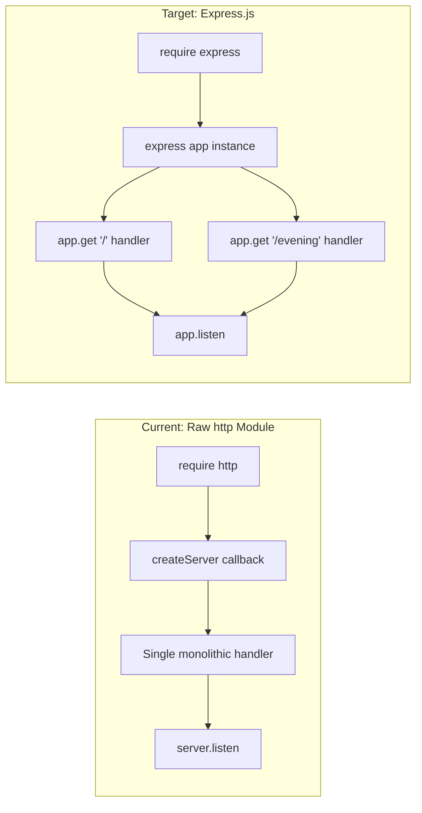

# Technical Specification

# 0. Agent Action Plan

## 0.1 Intent Clarification

### 0.1.1 Core Feature Objective

Based on the prompt, the Blitzy platform understands that the new feature requirement is to **integrate the Express.js web framework into an existing minimal Node.js HTTP server project and add a new API endpoint** that returns a "Good evening" response. The current project (`hello_world`, v1.0.0) serves a single static "Hello, World!" response using only Node.js's built-in `http` module with zero external dependencies.

The specific feature requirements are:

- **Adopt Express.js as the web framework**: Replace the raw `http.createServer()` pattern in `server.js` with an Express.js application instance, introducing the project's first external npm dependency
- **Preserve the existing "Hello World" endpoint**: The current `GET /` endpoint returning `"Hello, World!\n"` must continue to function identically after the Express.js migration, maintaining backward compatibility for any existing consumers
- **Add a new "Good evening" endpoint**: Create a second HTTP GET endpoint that returns the response `"Good evening"` — this is the net-new feature capability being introduced
- **Maintain project conventions**: The implementation must follow the existing code style (CommonJS modules, JSDoc annotations, `const` declarations, 2-space indentation) and project structure patterns already established in the repository

**Implicit requirements detected:**

- The `package.json` must be updated to declare `express` as a production dependency
- The `package-lock.json` will be regenerated to include Express.js and its transitive dependency tree
- The `README.md` must be updated to document the new endpoint, the Express.js dependency, and the revised project structure
- The server port (`3000`) and hostname (`127.0.0.1`) configuration must be preserved
- Console startup logging must remain functional after migration

### 0.1.2 Special Instructions and Constraints

- **Setup instruction provided by the user**: `npm` — confirming npm is the designated package manager for dependency installation
- **Backward compatibility**: The existing `GET /` endpoint returning `"Hello, World!\n"` must remain operational after Express.js integration
- **No environment variables or secrets**: The user has not specified any environment variables or secrets for this feature
- **No attachments or Figma screens**: No external design files or attachments have been provided
- **No specific Express.js version requested**: The user has not specified a particular Express.js version, so the latest stable release available on npm will be used

User Example (exact user request):
> "this is a tutorial of node js server hosting one endpoint that returns the response "Hello world". Could you add expressjs into the project and add another endpoint that return the response of "Good evening"?"

### 0.1.3 Technical Interpretation

These feature requirements translate to the following technical implementation strategy:

- To **integrate Express.js**, we will modify `server.js` to replace the `http.createServer()` server instantiation with an Express application instance (`express()`), registering route handlers via `app.get()` instead of a monolithic request callback
- To **preserve the existing Hello World endpoint**, we will register `app.get('/', ...)` that sends the same `"Hello, World!\n"` plain-text response with HTTP 200 status and `Content-Type: text/plain`
- To **add the Good Evening endpoint**, we will create a new route `app.get('/evening', ...)` that responds with `"Good evening"` in plain text with HTTP 200 status
- To **install Express.js**, we will run `npm install express` to add Express.js 5.2.1 (latest stable) as a production dependency in `package.json` and regenerate `package-lock.json`
- To **update documentation**, we will modify `README.md` to reflect the new dependency, updated endpoint table, and revised installation instructions


## 0.2 Repository Scope Discovery

### 0.2.1 Comprehensive File Analysis

The repository is a deliberately minimal Node.js project consisting of four source files at the root level plus a documentation folder. Every file in the repository has been inspected and its relevance to the Express.js integration feature assessed below.

#### Existing Files Requiring Modification

| File Path | Current Purpose | Modification Required | Rationale |
|-----------|----------------|----------------------|-----------|
| `server.js` | Main HTTP server entry point using raw `http` module (67 lines) | **Major rewrite** | Replace `http.createServer()` with Express.js app; register route handlers for `/` and `/evening`; update JSDoc annotations |
| `package.json` | npm manifest with zero dependencies (10 lines) | **Modify** | Add `express` to `dependencies`; update `description` and optionally `main` field; add `start` script |
| `package-lock.json` | Deterministic lockfile recording only root package (13 lines) | **Auto-regenerated** | Will be regenerated by `npm install express` to include Express.js and all transitive dependencies |
| `README.md` | Comprehensive project documentation (412 lines) | **Modify** | Update prerequisites, API endpoint table, installation notes, request flow diagram, configuration section, project structure, and deployment guide to reflect Express.js adoption and the new `/evening` endpoint |

#### Existing Files/Folders NOT Requiring Modification

| File/Folder Path | Purpose | Reason for Exclusion |
|------------------|---------|---------------------|
| `blitzy/` | Documentation artifacts folder | Contains project assessment and tech spec documents; no runtime code |
| `blitzy/documentation/Project Guide.md` | Project assessment report | Historical document; not affected by feature addition |
| `blitzy/documentation/Technical Specifications.md` | Agent action plan documentation | Specification artifact; not affected by runtime changes |
| `.git/` | Git version control | Managed by Git; no manual changes needed |

#### Integration Point Discovery

| Integration Point | Location | Impact |
|-------------------|----------|--------|
| HTTP server creation | `server.js:39` (`http.createServer()`) | Replaced with `express()` application factory |
| Request handler callback | `server.js:39-48` | Replaced with Express route handlers (`app.get()`) |
| Server listen binding | `server.js:63-66` (`server.listen()`) | Replaced with `app.listen()` |
| Module import | `server.js:14` (`require('http')`) | Replaced with `require('express')` |
| Configuration constants | `server.js:21, 28` (`hostname`, `port`) | Retained; passed to `app.listen()` |
| Response construction | `server.js:41-47` | Replaced with `res.send()` Express method |

### 0.2.2 Web Search Research Conducted

The following research was performed to inform this feature addition:

| Research Topic | Finding | Source |
|----------------|---------|--------|
| Latest Express.js stable version | Express.js 5.2.1 is the latest release on npm | npmjs.com/package/express |
| Express.js 5.x Node.js requirements | Requires Node.js >= 18 | npm view express@5.2.1 engines |
| Express.js 5.x stability status | Express 5.1.0 became the default `latest` tag on npm as of March 2025 | expressjs.com blog |
| Express.js 5.x breaking changes | Dropped Node.js < 18 support; updated path-to-regexp; removed deprecated v3/v4 API methods | GitHub releases |
| Node.js 20.x compatibility | Node.js 20.x (current project runtime) satisfies Express 5.x requirement of >= 18 | Verified via npm view |

### 0.2.3 New File Requirements

Given the minimal scope of this feature (adding one dependency and one endpoint to an existing single-file server), no new source files need to be created. All changes are modifications to existing files:

- **No new source files**: The Express.js integration and new endpoint will be implemented directly in the existing `server.js`
- **No new test files**: The project currently has no test framework; adding tests is outside the scope of this feature request
- **No new configuration files**: Express.js configuration will be handled inline within `server.js`, consistent with the project's minimal architecture
- **No new documentation files**: Updates to the existing `README.md` are sufficient to document the new endpoint


## 0.3 Dependency Inventory

### 0.3.1 Private and Public Packages

The project currently has zero external dependencies. This feature introduces Express.js as the first and only production dependency.

| Registry | Package Name | Version | Purpose | Node.js Requirement |
|----------|-------------|---------|---------|-------------------|
| npm (public) | `express` | `5.2.1` | Web framework for HTTP routing and middleware; replaces raw `http.createServer()` | `>= 18` |

**Version Justification:**
- Express.js `5.2.1` is the current latest stable version on npm as of February 2026, verified via `npm view express version`
- Express 5.x became the default `latest` tag on npm in March 2025 (Express 5.1.0 release)
- The project's Node.js runtime (v20.x) satisfies Express 5.x's minimum requirement of Node.js >= 18
- No user-specified version constraint was provided, so the latest stable release is used per npm default behavior

**Existing Built-in Dependencies (unchanged):**

| Module | Type | Current Usage | Post-Migration Usage |
|--------|------|---------------|---------------------|
| `http` | Node.js built-in | Server creation (`server.js:14`) | **Removed** — Express.js internally manages HTTP server creation |

### 0.3.2 Dependency Updates

#### Import Updates

The following import transformation will be applied in `server.js`:

| File | Current Import | New Import | Reason |
|------|---------------|------------|--------|
| `server.js` | `const http = require('http');` | `const express = require('express');` | Express.js replaces raw `http` module for server creation |

#### Package Manifest Updates

**`package.json` changes:**

| Field | Current Value | New Value | Purpose |
|-------|--------------|-----------|---------|
| `dependencies` | *(absent)* | `{ "express": "^5.2.1" }` | Declares Express.js as a production dependency |
| `scripts.start` | *(absent)* | `"node server.js"` | Adds a conventional npm start script |
| `description` | `"Hello world in Node.js"` | Updated to reflect Express.js usage | Accurate project description |

**`package-lock.json` regeneration:**
- The lockfile will be automatically regenerated by running `npm install express`
- It will grow from 13 lines (root-only) to include Express.js and its full transitive dependency tree
- Lockfile version remains `3` (compatible with npm 7+)

#### External Reference Updates

| File | Section to Update | Change Description |
|------|-------------------|-------------------|
| `README.md` | Prerequisites table | Add Express.js version requirement |
| `README.md` | Installation section | Remove note about "no external dependencies" |
| `README.md` | API Documentation table | Add new `/evening` endpoint row |
| `README.md` | Project Structure | Update file descriptions to reference Express.js |
| `README.md` | Deployment Guide | Update ecosystem config if applicable |


## 0.4 Integration Analysis

### 0.4.1 Existing Code Touchpoints

The Express.js integration requires modifications at every functional layer of `server.js`. Because the project is a single-file application, all touchpoints are concentrated in this one file.

#### Direct Modifications Required

| File | Location | Current Code | Required Change |
|------|----------|-------------|-----------------|
| `server.js` | Line 14 | `const http = require('http');` | Replace with `const express = require('express');` |
| `server.js` | Lines 1-11 | JSDoc `@fileoverview` and `@requires http` | Update to reference Express.js instead of raw `http` module |
| `server.js` | Lines 21-28 | Configuration constants (`hostname`, `port`) | Retain as-is; these constants feed into `app.listen()` |
| `server.js` | Lines 39-48 | `http.createServer((req, res) => { ... })` | Replace with `const app = express();` and individual `app.get()` route registrations |
| `server.js` | Lines 63-66 | `server.listen(port, hostname, () => { ... })` | Replace with `app.listen(port, hostname, () => { ... })` |

#### Integration Flow Transformation



### 0.4.2 Dependency Injection Points

| Component | Current Wiring | New Wiring |
|-----------|---------------|------------|
| HTTP Server Factory | `http.createServer(callback)` at `server.js:39` | `express()` application constructor |
| Route Registration | Implicit — all requests hit one callback | Explicit — `app.get('/', handler)` and `app.get('/evening', handler)` |
| Response API | `res.statusCode`, `res.setHeader()`, `res.end()` | `res.send()` Express response method (auto-sets Content-Type and status) |
| Server Binding | `server.listen(port, hostname, cb)` | `app.listen(port, hostname, cb)` — Express wraps `http.Server.listen()` internally |

### 0.4.3 Database/Schema Updates

- **Not applicable** — This project has no database, no persistent storage, and no schema. The feature addition is purely an HTTP routing change with no data layer impact.

### 0.4.4 Middleware and Cross-Cutting Concerns

| Concern | Impact | Decision |
|---------|--------|----------|
| Error handling | Express 5.x automatically catches rejected promises in route handlers | No custom error middleware needed for this simple feature |
| Content-Type headers | Express `res.send()` auto-detects Content-Type for string responses as `text/html` | Explicitly use `res.type('text').send()` or `res.set('Content-Type', 'text/plain').send()` to preserve `text/plain` behavior matching the original server |
| Request logging | Not currently implemented | Out of scope; no middleware additions required |
| CORS | Not currently implemented | Out of scope; no middleware additions required |


## 0.5 Technical Implementation

### 0.5.1 File-by-File Execution Plan

Every file listed below **must** be created or modified as part of this feature implementation.

**Group 1 — Core Application (Express.js Migration + New Endpoint):**

| Action | File | Purpose |
|--------|------|---------|
| **MODIFY** | `server.js` | Replace raw `http` module with Express.js application; register `GET /` route preserving "Hello, World!\n" response; register new `GET /evening` route returning "Good evening"; update JSDoc annotations to reference Express.js; retain `hostname` and `port` configuration constants; bind via `app.listen()` |

**Group 2 — Dependency Management:**

| Action | File | Purpose |
|--------|------|---------|
| **MODIFY** | `package.json` | Add `express` to `dependencies` with version `^5.2.1`; add `start` script (`node server.js`); update `description` field |
| **REGENERATE** | `package-lock.json` | Automatically regenerated by `npm install express` to include Express.js and its transitive dependency tree |

**Group 3 — Documentation:**

| Action | File | Purpose |
|--------|------|---------|
| **MODIFY** | `README.md` | Update prerequisites to include Express.js; update API endpoint reference table with `/evening` endpoint; revise installation section to note Express.js dependency; update request flow diagram; update project structure section; update configuration section for Express.js context |

### 0.5.2 Implementation Approach per File

## server.js — Express.js Migration and New Endpoint

The implementation establishes the Express.js foundation by transforming the server from a raw `http` module pattern to an Express.js application with explicit route definitions.

- **Replace the import**: Swap `require('http')` with `require('express')`
- **Create Express app**: Replace `http.createServer(callback)` with `const app = express()`
- **Register the root route**: Add `app.get('/', (req, res) => { ... })` that sends `"Hello, World!\n"` with `Content-Type: text/plain` and HTTP 200 status, preserving exact backward compatibility with the original response
- **Register the evening route**: Add `app.get('/evening', (req, res) => { ... })` that sends `"Good evening"` with `Content-Type: text/plain` and HTTP 200 status
- **Bind the server**: Replace `server.listen()` with `app.listen(port, hostname, callback)` retaining the existing console log message
- **Update JSDoc**: Revise `@fileoverview`, `@requires`, and `@module` tags to reference Express.js; add JSDoc for each route handler

The resulting `server.js` structure:

```javascript
const express = require('express');
const app = express();
app.get('/', (req, res) => { /* Hello World */ });
```

## package.json — Dependency Declaration

- Add `"express": "^5.2.1"` under a new `dependencies` object
- Add `"start": "node server.js"` under `scripts` for conventional npm startup
- Update `description` to reflect Express.js usage

## package-lock.json — Lockfile Regeneration

- Automatically handled by running `npm install express` in the project root
- No manual edits; npm generates the deterministic lockfile

## README.md — Documentation Updates

- **Prerequisites section**: Add Express.js 5.x to the requirements table
- **Installation section**: Remove the note stating "This project has no external dependencies" and confirm `npm install` installs Express.js
- **API Documentation section**: Add a new row for `GET /evening` in the endpoint reference table; add request/response details for the new endpoint
- **Request Flow Diagram**: Update the Mermaid sequence diagram to show both endpoints with Express routing
- **Configuration section**: Note that Express.js is now the server framework
- **Project Structure section**: Update file descriptions to mention Express.js
- **Deployment Guide section**: Update PM2 ecosystem config examples if affected

### 0.5.3 User Interface Design

Not applicable — this project is a headless HTTP server with no user interface. No Figma screens or UI designs were provided.


## 0.6 Scope Boundaries

### 0.6.1 Exhaustively In Scope

All files and changes required for this feature are enumerated below. This is the complete and exhaustive boundary of the implementation.

**Application Source:**

| Pattern / Path | Scope Detail |
|---------------|--------------|
| `server.js` | Full rewrite: Express.js import, app instantiation, `GET /` route (Hello World), `GET /evening` route (Good evening), `app.listen()` binding, JSDoc updates |

**Dependency Management:**

| Pattern / Path | Scope Detail |
|---------------|--------------|
| `package.json` | Add `express` dependency (`^5.2.1`), add `start` script, update `description` |
| `package-lock.json` | Regenerate via `npm install express` — includes Express.js and all transitive dependencies |

**Documentation:**

| Pattern / Path | Scope Detail |
|---------------|--------------|
| `README.md` | Update prerequisites table, installation section, API endpoint table (add `GET /evening`), request/response details, Mermaid sequence diagram, configuration section, project structure section |

**Integration Points:**

| Integration Point | File | Lines/Section Affected |
|-------------------|------|----------------------|
| Route registration for `GET /` | `server.js` | New Express route handler replacing lines 39-48 |
| Route registration for `GET /evening` | `server.js` | Net-new Express route handler |
| Server binding | `server.js` | `app.listen()` replacing lines 63-66 |
| Dependency declaration | `package.json` | New `dependencies` field |
| Endpoint documentation | `README.md` | API Documentation section (~lines 116-168) |

### 0.6.2 Explicitly Out of Scope

The following items are **not** part of this feature implementation:

| Excluded Item | Rationale |
|--------------|-----------|
| Adding a test framework (Jest, Mocha, etc.) | User did not request tests; the existing project has no test infrastructure |
| Adding middleware (CORS, body-parser, logging) | User only requested Express.js and a new endpoint; no middleware was specified |
| TypeScript migration | Project uses plain JavaScript (CommonJS); no TypeScript conversion was requested |
| ES Modules migration | Project uses `require()` (CommonJS); no module system change was requested |
| Environment variable configuration | User did not request `.env` file or `dotenv` integration; hardcoded constants are retained |
| Docker or CI/CD pipeline changes | No containerization or pipeline files exist; none were requested |
| Additional endpoints beyond `/evening` | Only one new endpoint was requested |
| Error handling middleware | The two routes are simple static responses; custom error handling is unnecessary |
| Performance optimization | Out of scope; not requested |
| Refactoring of `blitzy/` documentation files | These are historical documentation artifacts unrelated to the runtime server |
| Database or persistent storage integration | No data layer exists or was requested |
| Authentication or authorization | No security layer was requested |


## 0.7 Rules for Feature Addition

### 0.7.1 Feature-Specific Rules and Requirements

The following rules govern the implementation of this feature, derived from the user's request and the existing project conventions:

**Behavioral Compatibility:**

- The `GET /` endpoint **must** return the exact response body `"Hello, World!\n"` with HTTP status `200` and `Content-Type: text/plain` — preserving identical behavior to the current raw `http` implementation
- The new `GET /evening` endpoint **must** return the response body `"Good evening"` with HTTP status `200` and `Content-Type: text/plain`
- The server **must** continue to bind to `hostname = '127.0.0.1'` and `port = 3000` by default

**Code Style Conventions (matching existing patterns in `server.js`):**

- Use CommonJS module syntax (`require()` / `module.exports`)
- Use `const` for all variable declarations
- Use arrow functions for callbacks
- Use template literals for string interpolation
- Use 2-space indentation
- Include comprehensive JSDoc annotations (`@fileoverview`, `@module`, `@requires`, `@constant`, `@example`)
- Include inline comments explaining each significant operation

**Dependency Management:**

- Use `npm` as the package manager (per user setup instructions)
- Install Express.js via `npm install express` (no manual `package.json` edits for version)
- The `^` semver range prefix in `package.json` allows compatible minor/patch updates

**Documentation Standards:**

- All endpoint documentation in `README.md` must include method, path, description, status code, and content-type
- Mermaid diagrams must be updated to reflect the new routing architecture
- Installation instructions must accurately reflect the dependency installation step


## 0.8 References

### 0.8.1 Repository Files and Folders Searched

The following files and folders were comprehensively inspected to derive the conclusions in this Agent Action Plan:

| Path | Type | Purpose of Inspection |
|------|------|----------------------|
| ` ` (root) | Folder | Identify all project files, folder structure, and project summary |
| `server.js` | File | Analyze current HTTP server implementation, code patterns, JSDoc style, and integration points (67 lines, fully read) |
| `package.json` | File | Identify current dependencies (none), project metadata, scripts, and npm configuration (10 lines, fully read) |
| `package-lock.json` | File | Verify current lockfile state and dependency footprint (13 lines, fully read) |
| `README.md` | File | Assess existing documentation structure, endpoint documentation, prerequisites, and deployment guide (412 lines, fully read) |
| `blitzy/` | Folder | Inspect documentation artifacts folder and assess relevance to feature changes |
| `blitzy/documentation/` | Folder | Review contents for any runtime-relevant configuration or constraints |

### 0.8.2 Technical Specification Sections Consulted

| Section | Purpose of Consultation |
|---------|------------------------|
| 1.1 Executive Summary | Understand project purpose, stakeholders, and value proposition |
| 2.2 Feature Catalog | Review existing feature definitions (F-001, F-002, F-003) for integration understanding |
| 3.2 Programming Languages | Confirm JavaScript/ES6+ usage, CommonJS module system, and code patterns |
| 3.3 Frameworks & Libraries | Understand the intentional zero-framework decision being changed by this feature |
| 5.2 Component Details | Analyze Configuration Module, Request Handler, and Server Instance component architecture |
| Node.js Version Requirements | Verify Node.js and npm version constraints for Express.js compatibility |

### 0.8.3 External Research Conducted

| Source | URL / Method | Information Retrieved |
|--------|-------------|----------------------|
| npm registry | `npm view express version` | Latest Express.js version: 5.2.1 |
| npm registry | `npm view express@5.2.1 engines` | Node.js requirement: `>= 18` |
| GitHub (expressjs/express) | Web search | Express 5.x release details, breaking changes, Node.js compatibility |
| expressjs.com | Web search | Express 5.1.0 became default `latest` on npm (March 2025) |
| npmjs.com/package/express | Web search | Express 5.2.1 is latest; 97,614 dependents in npm ecosystem |

### 0.8.4 Attachments and External Resources

- **No attachments were provided** for this project
- **No Figma screens were provided** for this project
- **No environment files were provided** in `/tmp/environments_files/`


