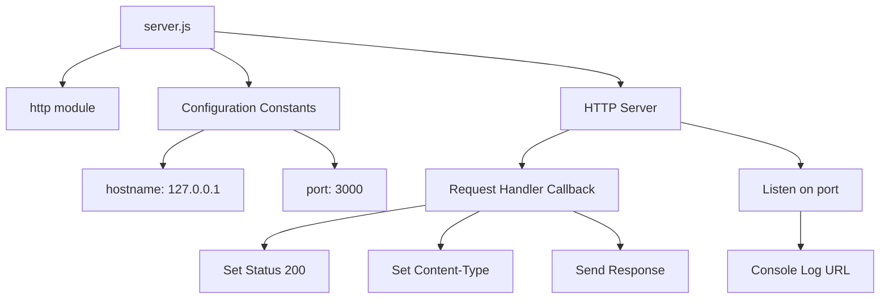
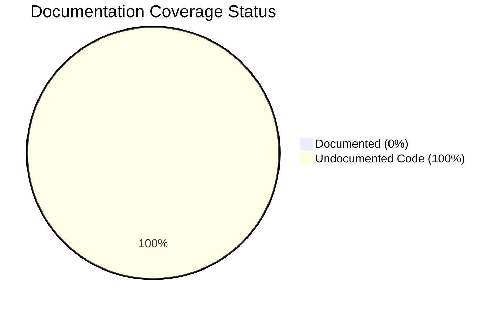
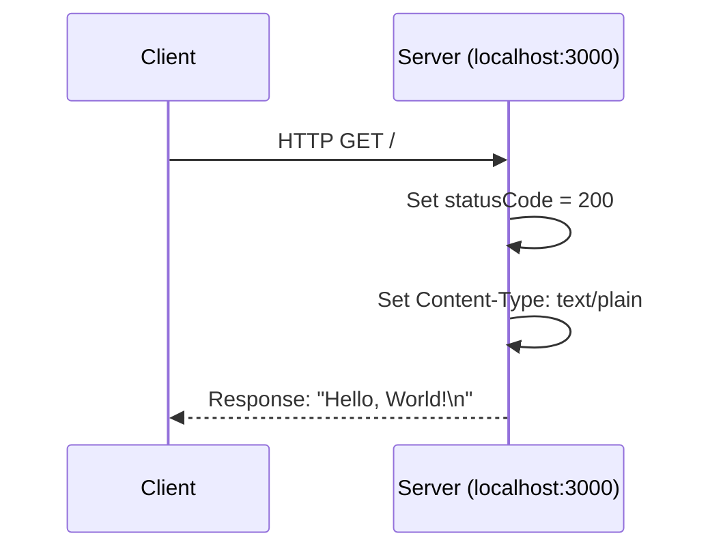
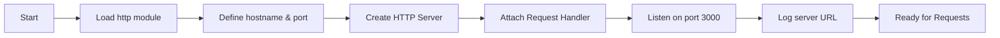

# Technical Specification

# 0. Agent Action Plan

## 0.1 Intent Clarification

Based on the provided requirements, the Blitzy platform understands that the documentation objective is to **create comprehensive documentation** for a simple Node.js HTTP server application. The user's request encompasses multiple documentation deliverables that will enhance code maintainability, developer onboarding, and operational understanding.

### 0.1.1 Core Documentation Objective

**Request Category:** Create new documentation | Update existing documentation

**Documentation Types Identified:**
- API documentation (JSDoc comments in source code)
- README file (comprehensive project documentation)
- User guides (setup instructions)
- Technical documentation (deployment guide)
- Code documentation (inline explanations)

**Explicit Requirements (as stated by user):**

| # | Requirement | Documentation Type | Priority |
|---|-------------|-------------------|----------|
| 1 | Add JSDoc comments to server.js functions | API/Code Documentation | High |
| 2 | Create comprehensive README | Project Documentation | High |
| 3 | Setup instructions | User Guide | High |
| 4 | API documentation | Technical Reference | High |
| 5 | Deployment guide | Operations Documentation | High |
| 6 | Inline code explanations | Code Documentation | High |

### 0.1.2 Special Instructions and Constraints

**Directives Captured:**
- No specific style guide provided - will follow JSDoc and Markdown best practices
- No template constraints specified - will create documentation structure from scratch
- Comprehensive coverage requested - all aspects of the application should be documented

**Template Requirements:** None specified - documentation will follow industry-standard Node.js project conventions

**Style Preferences:**
- Clear and concise technical writing
- Proper code examples with syntax highlighting
- Structured sections for easy navigation

### 0.1.3 Technical Interpretation

These documentation requirements translate to the following technical documentation strategy:

- **To add JSDoc comments**, we will **update** `server.js` by inserting JSDoc block comments above each function, constant, and module declaration with proper tags (@description, @param, @returns, @module, @constant, @type, @example)

- **To create a comprehensive README**, we will **update** `README.md` with complete project overview, installation steps, usage examples, API reference, configuration details, deployment instructions, and license information

- **To provide setup instructions**, we will **create** a dedicated section in README.md covering prerequisites, installation commands, environment configuration, and verification steps

- **To document the API**, we will **create** endpoint documentation describing the HTTP server behavior, request handling, and response format

- **To create a deployment guide**, we will **create** a section covering production deployment considerations, server configuration, process management, and monitoring recommendations

- **To add inline code explanations**, we will **update** `server.js` with contextual comments explaining code logic and design decisions

### 0.1.4 Inferred Documentation Needs

Based on code analysis, the following implicit documentation needs were identified:

| Source | Inferred Need | Rationale |
|--------|---------------|-----------|
| `server.js:1` | Module documentation | http module import requires explanation of its purpose |
| `server.js:3-4` | Configuration documentation | hostname and port constants need environment context |
| `server.js:6-10` | Request handler documentation | The callback function needs parameter and behavior docs |
| `server.js:12-14` | Server lifecycle documentation | The listen call and callback need usage explanation |
| `package.json` | Project metadata context | Name, version, and scripts should be referenced in README |
| No tests defined | Testing section | README should note test availability status |
| MIT License | License section | README should clarify licensing terms |

**User Journey Documentation Requirements:**
- New developers need quick-start guide to run the server
- Operations teams need deployment and monitoring guidance
- Contributors need understanding of code structure and conventions

## 0.2 Documentation Discovery and Analysis

### 0.2.1 Existing Documentation Infrastructure Assessment

**Repository Analysis Findings:**

Repository analysis reveals a **minimal documentation structure** with **significant coverage gaps**. The project contains only 4 files at the root level with no dedicated documentation folder.

**Search Patterns Employed:**

| Pattern | Files Found | Documentation Status |
|---------|-------------|---------------------|
| `README*` | `README.md` | Exists but minimal (2 lines) |
| `docs/**` | None | Not present |
| `*.md` | `README.md` | Single file, incomplete |
| `*.rst` | None | Not present |
| `wiki/**` | None | Not present |
| `jsdoc.json` | None | Not present |
| `*.jsdoc` | None | Not present |

**Current Documentation Infrastructure:**
- Documentation framework: None configured
- Documentation generator: None installed
- API documentation tools: None in use
- Diagram tools: None detected
- Documentation hosting: Not configured

**Existing Documentation Content (README.md):**

```
# hao-backprop-test

test project for backprop integration. Do not touch!
```

**Assessment:** The current README provides only a project title and a brief warning note. It lacks all standard documentation sections including installation, usage, API reference, and deployment guidance.

### 0.2.2 Repository Code Analysis for Documentation

**Search Patterns Used for Code to Document:**

| Pattern | Target | Files Found |
|---------|--------|-------------|
| `server.js` | Main application entry | 1 file (15 lines) |
| `*.js` | JavaScript source files | 1 file |
| `package.json` | NPM configuration | 1 file |
| `package-lock.json` | Dependency lock | 1 file |

**Key Directories Examined:**
- Root directory (`/`) - Contains all project files
- No subdirectories exist

**Code Components Requiring Documentation:**

| File | Component | Type | Current Docs | Needed |
|------|-----------|------|--------------|--------|
| `server.js:1` | `http` require | Import | None | JSDoc @requires |
| `server.js:3` | `hostname` | Constant | None | JSDoc @constant |
| `server.js:4` | `port` | Constant | None | JSDoc @constant |
| `server.js:6-10` | Request handler | Callback | None | JSDoc @callback |
| `server.js:6` | `http.createServer()` | Function call | None | Inline comment |
| `server.js:12-14` | `server.listen()` | Method call | None | JSDoc @example |

**Code Structure Analysis:**



### 0.2.3 Web Search Research Conducted

**Research Areas Investigated:**

| Topic | Purpose | Key Findings |
|-------|---------|--------------|
| JSDoc best practices Node.js | Code documentation standards | Use @module, @param, @returns, @example tags; Document CommonJS modules with @module tag |
| Node.js README template | Project documentation structure | Include sections: Description, Installation, Usage, API, Deployment, License |
| HTTP server documentation | API documentation patterns | Document endpoints, request/response formats, status codes |

**Best Practices Identified:**

- **JSDoc Standards:** Use structured block comments starting with `/**`, include @description for function purpose, @param for parameters with types, @returns for return values
- **README Structure:** Follow common pattern with badges, description, TOC, installation, usage, API reference, contributing, and license sections
- **Node.js Conventions:** Document CommonJS modules using @module tag, use @requires for dependencies, include @example for usage demonstrations

## 0.3 Documentation Scope Analysis

### 0.3.1 Code-to-Documentation Mapping

**Modules Requiring Documentation:**

**Module: server.js (Primary Application)**
| Element | Line | Public/Private | Current Doc | Documentation Needed |
|---------|------|----------------|-------------|---------------------|
| Module declaration | 1-15 | Public | None | @fileoverview, @module, @author |
| `http` import | 1 | Public | None | @requires with description |
| `hostname` constant | 3 | Public | None | @constant with @type and @default |
| `port` constant | 4 | Public | None | @constant with @type and @default |
| Request handler callback | 6-10 | Public | None | @callback with @param for req, res |
| Server instance | 6 | Public | None | @type annotation |
| `server.listen()` call | 12-14 | Public | None | @example with usage |
| Console log callback | 13 | Private | None | Inline comment |

**Configuration Options Requiring Documentation:**

| Config | File Location | Documented | Missing Documentation |
|--------|--------------|------------|----------------------|
| Server hostname | `server.js:3` | No | Default value, environment override potential |
| Server port | `server.js:4` | No | Default value, environment override potential |
| Response content | `server.js:9` | No | Response format, customization options |

**Features Requiring User Guides:**

| Feature | Current Coverage | Gaps |
|---------|------------------|------|
| HTTP Server | None | Overview, start/stop, request handling |
| Hello World Endpoint | None | URL, method, response format |
| Configuration | None | How to modify host/port |

### 0.3.2 Documentation Gap Analysis

Given the requirements and repository analysis, documentation gaps include:

**Undocumented Public APIs:**

| Component | Gap Type | Impact |
|-----------|----------|--------|
| HTTP endpoint (GET /) | Complete absence | Users don't know how to interact with server |
| Response format | No specification | Response structure undocumented |
| Status codes | Not listed | No error handling documentation |

**Missing User Guides:**

| Guide Topic | Current State | Required Content |
|-------------|---------------|------------------|
| Installation | Not present | Prerequisites, npm install, verification |
| Quick Start | Not present | Basic usage to run server |
| Configuration | Not present | Environment variables, customization |
| Troubleshooting | Not present | Common issues and solutions |

**Incomplete Architecture Documentation:**

| Area | Status | Needed |
|------|--------|--------|
| System overview | Missing | High-level architecture diagram |
| Request flow | Missing | Request/response lifecycle |
| Module structure | Missing | File/module relationship |

**Outdated Documentation:**

| File | Issue | Required Update |
|------|-------|-----------------|
| `README.md` | Contains only warning text | Complete rewrite with all sections |

### 0.3.3 Documentation Comprehensiveness Matrix



**Current vs. Target Documentation:**

| Documentation Area | Current State | Target State | Gap |
|-------------------|---------------|--------------|-----|
| JSDoc in server.js | 0 blocks | 6+ blocks | Full creation needed |
| README sections | 1 section | 10+ sections | 9 sections to add |
| API documentation | 0 endpoints | 1 endpoint | Full creation needed |
| Setup instructions | 0 steps | 5+ steps | Full creation needed |
| Deployment guide | 0 sections | 3+ sections | Full creation needed |
| Inline comments | 0 comments | 5+ comments | Full creation needed |

## 0.4 Documentation Implementation Design

### 0.4.1 Documentation Structure Planning

**Proposed Documentation Hierarchy:**

```
Project Root/
├── README.md (comprehensive documentation)
│   ├── Project Title & Badges
│   ├── Description
│   ├── Table of Contents
│   ├── Prerequisites
│   ├── Installation
│   ├── Usage / Quick Start
│   ├── API Documentation
│   │   └── GET / endpoint
│   ├── Configuration
│   ├── Deployment Guide
│   │   ├── Production Considerations
│   │   ├── Process Management
│   │   └── Monitoring
│   ├── Project Structure
│   ├── Contributing
│   └── License
│
├── server.js (with JSDoc comments)
│   ├── @fileoverview block
│   ├── @module declaration
│   ├── @constant hostname
│   ├── @constant port
│   ├── Server creation with inline comments
│   ├── @callback requestHandler
│   └── Server listen with @example
│
├── package.json (referenced, not modified)
└── package-lock.json (referenced, not modified)
```

### 0.4.2 Content Generation Strategy

**Information Extraction Approach:**

| Source | Extraction Method | Target Documentation |
|--------|-------------------|---------------------|
| `server.js:3-4` | Extract constant values | Configuration section in README |
| `server.js:6-10` | Analyze request handler | API endpoint documentation |
| `server.js:12-14` | Parse listen parameters | Usage/Quick Start section |
| `package.json` | Extract metadata | README header, prerequisites |
| `package-lock.json` | Extract Node version info | Prerequisites section |

**JSDoc Comment Structure for server.js:**

```javascript
/**
 * @fileoverview Simple HTTP server...
 * @module server
 * @requires http
 */
```

**README Section Templates:**

| Section | Content Source | Format |
|---------|----------------|--------|
| Prerequisites | package.json, runtime analysis | Bulleted list |
| Installation | npm commands | Code blocks |
| Usage | server.js analysis | Code examples + output |
| API | Request handler analysis | Table + code examples |
| Configuration | Constant analysis | Table with descriptions |
| Deployment | Best practices research | Numbered steps |

### 0.4.3 Documentation Standards

**Markdown Formatting Standards:**
- Headers: Use `#` hierarchy (H1 for title, H2 for main sections, H3 for subsections)
- Code blocks: Use triple backticks with language identifier (```bash, ```javascript)
- Tables: Use pipe-delimited format for structured data
- Links: Use reference-style links for repeated URLs

**JSDoc Standards:**
- Block comments: Start with `/**` and end with `*/`
- Tags: Use standard JSDoc tags (@param, @returns, @example, @constant, @type)
- Types: Specify JavaScript types in curly braces ({string}, {number}, {Object})
- Descriptions: Start with capital letter, use complete sentences

**Code Example Standards:**
- Include working, copy-paste ready examples
- Show expected output where applicable
- Use consistent indentation (2 spaces)

### 0.4.4 Diagram and Visual Strategy

**Mermaid Diagrams to Create:**

| Diagram Type | Purpose | Location |
|--------------|---------|----------|
| Flowchart | Request/Response lifecycle | README - API section |
| Sequence Diagram | Server startup flow | README - Usage section |

**Request Flow Diagram (to be included in README):**



**Server Lifecycle Diagram:**



### 0.4.5 Citation Requirements

All documentation will include source citations:

| Documentation Element | Citation Format |
|-----------------------|-----------------|
| Code examples | `Source: server.js:line_number` |
| Configuration values | `Default: value (from server.js)` |
| Package metadata | `From: package.json` |
| Technical claims | Inline reference to source file |

## 0.5 Documentation File Transformation Mapping

### 0.5.1 File-by-File Documentation Plan

**Complete Documentation Transformation Map:**

| Target Documentation File | Transformation | Source Code/Docs | Content/Changes |
|---------------------------|----------------|------------------|-----------------|
| `server.js` | UPDATE | `server.js` | Add JSDoc comments to module, constants, functions; add inline code explanations |
| `README.md` | UPDATE | `README.md`, `server.js`, `package.json` | Complete rewrite with: project overview, badges, TOC, prerequisites, installation, usage, API docs, configuration, deployment guide, project structure, contributing, license |

### 0.5.2 New Documentation Content Details

**File: server.js - JSDoc Comments Addition**

| Line(s) | Current State | JSDoc Addition |
|---------|---------------|----------------|
| 1 (before) | None | `@fileoverview`, `@module server`, `@author`, `@version`, `@requires http` |
| 3 | `const hostname = '127.0.0.1';` | `@constant {string} hostname - Server bind address` |
| 4 | `const port = 3000;` | `@constant {number} port - Server listening port` |
| 6-10 | `http.createServer((req, res) => {...})` | `@callback requestHandler`, `@param {http.IncomingMessage} req`, `@param {http.ServerResponse} res` |
| 7 | `res.statusCode = 200;` | Inline comment: `// Set HTTP success status` |
| 8 | `res.setHeader(...)` | Inline comment: `// Set response content type` |
| 9 | `res.end(...)` | Inline comment: `// Send response body and end` |
| 12-14 | `server.listen(...)` | `@example` with usage demonstration |

**Expected JSDoc Structure for server.js:**

```
File: server.js
Type: Source Code with JSDoc
Components to Document:
  - File-level: @fileoverview (purpose and overview)
  - Module: @module server declaration  
  - Imports: @requires http (Node.js built-in)
  - Constants: hostname (@constant, @type, @default)
  - Constants: port (@constant, @type, @default)
  - Callback: requestHandler (@callback, @param req, @param res)
  - Inline: 3 explanatory comments for response logic
Key Citations: package.json (version), http module docs
```

### 0.5.3 Documentation Files to Update Details

**README.md - Complete Restructure:**

| Section | New Content | Source |
|---------|-------------|--------|
| Title | `# Hello World Node.js Server` | `package.json:name` |
| Badges | License badge, Node.js version | `package.json:license`, runtime |
| Description | "A simple HTTP server that responds with 'Hello, World!'" | `server.js:9`, `package.json:description` |
| Table of Contents | Auto-generated section links | All sections |
| Prerequisites | Node.js v14.0.0 or higher, npm | Runtime requirements |
| Installation | `git clone`, `cd`, `npm install` | Standard commands |
| Usage | `node server.js`, curl example, expected output | `server.js:12-14` |
| API Reference | `GET /` endpoint with request/response details | `server.js:6-10` |
| Configuration | hostname and port constants | `server.js:3-4` |
| Deployment | Production considerations, PM2, environment config | Best practices |
| Project Structure | File tree with descriptions | Repository analysis |
| Contributing | Basic contribution guidelines | Standard template |
| License | MIT License notice | `package.json:license` |

**README.md Section Details:**

```
File: README.md
Type: Project Documentation
Current State: 2 lines (title + warning)
Target State: 10+ sections, ~200 lines
Sections:
  - Header (title, badges, description)
  - Table of Contents (linked navigation)
  - Prerequisites (Node.js version, npm)
  - Installation (clone, install steps)
  - Usage (start server, test endpoint)
  - API Documentation (endpoint reference table)
  - Configuration (environment options)
  - Deployment Guide (production, PM2, monitoring)
  - Project Structure (file descriptions)
  - Contributing (guidelines)
  - License (MIT)
Diagrams:
  - Request flow sequence diagram
  - Server architecture flowchart
Key Citations: server.js, package.json
```

### 0.5.4 Cross-Documentation Dependencies

**Internal References:**

| From Document | To Document | Reference Type |
|---------------|-------------|----------------|
| README.md | server.js | Code examples, configuration values |
| README.md | package.json | Project metadata, license |
| server.js JSDoc | README.md | Cross-reference for detailed docs |

**Navigation Structure:**

| README Section | Links To |
|----------------|----------|
| Table of Contents | All major sections |
| Prerequisites | Node.js download page (external) |
| API Reference | server.js source (internal) |
| License | LICENSE file or package.json |

### 0.5.5 Comprehensive File List

**All Documentation Files In Scope:**

| File Path | Action | Priority | Estimated Changes |
|-----------|--------|----------|-------------------|
| `server.js` | UPDATE (add JSDoc + inline comments) | High | +25-30 lines of comments |
| `README.md` | UPDATE (complete rewrite) | High | ~200 lines (from 2 lines) |

**Files Referenced But Not Modified:**

| File Path | Reference Purpose |
|-----------|-------------------|
| `package.json` | Extract project metadata for README |
| `package-lock.json` | Verify lockfile version for docs |

## 0.6 Dependency Inventory

### 0.6.1 Documentation Dependencies

**Project Dependencies Analysis:**

The project currently has **no external dependencies**. All functionality relies on Node.js built-in modules.

**Built-in Module Dependencies:**

| Module | Source | Purpose | Documentation Reference |
|--------|--------|---------|------------------------|
| `http` | Node.js core | HTTP server creation | [Node.js HTTP Documentation](https://nodejs.org/api/http.html) |

**Runtime Requirements:**

| Runtime | Minimum Version | Recommended | Source |
|---------|-----------------|-------------|--------|
| Node.js | 14.0.0 | 20.x LTS | `package-lock.json:lockfileVersion:3` (requires Node 16+) |
| npm | 6.0.0 | 10.x | Bundled with Node.js |

**Note:** The `lockfileVersion: 3` in `package-lock.json` indicates compatibility with npm 7+ which requires Node.js 10.0.0+, but for modern best practices and security, Node.js 14+ is recommended.

### 0.6.2 Documentation Tool Recommendations

Since no documentation tools are currently installed, the following are recommended for enhancing documentation workflow:

| Registry | Package Name | Version | Purpose |
|----------|--------------|---------|---------|
| npm | jsdoc | 4.0.4 | Generate HTML documentation from JSDoc comments |
| npm | docdash | 2.0.2 | Clean JSDoc template theme |
| npm | jsdoc-to-markdown | 9.0.5 | Generate Markdown API docs from JSDoc |
| npm | markdown-toc | 1.2.0 | Auto-generate table of contents for README |

**Optional Development Dependencies (for documentation generation):**

```json
{
  "devDependencies": {
    "jsdoc": "^4.0.4"
  },
  "scripts": {
    "docs": "jsdoc server.js -d docs/"
  }
}
```

### 0.6.3 Documentation Reference Updates

**No documentation link updates required** - this is a new documentation effort with no existing internal links to maintain.

**External References to Include in README:**

| Reference | URL | Context |
|-----------|-----|---------|
| Node.js | https://nodejs.org/ | Prerequisites section |
| Node.js HTTP API | https://nodejs.org/api/http.html | API Reference section |
| npm | https://www.npmjs.com/ | Installation section |

### 0.6.4 Version Compatibility Notes

**Documentation Version Alignment:**

| Component | Current Version | Documentation Target |
|-----------|-----------------|---------------------|
| Project | 1.0.0 | README version badge |
| Node.js API | http (stable) | Node.js LTS documentation |
| npm lockfile | v3 | Document npm 7+ requirement |

**Version Constraints for Documentation:**

- JSDoc comments will use standard tags compatible with JSDoc 3.x and 4.x
- README Markdown syntax compatible with GitHub Flavored Markdown
- Mermaid diagrams use syntax compatible with GitHub rendering

## 0.7 Coverage and Quality Targets

### 0.7.1 Documentation Coverage Metrics

**Current Coverage Analysis:**

| Documentation Category | Current | Target | Gap |
|-----------------------|---------|--------|-----|
| Public APIs documented | 0/4 (0%) | 4/4 (100%) | 4 items |
| Constants documented | 0/2 (0%) | 2/2 (100%) | 2 items |
| README sections | 1/11 (9%) | 11/11 (100%) | 10 sections |
| Inline code comments | 0/5 (0%) | 5/5 (100%) | 5 comments |

**Target Coverage: 100%** based on user requirement for "comprehensive" documentation

**Coverage Gaps to Address:**

| Component | Current State | Target State | Action |
|-----------|---------------|--------------|--------|
| server.js JSDoc | 0% documented | 100% documented | Add 6 JSDoc blocks |
| server.js inline | 0% commented | Key lines commented | Add 5 inline comments |
| README.md | 9% complete | 100% complete | Add 10 sections |

### 0.7.2 Documentation Quality Criteria

**Completeness Requirements:**

| Documentation Type | Required Elements | Verification |
|-------------------|-------------------|--------------|
| JSDoc - Module | @fileoverview, @module, @author, @requires | All tags present |
| JSDoc - Constants | @constant, @type, @default, description | Type and default documented |
| JSDoc - Callbacks | @callback, @param (with types), description | All parameters documented |
| README - Section | Heading, content, code examples | Each section self-contained |
| README - API | Method, URL, response, examples | Complete endpoint specification |

**Accuracy Validation Requirements:**

| Validation Check | Method | Pass Criteria |
|------------------|--------|---------------|
| Code examples | Execute in Node.js | Examples run without error |
| API documentation | Test with curl | Response matches documented format |
| Configuration values | Compare to source | Defaults match server.js |
| Package metadata | Compare to package.json | Versions and names accurate |

**Clarity Standards:**

| Standard | Requirement | Example |
|----------|-------------|---------|
| Language | Technical but accessible | "Starts an HTTP server" not "Instantiates server object" |
| Structure | Progressive disclosure | Overview → Details → Examples |
| Terminology | Consistent across docs | Use "server" consistently, not "app/server/instance" |
| Examples | Working, copy-paste ready | Include all imports and setup |

**Maintainability Standards:**

| Aspect | Requirement |
|--------|-------------|
| Source citations | All technical details cite source file:line |
| Version tracking | README includes version badge |
| Update indicators | JSDoc @since tags where applicable |
| Modular structure | Sections can be updated independently |

### 0.7.3 Example and Diagram Requirements

**Minimum Examples Required:**

| Documentation Area | Example Count | Example Type |
|-------------------|---------------|--------------|
| Installation | 3 | Shell commands |
| Usage | 2 | Shell + curl commands |
| API endpoint | 2 | Request + Response |
| Configuration | 1 | Code modification |
| Deployment | 2 | PM2 + environment |

**Diagram Requirements:**

| Diagram | Type | Purpose | Location |
|---------|------|---------|----------|
| Request Flow | Sequence | Show HTTP request lifecycle | README - API section |
| Server Architecture | Flowchart | Show startup process | README - Overview |

**Code Example Verification:**

All code examples will be verified by:
1. Syntax highlighting compatibility check
2. Copy-paste execution test
3. Output comparison with documented output

### 0.7.4 Quality Acceptance Criteria

**Documentation Complete When:**

- [ ] All JSDoc blocks pass `jsdoc` parsing without warnings
- [ ] README contains all 11 required sections
- [ ] All code examples are executable
- [ ] API documentation matches actual server behavior
- [ ] Mermaid diagrams render correctly in GitHub
- [ ] All external links are valid
- [ ] Terminology is consistent throughout
- [ ] Source citations present for all technical claims

## 0.8 Scope Boundaries

### 0.8.1 Exhaustively In Scope

**Documentation File Updates:**

| File Pattern | Action | Description |
|--------------|--------|-------------|
| `README.md` | UPDATE | Complete rewrite with comprehensive documentation |
| `server.js` | UPDATE | Add JSDoc comments and inline code explanations |

**Documentation Content Creation:**

| Content Type | Scope | Details |
|--------------|-------|---------|
| JSDoc blocks | `server.js` | File-level, constants, callbacks, examples |
| Inline comments | `server.js` | Key code lines explaining logic |
| README sections | `README.md` | All 11 sections as specified |
| Code examples | `README.md` | Installation, usage, API, deployment |
| Diagrams | `README.md` | Request flow, server architecture |

**Specific Documentation Elements In Scope:**

```
server.js Documentation:
├── @fileoverview block
├── @module server declaration
├── @requires http annotation
├── @constant hostname with @type and @default
├── @constant port with @type and @default  
├── @callback requestHandler with @param tags
├── Inline comment: status code explanation
├── Inline comment: header setting explanation
├── Inline comment: response ending explanation
└── @example for server.listen usage

README.md Sections:
├── Project title and badges
├── Description
├── Table of Contents
├── Prerequisites
├── Installation
├── Usage / Quick Start
├── API Documentation
├── Configuration
├── Deployment Guide
├── Project Structure
├── Contributing
└── License
```

### 0.8.2 Explicitly Out of Scope

**Source Code Modifications (Beyond Comments):**

| Exclusion | Reason |
|-----------|--------|
| Functional code changes to server.js | Documentation task only |
| Adding new features or endpoints | Not requested |
| Refactoring existing code logic | Not requested |
| Adding error handling code | Not requested |
| Modifying constants values | Not requested |

**Configuration File Modifications:**

| Exclusion | Reason |
|-----------|--------|
| package.json changes | No dependencies to add |
| package-lock.json changes | No dependency changes |
| New configuration files | Not required for documentation |

**Additional Documentation Not Requested:**

| Exclusion | Reason |
|-----------|--------|
| API documentation site (HTML) | JSDoc generation not explicitly requested |
| Separate docs/ folder | Not in requirements |
| CHANGELOG.md | Not requested |
| CONTRIBUTING.md (separate file) | Will be section in README |
| CODE_OF_CONDUCT.md | Not requested |
| GitHub templates | Not requested |

**Testing Modifications:**

| Exclusion | Reason |
|-----------|--------|
| Test file updates | No test files exist; not requested |
| Test documentation | No tests to document |

**Deployment Artifacts:**

| Exclusion | Reason |
|-----------|--------|
| Docker configuration | Not requested |
| CI/CD configuration | Not requested |
| Kubernetes manifests | Not requested |

### 0.8.3 Boundary Clarifications

**Documentation-Only Changes:**

This documentation task will ONLY:
- Add comment blocks (JSDoc and inline) to existing code
- Rewrite the README.md file with comprehensive content
- Reference but not modify package.json

**No New Files Created:**

The task scope does not include creating:
- docs/ directory
- Separate markdown files
- Configuration files for documentation generators
- Build scripts for documentation

**Preservation Requirements:**

| Element | Status |
|---------|--------|
| Existing code functionality | Preserved (comments only) |
| package.json structure | Unchanged |
| package-lock.json | Unchanged |
| File structure | Unchanged (no new files) |

## 0.9 Execution Parameters

### 0.9.1 Documentation-Specific Instructions

**Documentation Build Commands:**

| Command | Purpose | Environment |
|---------|---------|-------------|
| N/A | No documentation generator installed | Current state |
| `jsdoc server.js -d docs/` | Generate HTML docs (optional) | If jsdoc installed |

**Documentation Preview Commands:**

| Command | Purpose | Expected Output |
|---------|---------|-----------------|
| `cat README.md` | View README content | Rendered in terminal |
| `node server.js` | Verify documented behavior | Server starts on :3000 |
| `curl http://127.0.0.1:3000/` | Test documented endpoint | "Hello, World!" |

**Documentation Validation Commands:**

| Command | Purpose | Pass Criteria |
|---------|---------|---------------|
| `node --check server.js` | Verify syntax after adding comments | Exit code 0 |
| `grep -c "@" server.js` | Count JSDoc tags | 10+ occurrences |

### 0.9.2 Default Documentation Formats

**Primary Formats:**

| Documentation | Format | Rationale |
|--------------|--------|-----------|
| README | Markdown (GFM) | GitHub rendering, universal support |
| Code comments | JSDoc | Industry standard for JavaScript |
| Diagrams | Mermaid | Native GitHub markdown support |
| Code examples | Fenced code blocks | Syntax highlighting support |

**Markdown Standards:**

- `# H1` - Project Title
- `## H2` - Major Sections  
- `### H3` - Subsections
- Bullet lists (`-`) for features
- Numbered lists (`1.`) for steps
- Backticks for inline code
- Fenced code blocks with language identifier

**JSDoc Standards:**

- Block starts with `/**` and ends with `*/`
- `@description` - Brief description
- `@param {Type} name` - Parameter description
- `@returns {Type}` - Return description
- `@example` - Usage example

### 0.9.3 Citation Requirements

**Source Citation Format:**

| Content Type | Citation Format | Example |
|--------------|-----------------|---------|
| Code values | `(server.js:line)` | "Port 3000 (server.js:4)" |
| Package info | `(package.json)` | "Version 1.0.0 (package.json)" |
| Behavior | `(Source: file:line-range)` | "Source: server.js:6-10" |

**Citation Placement:**

- README: Inline or as comments in code blocks
- JSDoc: @see tags for cross-references
- Tables: Dedicated "Source" column where applicable

### 0.9.4 Style Guide Reference

**Documentation Style Compliance:**

| Aspect | Standard | Source |
|--------|----------|--------|
| JSDoc syntax | JSDoc 3.x/4.x specification | jsdoc.app |
| Markdown | GitHub Flavored Markdown | github.com/gfm |
| Code style | Existing project conventions | server.js analysis |
| Terminology | Node.js official terminology | nodejs.org/docs |

**Consistency Rules:**

| Term | Preferred Usage | Avoid |
|------|-----------------|-------|
| Server | "server" | app, application, instance |
| Endpoint | "endpoint" | route, path, URL |
| Request | "request" or "req" | incoming message |
| Response | "response" or "res" | outgoing message |

### 0.9.5 Working Directory and Paths

**Repository Path:** `/tmp/blitzy/SK-30-JAN/bass2/`

**File Locations:**

| File | Absolute Path |
|------|---------------|
| server.js | `/tmp/blitzy/SK-30-JAN/bass2/server.js` |
| README.md | `/tmp/blitzy/SK-30-JAN/bass2/README.md` |
| package.json | `/tmp/blitzy/SK-30-JAN/bass2/package.json` |
| package-lock.json | `/tmp/blitzy/SK-30-JAN/bass2/package-lock.json` |

## 0.10 Rules for Documentation

### 0.10.1 User-Specified Requirements

Based on the user's request, the following documentation rules apply:

| Rule # | Requirement | Implementation |
|--------|-------------|----------------|
| R1 | Add JSDoc comments to server.js functions | Document all functions, constants, and module with JSDoc blocks |
| R2 | Create comprehensive README | Include all standard sections for a complete project README |
| R3 | Include setup instructions | Document prerequisites, installation, and verification steps |
| R4 | Include API documentation | Document the HTTP endpoint with request/response details |
| R5 | Include deployment guide | Document production deployment considerations |
| R6 | Include inline code explanations | Add contextual comments explaining code logic |

### 0.10.2 Derived Documentation Standards

**From "Comprehensive" Requirement:**

- All public elements must have documentation
- Documentation must be self-contained (no missing context)
- Include working examples for all documented features
- Cover edge cases and error scenarios where applicable

**From "JSDoc comments" Requirement:**

- Use standard JSDoc 3.x/4.x syntax
- Include type annotations for all parameters
- Provide descriptions for all documented elements
- Use @example tags for usage demonstrations

**From "Setup instructions" Requirement:**

- List all prerequisites clearly
- Provide step-by-step installation commands
- Include verification steps
- Document expected outcomes

**From "API documentation" Requirement:**

- Document HTTP method and endpoint URL
- Specify request parameters (if any)
- Document response format and content type
- Include example request/response

**From "Deployment guide" Requirement:**

- Document production environment considerations
- Include process management recommendations
- Cover environment configuration
- Address monitoring and logging

**From "Inline code explanations" Requirement:**

- Explain non-obvious code logic
- Document the "why" not just the "what"
- Keep comments concise and relevant
- Place comments near the code they describe

### 0.10.3 Quality Enforcement Rules

| Rule | Enforcement Criteria |
|------|---------------------|
| Accuracy | All documented values must match source code |
| Completeness | No @TODO or placeholder content |
| Consistency | Uniform style across all documentation |
| Testability | All code examples must be executable |
| Maintainability | Source citations for future updates |

### 0.10.4 Format Compliance Rules

**JSDoc Format Rules:**

- Every JSDoc block must start with `/**` on its own line
- Tags must use `@` prefix followed by tag name
- Type annotations must use curly braces: `{string}`, `{number}`
- Parameter names must match actual code parameter names
- @example content must be syntactically valid JavaScript

**README Format Rules:**

- Use GitHub Flavored Markdown syntax
- Section headings must use appropriate heading levels (## for main, ### for sub)
- Code blocks must specify language for syntax highlighting
- Tables must have header row and alignment row
- Links must use proper Markdown link syntax

**Comment Format Rules:**

- Inline comments must use `//` prefix
- Comments must be on their own line or at end of code line
- Comments must be grammatically correct
- Comments must not exceed 80 characters where practical

## 0.11 References

### 0.11.1 Repository Files Analyzed

**Files Retrieved and Examined:**

| File | Path | Lines | Purpose in Analysis |
|------|------|-------|---------------------|
| server.js | `/tmp/blitzy/SK-30-JAN/bass2/server.js` | 15 | Primary documentation target; analyzed for JSDoc placement and inline comment locations |
| README.md | `/tmp/blitzy/SK-30-JAN/bass2/README.md` | 2 | Current documentation state assessment; identified gaps |
| package.json | `/tmp/blitzy/SK-30-JAN/bass2/package.json` | 11 | Project metadata extraction; version, license, author info |
| package-lock.json | `/tmp/blitzy/SK-30-JAN/bass2/package-lock.json` | 14 | Lockfile version analysis; Node.js compatibility verification |

**Folders Examined:**

| Folder | Path | Contents | Finding |
|--------|------|----------|---------|
| Root | `/tmp/blitzy/SK-30-JAN/bass2/` | 4 files | Single-level project; no subdirectories; no docs folder |

### 0.11.2 Search Operations Performed

**Repository Search History:**

| Search # | Tool | Target | Purpose | Result |
|----------|------|--------|---------|--------|
| 1 | bash find | `.blitzyignore` | Check for ignore patterns | None found |
| 2 | get_source_folder_contents | Root folder | Repository structure analysis | 4 files identified |
| 3 | read_file | server.js | Source code analysis | 15 lines retrieved |
| 4 | read_file | README.md | Current documentation state | 2 lines retrieved |
| 5 | read_file | package.json | Project metadata | 11 lines retrieved |
| 6 | read_file | package-lock.json | Dependency analysis | 14 lines retrieved |
| 7 | bash | Node.js version | Runtime verification | v20.20.0 confirmed |
| 8 | bash | npm version | Package manager verification | 11.1.0 confirmed |
| 9 | bash | Server test | Functionality verification | "Hello, World!" confirmed |

### 0.11.3 Web Research Conducted

**Web Searches Performed:**

| Search Query | Purpose | Key Findings Applied |
|--------------|---------|---------------------|
| "JSDoc best practices Node.js 2024" | JSDoc documentation standards | @module tag for CommonJS, @param with types, @example usage |
| "Node.js README best practices template 2024" | README structure guidance | Section order, content recommendations, badge usage |

**External Documentation Referenced:**

| Resource | URL | Content Used |
|----------|-----|--------------|
| JSDoc Official | jsdoc.app | Tag syntax and CommonJS module documentation |
| Node.js HTTP Docs | nodejs.org/api/http.html | HTTP module API reference |
| GitHub Flavored Markdown | github.github.com/gfm/ | Markdown syntax specification |
| Mermaid Diagrams | mermaid.js.org | Diagram syntax for documentation |

### 0.11.4 Attachments and External Resources

**User-Provided Attachments:** None provided

**User-Provided URLs:** None provided

**User-Provided Setup Instructions:** None provided

**Environment Configuration:**

| Item | Value | Source |
|------|-------|--------|
| Working Directory | `/tmp/blitzy/SK-30-JAN/bass2/` | Repository location |
| Node.js Version | v20.20.0 | System runtime |
| npm Version | 11.1.0 | System package manager |

### 0.11.5 Technical Specification Cross-References

**Relevant Tech Spec Sections:**

| Section | Relevance |
|---------|-----------|
| 3.2 Programming Languages | Node.js as runtime |
| 3.3 Frameworks & Libraries | http built-in module |
| 3.4 Open Source Dependencies | No external dependencies |
| package.json Configuration | Project metadata source |

### 0.11.6 Documentation Standards Referenced

| Standard | Application |
|----------|-------------|
| JSDoc 3.x Specification | JSDoc comment syntax and tags |
| GitHub Flavored Markdown | README formatting |
| Node.js Documentation Style | Terminology and conventions |
| Semantic Versioning | Version documentation (1.0.0) |

